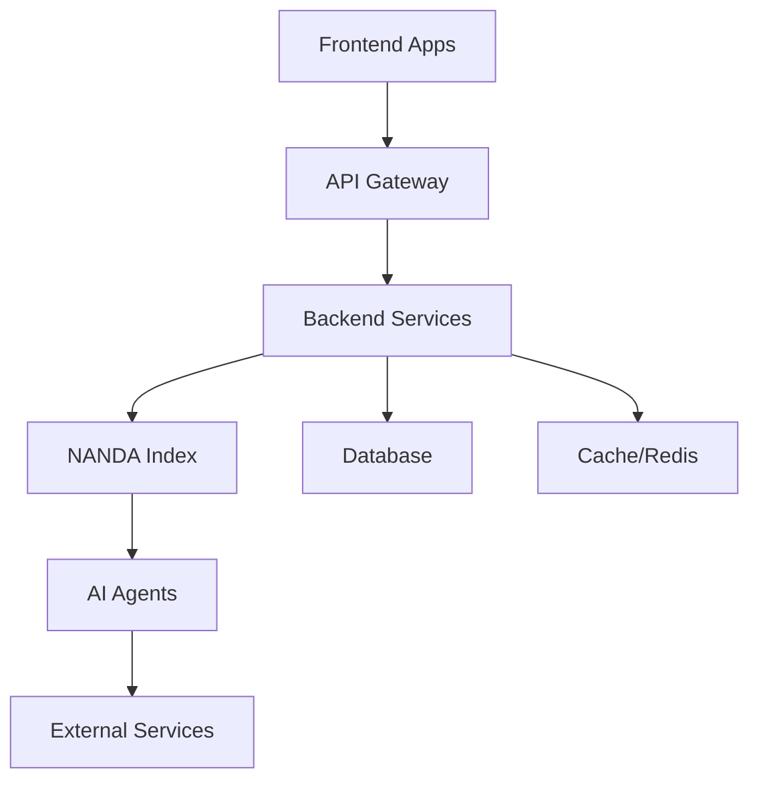

# Candlefish AI - System Architecture

## 🏗️ Repository Structure

```
candlefish-ai/
├── apps/                 # Frontend applications
│   ├── paintbox/        # Paint estimation platform
│   ├── promoteros/      # Promoter management system
│   ├── crown-trophy/    # Trophy business application
│   ├── nanda-dashboard/ # NANDA monitoring dashboard
│   └── website/         # Marketing website
├── services/            # Backend microservices
│   ├── nanda-index/     # AI agent orchestration
│   ├── crestron-ha/     # Home automation integration
│   └── promoteros-api/  # PromoterOS backend
├── packages/            # Shared libraries
│   └── nanda-index/     # NANDA index package
├── agents/              # AI agent definitions
│   ├── internal/        # Internal agent implementations
│   └── nanda/           # NANDA agent specifications
├── deployment/          # Deployment configurations
│   ├── k8s/            # Kubernetes manifests
│   ├── terraform/       # Infrastructure as code
│   └── monitoring/      # Observability setup
├── docs/               # Documentation
└── scripts/            # Automation scripts

```

## 🎯 Core Components

### Frontend Applications

#### Paintbox (`apps/paintbox/`)
- **Purpose**: Professional paint estimation platform
- **Stack**: Next.js 14, React, TypeScript, Tailwind CSS
- **Deployment**: Netlify (Production: paintbox.candlefish.ai)
- **Features**: PWA support, offline mode, PDF generation

#### PromoterOS (`apps/promoteros/`)
- **Purpose**: Event promoter management system
- **Stack**: Next.js, tRPC, Prisma
- **Deployment**: Netlify
- **Features**: Multi-tenancy, real-time updates

#### Crown Trophy (`apps/crown-trophy/`)
- **Purpose**: Trophy and awards business management
- **Stack**: React, TypeScript
- **Deployment**: Netlify

### Backend Services

#### NANDA Index (`services/nanda-index/`)
- **Purpose**: AI agent orchestration and management
- **Stack**: Node.js, Express, GraphQL
- **Deployment**: Fly.io
- **Features**: Agent registry, inter-agent communication

#### Crestron HA (`services/crestron-ha/`)
- **Purpose**: Home automation integration
- **Stack**: Python, FastAPI
- **Deployment**: Fly.io
- **Features**: Device control, automation rules

### AI Agents (`agents/`)

#### Agent Types
- **Code Review Agents**: Automated code quality checks
- **Deployment Agents**: Infrastructure management
- **Monitoring Agents**: System health tracking
- **Business Agents**: Domain-specific automation

## 🔄 Data Flow



## 🚀 Deployment Architecture

### Environments
- **Development**: Local Docker Compose
- **Staging**: Preview deployments on PRs
- **Production**: Main branch auto-deploy

### Infrastructure
- **Frontend Hosting**: Netlify
- **Backend Hosting**: Fly.io
- **Database**: PostgreSQL (managed)
- **Cache**: Redis
- **Monitoring**: Grafana, Prometheus
- **CI/CD**: GitHub Actions

## 🔐 Security Architecture

### Authentication
- JWT-based authentication
- AWS Cognito integration (planned)
- Role-based access control (RBAC)

### Secrets Management
- AWS Secrets Manager for production
- GitHub Secrets for CI/CD
- Local `.env` files for development (gitignored)

### Security Best Practices
- All secrets rotated regularly
- HTTPS enforced everywhere
- CORS properly configured
- Rate limiting implemented
- Input validation on all endpoints

## 📊 Monitoring & Observability

### Metrics Collection
- Prometheus for metrics
- Grafana for visualization
- Custom dashboards per service

### Logging
- Structured logging with JSON
- Centralized log aggregation
- Error tracking with Sentry (planned)

### Health Checks
- `/health` endpoints on all services
- Automated uptime monitoring
- Alert configuration for critical issues

## 🔧 Development Workflow

### Local Development
1. Clone repository
2. Install dependencies: `pnpm install`
3. Set up environment: `cp .env.example .env`
4. Start services: `pnpm dev`

### Testing
- Unit tests: `pnpm test`
- E2E tests: `pnpm test:e2e`
- Load tests: `pnpm test:load`

### Deployment
- Feature branches → Preview deployments
- Main branch → Production deployment
- Rollback capability via GitHub Actions

## 📚 Key Technologies

### Frontend
- Next.js 14 (App Router)
- React 18
- TypeScript 5
- Tailwind CSS
- Framer Motion

### Backend
- Node.js 20
- Python 3.12
- GraphQL (Apollo Server)
- tRPC
- Prisma ORM

### Infrastructure
- Docker
- Kubernetes
- Terraform
- GitHub Actions
- AWS Services

## 🎨 Design System

### UI Components
- Shadcn/ui base components
- Custom Candlefish theme
- Consistent color palette
- Responsive design patterns

### Branding
- Eggshell color scheme
- Minimalist aesthetic
- Focus on usability

## 📈 Performance Targets

- **Page Load**: < 2s (LCP)
- **API Response**: < 200ms (p95)
- **Uptime**: 99.9% SLA
- **Error Rate**: < 0.1%

## 🔄 Future Roadmap

### Q4 2025
- [ ] Complete NANDA agent marketplace
- [ ] Implement GraphQL federation
- [ ] Add real-time collaboration features
- [ ] Enhanced monitoring dashboard

### Q1 2026
- [ ] Mobile applications
- [ ] Advanced AI capabilities
- [ ] International expansion
- [ ] Enterprise features

## 📞 Support & Contact

- **Documentation**: See `/docs` directory
- **Issues**: GitHub Issues
- **Slack**: #candlefish-dev
- **Email**: dev@candlefish.ai

---

*Last Updated: August 2025*
