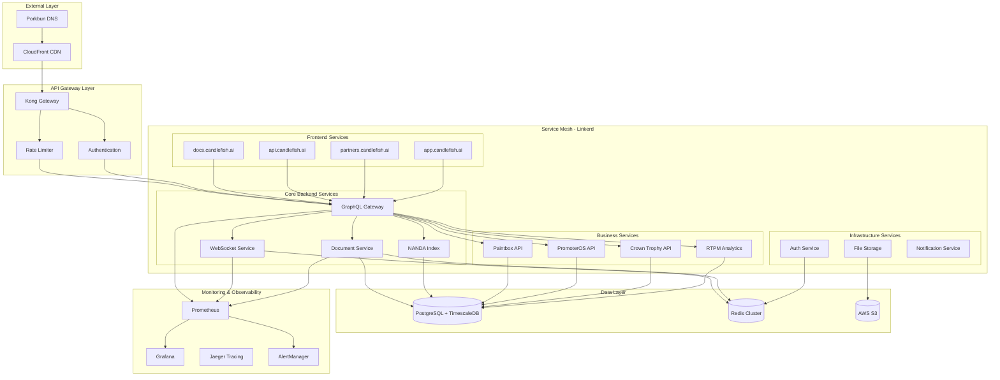

# Candlefish AI Backend Architecture - Comprehensive Design

## Executive Summary

This document presents a comprehensive backend architecture for the Candlefish AI platform, designed with security-first principles, automated deployment pipelines, and clear service boundaries to support the platform's multi-tenant AI agent ecosystem.

## 1. Priority Implementation Plan

### Phase 1: Security Foundation (CRITICAL - IMMEDIATE)
1. **Kong API Gateway Security Deployment**
   - Store Kong PAT in AWS Secrets Manager
   - Configure rate limiting, CORS, and auth
   - Implement API versioning strategy

2. **Linkerd Service Mesh Setup**
   - mTLS between all services
   - Circuit breakers and load balancing
   - Observability and metrics collection

### Phase 2: Infrastructure & CI/CD
1. **Automated Deployment Pipelines**
   - CI/CD for docs.candlefish.ai and api.candlefish.ai
   - Zero-downtime deployment strategy
   - Staging → Production workflow automation

2. **DNS & SSL Configuration**
   - Configure partners.candlefish.ai via Porkbun DNS
   - Create dedicated Netlify site for partners portal
   - Automated certificate management

### Phase 3: Parallel Service & Performance Track
1. **Service Boundary Implementation**
   - GraphQL Federation setup
   - Redis caching layer
   - CDN optimization
   - Database query optimization

2. **Critical Bug Fixes**
   - Replace localhost URLs in production
   - Fix Jest configuration issues
   - Bundle size reduction

## 2. Service Architecture Overview



## 3. Service Boundary Definitions

### 3.1 API Gateway Services
- **Kong Gateway**: Central entry point, authentication, rate limiting
- **Load Balancer**: Traffic distribution with health checks
- **SSL Termination**: Certificate management and HTTPS enforcement

### 3.2 Core Platform Services
- **GraphQL Gateway**: Federated schema, query optimization
- **Authentication Service**: JWT management, user sessions, RBAC
- **WebSocket Service**: Real-time communications, presence
- **Document Service**: CRDT-based collaboration, version control

### 3.3 Business Domain Services
- **NANDA Index**: AI agent orchestration and registry
- **Paintbox API**: Paint estimation and project management
- **PromoterOS API**: Event promotion and management
- **Crown Trophy API**: Awards and recognition platform
- **RTPM Analytics**: Real-time performance monitoring

### 3.4 Infrastructure Services
- **File Storage Service**: Document upload/download, CDN integration
- **Notification Service**: Email, SMS, push notifications
- **Audit Service**: Activity logging, compliance tracking

## 4. Database Schema Design

### 4.1 Core Tables

```sql
-- Users and Authentication
CREATE TABLE users (
    id UUID PRIMARY KEY DEFAULT gen_random_uuid(),
    email VARCHAR(255) UNIQUE NOT NULL,
    password_hash VARCHAR(255) NOT NULL,
    role VARCHAR(50) NOT NULL DEFAULT 'user',
    tenant_id UUID NOT NULL,
    created_at TIMESTAMP WITH TIME ZONE DEFAULT NOW(),
    updated_at TIMESTAMP WITH TIME ZONE DEFAULT NOW(),
    last_login TIMESTAMP WITH TIME ZONE
);

-- Multi-tenancy support
CREATE TABLE tenants (
    id UUID PRIMARY KEY DEFAULT gen_random_uuid(),
    name VARCHAR(255) NOT NULL,
    slug VARCHAR(100) UNIQUE NOT NULL,
    plan VARCHAR(50) NOT NULL DEFAULT 'free',
    settings JSONB DEFAULT '{}',
    created_at TIMESTAMP WITH TIME ZONE DEFAULT NOW()
);

-- Service mesh and API management
CREATE TABLE api_keys (
    id UUID PRIMARY KEY DEFAULT gen_random_uuid(),
    user_id UUID REFERENCES users(id) ON DELETE CASCADE,
    tenant_id UUID REFERENCES tenants(id) ON DELETE CASCADE,
    name VARCHAR(255) NOT NULL,
    key_hash VARCHAR(255) UNIQUE NOT NULL,
    scopes JSONB DEFAULT '[]',
    rate_limit INTEGER DEFAULT 1000,
    expires_at TIMESTAMP WITH TIME ZONE,
    created_at TIMESTAMP WITH TIME ZONE DEFAULT NOW()
);

-- NANDA Agent Registry
CREATE TABLE nanda_agents (
    id UUID PRIMARY KEY DEFAULT gen_random_uuid(),
    name VARCHAR(255) NOT NULL,
    description TEXT,
    version VARCHAR(50) NOT NULL,
    spec JSONB NOT NULL,
    status VARCHAR(50) DEFAULT 'inactive',
    tenant_id UUID REFERENCES tenants(id),
    created_by UUID REFERENCES users(id),
    created_at TIMESTAMP WITH TIME ZONE DEFAULT NOW()
);

-- Document management with CRDT support
CREATE TABLE documents (
    id UUID PRIMARY KEY DEFAULT gen_random_uuid(),
    title VARCHAR(255) NOT NULL,
    content_type VARCHAR(100),
    tenant_id UUID REFERENCES tenants(id),
    created_by UUID REFERENCES users(id),
    crdt_state JSONB NOT NULL DEFAULT '{}',
    version INTEGER DEFAULT 1,
    created_at TIMESTAMP WITH TIME ZONE DEFAULT NOW(),
    updated_at TIMESTAMP WITH TIME ZONE DEFAULT NOW()
);

-- Performance analytics (TimescaleDB hypertable)
CREATE TABLE metrics (
    time TIMESTAMPTZ NOT NULL,
    service_name VARCHAR(100) NOT NULL,
    metric_name VARCHAR(100) NOT NULL,
    value DOUBLE PRECISION,
    labels JSONB DEFAULT '{}',
    tenant_id UUID
);

-- Convert to hypertable for time-series data
SELECT create_hypertable('metrics', 'time', chunk_time_interval => INTERVAL '1 hour');
```

### 4.2 Indexing Strategy

```sql
-- Performance indexes
CREATE INDEX idx_users_tenant_email ON users(tenant_id, email);
CREATE INDEX idx_users_last_login ON users(last_login) WHERE last_login IS NOT NULL;
CREATE INDEX idx_api_keys_tenant ON api_keys(tenant_id) WHERE expires_at > NOW();
CREATE INDEX idx_nanda_agents_tenant_status ON nanda_agents(tenant_id, status);
CREATE INDEX idx_documents_tenant_updated ON documents(tenant_id, updated_at DESC);

-- TimescaleDB indexes
CREATE INDEX idx_metrics_service_time ON metrics(service_name, time DESC);
CREATE INDEX idx_metrics_tenant_time ON metrics(tenant_id, time DESC) WHERE tenant_id IS NOT NULL;
```

## 5. API Contract Specifications

### 5.1 GraphQL Federation Schema

```graphql
# Gateway schema combining all subgraphs
type Query {
  # User management
  me: User
  users(filter: UserFilter): [User!]!
  
  # NANDA agents
  agents(filter: AgentFilter): [Agent!]!
  agent(id: ID!): Agent
  
  # Documents
  documents(filter: DocumentFilter): [Document!]!
  document(id: ID!): Document
  
  # Analytics
  metrics(query: MetricsQuery!): MetricsResult!
  
  # Health checks
  health: HealthStatus!
}

type Mutation {
  # Authentication
  login(input: LoginInput!): AuthPayload!
  logout: Boolean!
  refreshToken: AuthPayload!
  
  # Agent management
  createAgent(input: CreateAgentInput!): Agent!
  updateAgent(id: ID!, input: UpdateAgentInput!): Agent!
  deleteAgent(id: ID!): Boolean!
  
  # Document operations
  createDocument(input: CreateDocumentInput!): Document!
  updateDocument(id: ID!, operations: [CRDTOperation!]!): Document!
}

type Subscription {
  # Real-time document collaboration
  documentUpdated(id: ID!): DocumentUpdate!
  
  # Agent status changes
  agentStatusChanged(tenantId: ID!): AgentStatusUpdate!
  
  # System notifications
  notifications(userId: ID!): Notification!
}
```

### 5.2 REST API Endpoints

```yaml
# Kong Gateway routing configuration
paths:
  /auth/login:
    post:
      summary: Authenticate user
      requestBody:
        required: true
        content:
          application/json:
            schema:
              type: object
              properties:
                email:
                  type: string
                  format: email
                password:
                  type: string
                  minLength: 8
      responses:
        200:
          description: Authentication successful
          content:
            application/json:
              schema:
                type: object
                properties:
                  token:
                    type: string
                  user:
                    $ref: '#/components/schemas/User'
        401:
          $ref: '#/components/responses/Unauthorized'

  /agents:
    get:
      summary: List NANDA agents
      parameters:
        - name: tenant_id
          in: query
          required: true
          schema:
            type: string
            format: uuid
      responses:
        200:
          description: Agent list retrieved
          content:
            application/json:
              schema:
                type: object
                properties:
                  data:
                    type: array
                    items:
                      $ref: '#/components/schemas/Agent'
                  pagination:
                    $ref: '#/components/schemas/Pagination'

  /documents/{id}/collaborate:
    post:
      summary: Apply CRDT operations to document
      parameters:
        - name: id
          in: path
          required: true
          schema:
            type: string
            format: uuid
      requestBody:
        required: true
        content:
          application/json:
            schema:
              type: object
              properties:
                operations:
                  type: array
                  items:
                    $ref: '#/components/schemas/CRDTOperation'
      responses:
        200:
          description: Operations applied successfully
```

## 6. Technology Stack & Rationale

### 6.1 API Gateway & Security
- **Kong Gateway**: Industry-standard API management with comprehensive plugin ecosystem
- **Kong PAT**: Secure token-based authentication stored in AWS Secrets Manager
- **Rate Limiting**: Protection against abuse with granular controls per tenant/user
- **Linkerd Service Mesh**: Zero-trust security with automatic mTLS

### 6.2 Backend Services
- **Node.js 20 + TypeScript**: Consistent language across services, excellent async performance
- **GraphQL Federation**: Unified API layer with independent service development
- **Apollo Server 4**: Production-ready GraphQL server with caching and subscriptions
- **Fastify**: High-performance HTTP server for REST endpoints

### 6.3 Data Layer
- **PostgreSQL 15**: ACID compliance, advanced features, JSON support
- **TimescaleDB**: Time-series data optimization for metrics and analytics
- **Redis 7**: Caching, session storage, pub/sub for real-time features
- **AWS S3**: Scalable object storage for files and documents

### 6.4 Infrastructure
- **Docker**: Containerization for consistent deployments
- **Kubernetes**: Container orchestration with auto-scaling
- **Terraform**: Infrastructure as code for reproducible deployments
- **GitHub Actions**: CI/CD automation with security scanning

### 6.5 Monitoring & Observability
- **Prometheus**: Metrics collection with pull-based model
- **Grafana**: Visualization and alerting dashboards
- **Jaeger**: Distributed tracing across services
- **Structured Logging**: JSON format with correlation IDs

## 7. Deployment Architecture

### 7.1 Environment Strategy

```yaml
# GitHub Actions workflow for automated deployment
name: Deploy Backend Services
on:
  push:
    branches: [main]
  pull_request:
    branches: [main]

jobs:
  security-scan:
    runs-on: ubuntu-latest
    steps:
      - name: Security scan with Snyk
      - name: SAST with CodeQL
      - name: Container security scan

  test:
    runs-on: ubuntu-latest
    strategy:
      matrix:
        service: [auth, graphql, websocket, document, nanda]
    steps:
      - name: Run unit tests
      - name: Run integration tests
      - name: Coverage report

  deploy-staging:
    needs: [security-scan, test]
    if: github.event_name == 'pull_request'
    runs-on: ubuntu-latest
    steps:
      - name: Deploy to staging
      - name: Run E2E tests
      - name: Performance tests

  deploy-production:
    needs: [security-scan, test]
    if: github.ref == 'refs/heads/main'
    runs-on: ubuntu-latest
    steps:
      - name: Blue-green deployment
      - name: Health checks
      - name: Rollback on failure
```

### 7.2 Zero-Downtime Deployment

```bash
#!/bin/bash
# Blue-green deployment script

CURRENT_ENV=$(kubectl get service api-gateway -o jsonpath='{.spec.selector.version}')
NEW_ENV=$([ "$CURRENT_ENV" = "blue" ] && echo "green" || echo "blue")

echo "Deploying to $NEW_ENV environment"

# Deploy new version
kubectl apply -f k8s/deployments/$NEW_ENV/
kubectl rollout status deployment/api-gateway-$NEW_ENV

# Health check
kubectl run health-check --image=curlimages/curl --rm -it --restart=Never \
  -- curl -f http://api-gateway-$NEW_ENV:8000/health

if [ $? -eq 0 ]; then
  echo "Health check passed, switching traffic"
  kubectl patch service api-gateway -p '{"spec":{"selector":{"version":"'$NEW_ENV'"}}}'
  
  # Wait and cleanup old version
  sleep 60
  kubectl delete deployment api-gateway-$CURRENT_ENV
else
  echo "Health check failed, rolling back"
  kubectl delete deployment api-gateway-$NEW_ENV
  exit 1
fi
```

## 8. Security Architecture

### 8.1 Kong Gateway Configuration

```yaml
# kong.yml - Declarative configuration
_format_version: "3.0"

services:
  - name: graphql-gateway
    url: http://graphql-service:4000
    plugins:
      - name: rate-limiting
        config:
          minute: 1000
          hour: 10000
          policy: redis
          redis:
            host: redis
            port: 6379
      - name: cors
        config:
          origins:
            - "https://*.candlefish.ai"
          methods:
            - GET
            - POST
            - PUT
            - DELETE
            - OPTIONS
          headers:
            - Authorization
            - Content-Type
      - name: jwt
        config:
          secret_is_base64: false
          key_claim_name: kid
      - name: prometheus
        config:
          per_consumer: true

  - name: websocket-service
    url: http://websocket-service:4001
    plugins:
      - name: rate-limiting
        config:
          minute: 100
          policy: redis

routes:
  - name: graphql-route
    service: graphql-gateway
    paths:
      - /graphql
      - /api/v1
    
  - name: websocket-route
    service: websocket-service
    paths:
      - /ws
    protocols:
      - http
      - https
      - ws
      - wss
```

### 8.2 Linkerd Service Mesh Setup

```yaml
# linkerd-config.yaml
apiVersion: linkerd.io/v1alpha2
kind: TrafficSplit
metadata:
  name: api-gateway-split
spec:
  service: api-gateway
  backends:
  - service: api-gateway-blue
    weight: 100
  - service: api-gateway-green
    weight: 0

---
apiVersion: policy.linkerd.io/v1beta1
kind: Server
metadata:
  name: graphql-server
spec:
  podSelector:
    matchLabels:
      app: graphql-gateway
  port: 4000
  proxyProtocol: HTTP/2

---
apiVersion: policy.linkerd.io/v1beta1
kind: ServerAuthorization
metadata:
  name: graphql-auth
spec:
  server:
    name: graphql-server
  requiredRoutes:
  - pathRegex: "/graphql"
    methods: ["POST", "GET"]
  - pathRegex: "/health"
    methods: ["GET"]
```

## 9. Performance Optimization Strategy

### 9.1 Caching Architecture

```typescript
// Multi-layer caching implementation
export class CacheManager {
  private redis: Redis;
  private memoryCache: Map<string, any>;
  
  constructor() {
    this.redis = new Redis(process.env.REDIS_URL);
    this.memoryCache = new Map();
  }
  
  async get<T>(key: string, options?: CacheOptions): Promise<T | null> {
    // L1: Memory cache (fastest)
    if (this.memoryCache.has(key)) {
      return this.memoryCache.get(key);
    }
    
    // L2: Redis cache (fast, distributed)
    const redisValue = await this.redis.get(key);
    if (redisValue) {
      const parsed = JSON.parse(redisValue);
      // Populate L1 cache
      this.memoryCache.set(key, parsed);
      return parsed;
    }
    
    return null;
  }
  
  async set<T>(key: string, value: T, ttl: number = 3600): Promise<void> {
    // Store in both layers
    this.memoryCache.set(key, value);
    await this.redis.setex(key, ttl, JSON.stringify(value));
  }
  
  async invalidate(pattern: string): Promise<void> {
    // Clear memory cache
    for (const key of this.memoryCache.keys()) {
      if (key.includes(pattern)) {
        this.memoryCache.delete(key);
      }
    }
    
    // Clear Redis cache
    const keys = await this.redis.keys(`*${pattern}*`);
    if (keys.length > 0) {
      await this.redis.del(...keys);
    }
  }
}
```

### 9.2 Database Optimization

```sql
-- Query optimization examples
-- Use partial indexes for filtered queries
CREATE INDEX CONCURRENTLY idx_active_agents 
ON nanda_agents(tenant_id, updated_at DESC) 
WHERE status = 'active';

-- Materialized views for complex analytics
CREATE MATERIALIZED VIEW tenant_metrics_daily AS
SELECT 
    tenant_id,
    DATE_TRUNC('day', time) as day,
    service_name,
    AVG(value) as avg_response_time,
    MAX(value) as max_response_time,
    COUNT(*) as request_count
FROM metrics 
WHERE metric_name = 'response_time'
  AND time >= NOW() - INTERVAL '30 days'
GROUP BY tenant_id, day, service_name;

-- Refresh schedule
CREATE OR REPLACE FUNCTION refresh_tenant_metrics()
RETURNS void AS $$
BEGIN
    REFRESH MATERIALIZED VIEW CONCURRENTLY tenant_metrics_daily;
END;
$$ LANGUAGE plpgsql;

-- Auto-refresh every hour
SELECT cron.schedule('refresh-metrics', '0 * * * *', 'SELECT refresh_tenant_metrics();');
```

### 9.3 CDN Configuration

```typescript
// CloudFront distribution configuration
export const cdnConfig = {
  origins: [
    {
      domainName: 'api.candlefish.ai',
      customOriginConfig: {
        HTTPSPort: 443,
        originProtocolPolicy: 'https-only',
        originSslProtocols: ['TLSv1.2']
      }
    }
  ],
  defaultCacheBehavior: {
    targetOriginId: 'api-origin',
    viewerProtocolPolicy: 'redirect-to-https',
    cachePolicyId: 'custom-api-cache-policy',
    compress: true
  },
  cacheBehaviors: [
    {
      pathPattern: '/static/*',
      cachePolicyId: 'static-content-policy',
      ttl: { default: 86400, max: 31536000 }
    },
    {
      pathPattern: '/graphql',
      cachePolicyId: 'no-cache-policy',
      ttl: { default: 0, max: 0 }
    }
  ]
};
```

## 10. Monitoring & Alerting

### 10.1 Prometheus Configuration

```yaml
# prometheus.yml
global:
  scrape_interval: 15s
  evaluation_interval: 15s

rule_files:
  - "alert-rules.yml"

alerting:
  alertmanagers:
    - static_configs:
        - targets:
          - alertmanager:9093

scrape_configs:
  - job_name: 'kong-gateway'
    static_configs:
      - targets: ['kong:8001']
    metrics_path: /metrics
    
  - job_name: 'graphql-services'
    kubernetes_sd_configs:
      - role: pod
    relabel_configs:
      - source_labels: [__meta_kubernetes_pod_label_app]
        action: keep
        regex: graphql-.*
        
  - job_name: 'linkerd-proxy'
    kubernetes_sd_configs:
      - role: pod
    relabel_configs:
      - source_labels: [__meta_kubernetes_pod_container_name]
        action: keep
        regex: linkerd-proxy
```

### 10.2 Alert Rules

```yaml
# alert-rules.yml
groups:
  - name: candlefish.alerts
    rules:
      - alert: HighErrorRate
        expr: |
          (
            rate(http_requests_total{status=~"5.."}[5m]) /
            rate(http_requests_total[5m])
          ) > 0.05
        for: 5m
        labels:
          severity: critical
        annotations:
          summary: "High error rate detected"
          description: "Service {{ $labels.service }} has error rate above 5%"
          
      - alert: HighLatency
        expr: |
          histogram_quantile(0.95, rate(http_request_duration_seconds_bucket[5m])) > 0.5
        for: 2m
        labels:
          severity: warning
        annotations:
          summary: "High latency detected"
          
      - alert: ServiceDown
        expr: up == 0
        for: 1m
        labels:
          severity: critical
        annotations:
          summary: "Service is down"
```

## 11. Scalability Considerations

### 11.1 Horizontal Scaling Strategy

```yaml
# Kubernetes HPA configuration
apiVersion: autoscaling/v2
kind: HorizontalPodAutoscaler
metadata:
  name: graphql-gateway-hpa
spec:
  scaleTargetRef:
    apiVersion: apps/v1
    kind: Deployment
    name: graphql-gateway
  minReplicas: 3
  maxReplicas: 50
  metrics:
  - type: Resource
    resource:
      name: cpu
      target:
        type: Utilization
        averageUtilization: 70
  - type: Resource
    resource:
      name: memory
      target:
        type: Utilization
        averageUtilization: 80
  - type: Pods
    pods:
      metric:
        name: http_requests_per_second
      target:
        type: AverageValue
        averageValue: "1000"
  behavior:
    scaleDown:
      stabilizationWindowSeconds: 300
      policies:
      - type: Percent
        value: 10
        periodSeconds: 60
    scaleUp:
      stabilizationWindowSeconds: 60
      policies:
      - type: Percent
        value: 50
        periodSeconds: 60
```

### 11.2 Database Scaling

```sql
-- Partitioning strategy for large tables
CREATE TABLE documents_partitioned (
    id UUID NOT NULL,
    tenant_id UUID NOT NULL,
    title VARCHAR(255) NOT NULL,
    created_at TIMESTAMP WITH TIME ZONE DEFAULT NOW(),
    CONSTRAINT documents_pkey PRIMARY KEY (id, tenant_id)
) PARTITION BY HASH (tenant_id);

-- Create partitions (adjust based on tenant distribution)
DO $$
BEGIN
    FOR i IN 0..15 LOOP
        EXECUTE format('CREATE TABLE documents_part_%s PARTITION OF documents_partitioned
                       FOR VALUES WITH (modulus 16, remainder %s)', i, i);
    END LOOP;
END $$;

-- Connection pooling configuration
-- PgBouncer configuration for connection management
[databases]
candlefish = host=postgres port=5432 dbname=candlefish_prod pool_size=25 max_client_conn=100

[pgbouncer]
listen_port = 6432
listen_addr = 0.0.0.0
auth_type = scram-sha-256
pool_mode = transaction
max_client_conn = 1000
default_pool_size = 25
reserve_pool_size = 5
```

## 12. Critical Issues & Immediate Actions

### 12.1 Production URL Fixes

The current codebase contains localhost URLs that need immediate replacement:

```typescript
// Fix in next.config.js files
const nextConfig = {
  async rewrites() {
    return [
      {
        source: '/api/graphql',
        destination: process.env.GRAPHQL_ENDPOINT || 'https://api.candlefish.ai/graphql', // Fixed
      },
    ]
  },
}
```

### 12.2 Jest Configuration Fix

```javascript
// jest.config.js - Updated configuration
module.exports = {
  testEnvironment: 'jsdom',
  setupFilesAfterEnv: ['<rootDir>/jest.setup.js'],
  moduleNameMapping: {
    '^@/(.*)$': '<rootDir>/src/$1',
    '^~/(.*)$': '<rootDir>/$1'
  },
  transform: {
    '^.+\\.(js|jsx|ts|tsx)$': ['babel-jest', { presets: ['next/babel'] }]
  },
  collectCoverageFrom: [
    'src/**/*.{js,jsx,ts,tsx}',
    '!src/**/*.d.ts',
    '!src/pages/api/**/*'
  ],
  testPathIgnorePatterns: ['<rootDir>/.next/', '<rootDir>/node_modules/'],
  transformIgnorePatterns: [
    '/node_modules/',
    '^.+\\.module\\.(css|sass|scss)$',
  ]
};
```

## 13. Implementation Timeline

### Week 1: Security Foundation
- [ ] Deploy Kong API Gateway with security configuration
- [ ] Store Kong PAT in AWS Secrets Manager
- [ ] Implement Linkerd service mesh with mTLS
- [ ] Configure rate limiting and CORS policies

### Week 2: CI/CD & Infrastructure  
- [ ] Set up automated deployment pipelines
- [ ] Configure DNS for partners.candlefish.ai
- [ ] Create Netlify site for partners portal
- [ ] Implement blue-green deployment strategy

### Week 3: Service Architecture
- [ ] Deploy GraphQL Federation gateway
- [ ] Implement Redis caching layer
- [ ] Set up monitoring with Prometheus/Grafana
- [ ] Fix localhost URLs and Jest configuration

### Week 4: Performance & Optimization
- [ ] Configure CDN with CloudFront
- [ ] Implement database query optimization
- [ ] Set up automated scaling policies
- [ ] Complete integration testing

## 14. Success Metrics

- **Security**: Zero security vulnerabilities in production
- **Performance**: API response time < 200ms (p95), Page load < 2s
- **Reliability**: 99.9% uptime, automated recovery from failures
- **Scalability**: Handle 10x traffic increase without performance degradation
- **Developer Experience**: < 10 minutes from code to production

---

*This architecture is designed to support Candlefish AI's growth from startup to enterprise scale while maintaining security, performance, and developer productivity.*
