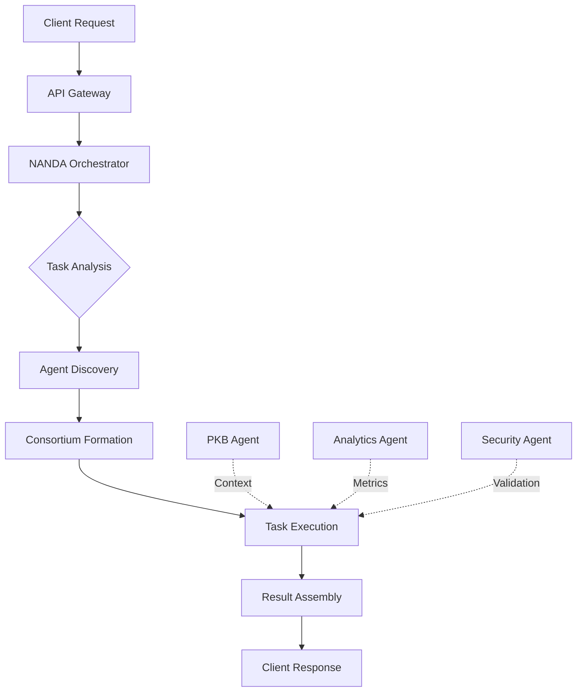

# 🏗️ NANDA-Powered Candlefish.ai Internal Architecture

## Vision
Transform all Candlefish.ai services into a living ecosystem of collaborative AI agents that discover, communicate, and optimize themselves using the NANDA protocol.

## Core Principle
**Every Candlefish.ai service becomes a NANDA agent** that can:
- Discover other internal services automatically
- Negotiate resource allocation
- Form consortiums for complex tasks
- Self-optimize based on performance metrics
- Share knowledge across the ecosystem

---

## 📊 Candlefish.ai Service → NANDA Agent Mapping

### 1. **Paintbox Agent** (`nanda://candlefish/paintbox`)
**Current Service**: Paint estimation platform at test.candlefish.ai
**Agent Capabilities**:
- `estimate-generation` - Create paint estimates
- `cost-calculation` - Calculate project costs
- `salesforce-sync` - Sync with Salesforce CRM
- `companycam-integration` - Handle CompanyCam photos

**How It Works**:
```javascript
// When a new estimate request comes in:
1. Paintbox Agent receives request
2. Forms consortium with:
   - ML Agent (for image analysis of rooms)
   - Database Agent (for pricing lookups)
   - PDF Agent (for report generation)
3. Agents bid on subtasks based on current load
4. Orchestrator coordinates execution
5. Results assembled and returned
```

### 2. **PKB Agent** (`nanda://candlefish/pkb`)
**Current Service**: Personal Knowledge Base system
**Agent Capabilities**:
- `knowledge-ingestion` - Ingest documents/emails
- `semantic-search` - Search across knowledge
- `insight-generation` - Generate insights from data
- `memory-augmentation` - Enhance with context

**Integration Benefits**:
- PKB Agent can provide context to ALL other agents
- Any agent can query PKB for historical information
- Automatic knowledge sharing across services

### 3. **Clark County Scraper Agent** (`nanda://candlefish/clark-scraper`)
**Current Service**: Permit scraping system
**Agent Capabilities**:
- `permit-monitoring` - Monitor new permits
- `data-extraction` - Extract permit details
- `change-detection` - Detect status changes
- `alert-generation` - Generate notifications

**Consortium Formation**:
- Works with Database Agent for storage
- Coordinates with Notification Agent for alerts
- Shares data with Analytics Agent

### 4. **Executive AI Assistant Agent** (`nanda://candlefish/executive-assistant`)
**Agent Capabilities**:
- `email-drafting` - Draft professional emails
- `calendar-management` - Manage schedules
- `task-prioritization` - Prioritize tasks
- `meeting-preparation` - Prepare meeting briefs

### 5. **Dashboard Analytics Agent** (`nanda://candlefish/analytics`)
**Agent Capabilities**:
- `metric-calculation` - Calculate KPIs
- `trend-analysis` - Analyze trends
- `report-generation` - Generate reports
- `anomaly-detection` - Detect anomalies

---

## 🔄 Internal Agent Communication Flow



---

## 💰 Internal Resource Economy

### Credit System
Each internal agent has:
- **Daily Budget**: Credits for internal operations
- **Earning Potential**: Credits earned by completing tasks
- **Bidding Power**: Ability to bid on high-priority tasks

### Resource Allocation
```python
# Example: Paintbox needs urgent estimate
paintbox_agent.broadcast_task({
    "type": "urgent_estimate",
    "deadline": "10_minutes",
    "reward": 500  # Internal credits
})

# Agents bid based on availability
ml_agent.bid(300, confidence=0.95)
database_agent.bid(250, confidence=0.99)
pdf_agent.bid(200, confidence=1.0)

# Orchestrator selects optimal consortium
```

---

## 🚀 Implementation Phases

### Phase 1: Core Infrastructure (Week 1-2)
- [ ] Deploy internal NANDA registry
- [ ] Create agent registration system
- [ ] Implement inter-agent communication
- [ ] Set up orchestrator service

### Phase 2: Service Migration (Week 3-4)
- [ ] Convert Paintbox to NANDA agent
- [ ] Convert PKB to NANDA agent
- [ ] Convert Clark Scraper to NANDA agent
- [ ] Test agent discovery and communication

### Phase 3: Intelligence Layer (Week 5-6)
- [ ] Implement consortium formation
- [ ] Add bidding/marketplace mechanics
- [ ] Create self-optimization loops
- [ ] Deploy monitoring dashboard

### Phase 4: Production (Week 7-8)
- [ ] Load testing with real workflows
- [ ] Performance optimization
- [ ] Failover and redundancy
- [ ] Production deployment

---

## 🎯 Immediate Benefits

### 1. **Automatic Service Discovery**
No more hardcoded endpoints. Services discover each other dynamically.

### 2. **Load Balancing**
Agents automatically route tasks to least loaded instances.

### 3. **Fault Tolerance**
If one agent fails, others automatically take over its tasks.

### 4. **Cross-Service Intelligence**
PKB provides context to Paintbox, which informs Analytics, etc.

### 5. **Self-Optimization**
Agents learn from each other and optimize their performance.

---

## 📊 Monitoring & Visualization

The NANDA Dashboard (http://localhost:3005) becomes our:
- **Service Health Monitor** - Real-time status of all services
- **Task Flow Visualizer** - See how tasks flow between agents
- **Performance Tracker** - Monitor latency, throughput, errors
- **Resource Manager** - Track credit allocation and usage
- **Consortium Viewer** - Watch agents collaborate in real-time

---

## 🔌 External Integration Points

While primarily internal, our NANDA agents can:
- Register with global NANDA index when available
- Accept external agent requests (with authentication)
- Form consortiums with partner company agents
- Provide services to customers via NANDA protocol

---

## 💡 Unique Advantages

### Why This Approach Wins:
1. **Dogfooding** - We use our own infrastructure
2. **Real Value** - Immediate benefits to existing services
3. **Evolution Path** - Start internal, go global later
4. **Competitive Moat** - Our services become inherently collaborative
5. **Cost Reduction** - Optimal resource utilization

### Example: Paintbox Estimate Generation

**Before NANDA**:
```javascript
// Monolithic, tightly coupled
async function generateEstimate(data) {
  const rooms = await analyzeImages(data.images);
  const costs = await calculateCosts(rooms);
  const pdf = await generatePDF(costs);
  return pdf;
}
```

**After NANDA**:
```javascript
// Distributed, intelligent, self-optimizing
async function generateEstimate(data) {
  const task = orchestrator.createTask({
    type: 'estimate_generation',
    data: data,
    sla: { maxLatency: 5000, priority: 'high' }
  });
  
  // Agents automatically coordinate
  // - Image Agent analyzes rooms (bids 100 credits)
  // - Costing Agent calculates prices (bids 80 credits)
  // - PDF Agent generates report (bids 60 credits)
  // - PKB Agent provides historical context (free)
  
  return await task.execute(); // Self-optimizing execution
}
```

---

## 🎬 Next Immediate Steps

1. **Deploy Internal Registry** (Today)
   ```bash
   cd official-nanda-index
   python3 run_registry.py --public-url http://localhost:6900
   ```

2. **Create First Agent** (Today)
   - Start with PKB Agent (most valuable for context)
   - Implement basic query/response

3. **Connect to Dashboard** (Today)
   - Wire up real agent to monitoring dashboard
   - Show actual inter-agent communication

4. **Gradual Migration** (This Week)
   - One service at a time
   - Maintain backwards compatibility
   - Measure performance improvements

---

## 🎯 Success Metrics

- **Latency Reduction**: 30% faster request processing
- **Resource Utilization**: 40% better CPU/memory usage
- **Development Speed**: 50% faster feature deployment
- **System Reliability**: 99.9% uptime with self-healing
- **Cost Reduction**: 25% lower infrastructure costs

---

## 🚀 The Vision Realized

In 6 months, Candlefish.ai will have:
- **20+ internal agents** working collaboratively
- **Fully self-optimizing** infrastructure
- **Zero manual service discovery**
- **Automatic failover and scaling**
- **Cross-service intelligence sharing**

Every new feature becomes an agent. Every agent makes the whole system smarter.

**This is how we build the future - by using it ourselves first.**
