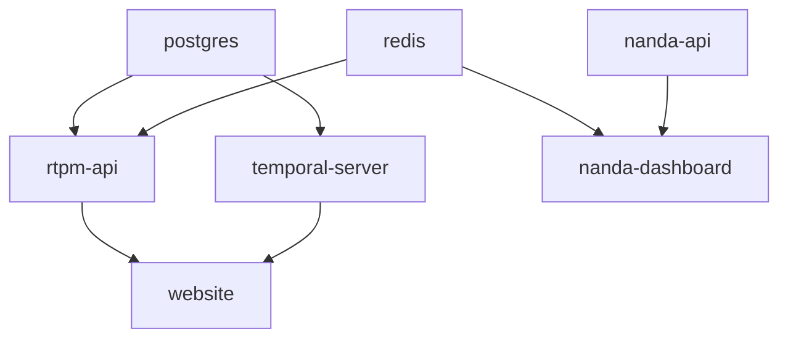

# Candlefish.ai - Coherent Vertical Automation Platform

[](https://github.com/candlefish-ai/candlefish-ai/actions/workflows/monorepo-ci.yml)
[](https://github.com/candlefish-ai/candlefish-ai/actions/workflows/auto-security.yml)
[](https://github.com/candlefish-ai/candlefish-ai/actions/workflows/auto-dependencies.yml)
[](https://github.com/candlefish-ai/candlefish-ai/actions/workflows/auto-performance.yml)
[](LICENSE)

> Converting messy, Excel-bound operations into durable, AI-native systems for real-world industries

## Vision

Candlefish is building the AI control plane for blue-collar and craft industries, transforming spreadsheet chaos into intelligent automation through our "single spine, many faces" architecture.

## Core Products

### Vertical Applications
- **Paintbox** - Professional paint estimation and job management
- **Crown** - Trophy and awards inventory and production
- **PromoterOS** - Venue booking and settlement management  
- **Brewkit** - Brewery production planning and inventory

### Platform Capabilities
- **Excel Migration Engine** - 5-minute spreadsheet to application transformation
- **Coherent Core** - Shared infrastructure across all verticals
- **Operator Network** - Certified partners for implementation and support
- **AI Alignment** - Systems that evolve with their users

## Quick Start

### Development Setup

1. **Clone and setup**
   ```bash
   git clone https://github.com/candlefish-ai/candlefish-ai.git
   cd candlefish-ai
   pnpm install
   ```

2. **Configure environment**
   ```bash
   cp .env.example .env
   # Edit .env with your configuration
   ```

3. **Start with Docker (Recommended)**
   ```bash
   # Development environment
   docker-compose up -d
   
   # Or production environment
   docker-compose -f docker-compose.prod.yml up -d
   ```

4. **Alternative: Local development**
   ```bash
   # Start individual services
   pnpm dev
   ```

5. **Access applications**
   - RTPM API: http://localhost:8080
   - NANDA API: http://localhost:3000
   - NANDA Dashboard: http://localhost:3001
   - Website: http://localhost:3002
   - Temporal Server: http://localhost:8088
   - Monitoring (dev profile): http://localhost:3003

## Architecture

```
┌─────────────────────────────────────────┐
│      VERTICAL APPLICATIONS              │
│  Paintbox | Crown | PromoterOS | Brewkit│
└─────────────────────────────────────────┘
                    ▼
┌─────────────────────────────────────────┐
│         CANDLEFISH CORE                 │
│  Identity | Data | Workflow | Agents    │
└─────────────────────────────────────────┘
                    ▼
┌─────────────────────────────────────────┐
│       EXCEL MIGRATION ENGINE            │
│  Parse | Analyze | Transform | Generate │
└─────────────────────────────────────────┘
```

## Project Structure

```
candlefish-ai/                     # Monorepo root
├── apps/                         # Application services
│   ├── website/                 # Main marketing site
│   ├── rtpm-api/               # Real-time Project Management API
│   ├── nanda-api/              # NANDA agent system API
│   ├── nanda-dashboard/        # NANDA monitoring dashboard
│   ├── mobile-dashboard/       # Mobile applications
│   └── brand-portal/           # Brand assets
├── projects/                    # Vertical implementations  
│   ├── paintbox/              # Painting contractor platform
│   ├── crowntrophy/           # Trophy/awards management
│   └── promoteros/            # Venue booking system
├── services/                   # Shared services
│   ├── auth-service/          # Authentication service
│   └── promoteros-api/        # PromoterOS backend
├── packages/                   # Shared packages
│   ├── ui-components/         # Design system components
│   └── tyler-setup/           # Employee onboarding
├── candlefish-temporal-platform/ # Temporal workflows
├── clark_county_permits_emergency/ # Web scraping system
├── ibm-watsonx-portfolio/     # AI portfolio site
├── nanda-adapter/             # NANDA system adapter
├── deployment/                # Infrastructure configs
│   ├── terraform/             # Infrastructure as Code
│   ├── k8s/                  # Kubernetes manifests
│   └── docker/               # Docker configurations
└── docs/                      # Documentation
    └── operator-network/      # Partner resources
```

## Key Documents

- [Strategic Plan 2025-2027](./STRATEGY_2025.md)
- [Operator Network Playbook](./OPERATOR_NETWORK_PLAYBOOK.md)
- [Excel Migration Architecture](./EXCEL_MIGRATION_ARCHITECTURE.md)
- [Alignment Manifesto](./ALIGNMENT_MANIFESTO.md)

## Technology Stack

- **Frontend**: Next.js 14, React, TypeScript, TailwindCSS, Vite
- **Backend**: Node.js, Python 3.12, FastAPI, GraphQL Federation, Prisma
- **Database**: PostgreSQL (TimescaleDB), Redis, S3
- **AI/ML**: Anthropic Claude, OpenAI, Custom models
- **Workflows**: Temporal, Python asyncio
- **Infrastructure**: Docker, AWS ECS/EKS, Terraform, GitHub Actions
- **Monitoring**: Prometheus, Grafana, OpenTelemetry
- **Package Management**: pnpm (Node.js), Poetry (Python)

## Development Workflow

### Service Dependencies


### Docker Commands

```bash
# Development environment
docker-compose up -d                    # Start all services
docker-compose down                      # Stop all services
docker-compose logs -f [service]         # View logs
docker-compose restart [service]         # Restart service

# Production environment
docker-compose -f docker-compose.prod.yml up -d
docker-compose -f docker-compose.prod.yml down

# Monitoring (development only)
docker-compose --profile monitoring up -d  # Include Grafana
```

### Running Tests
```bash
# Unit tests
pnpm test

# Integration tests
pnpm test:integration

# E2E tests with Docker
docker-compose -f docker-compose.test.yml up --abort-on-container-exit
```

### Code Quality
```bash
# Linting (Python)
ruff check
ruff format

# Linting (TypeScript/JavaScript) 
pnpm lint
pnpm format

# Type checking
pnpm typecheck
```

### Deployment
```bash
# Build production images
docker-compose -f docker-compose.prod.yml build

# Deploy to staging/production (via CI/CD)
git push origin main  # Triggers automated deployment
```

## Contributing

We follow a structured development process:

1. **Branch Naming**: `feat/description-YYYYMMDD`
2. **Commit Style**: Present tense, concise messages
3. **Code Review**: All PRs require approval
4. **Testing**: Maintain 80% coverage minimum

## Security

- SOC 2 Type I target: Q1 2026
- Per-tenant encryption with KMS
- Row-level security on all data
- Complete audit trail
- GDPR/CCPA compliant

## Support

- **Documentation**: [docs.candlefish.ai](https://docs.candlefish.ai)
- **Partner Portal**: [partners.candlefish.ai](https://partners.candlefish.ai)
- **API Reference**: [api.candlefish.ai](https://api.candlefish.ai)

## License

Proprietary - Candlefish.ai © 2025

---

**Building the future of work through aligned intelligence.**
## Docker Services

### Development Environment (`docker-compose.yml`)
- **postgres**: TimescaleDB with development data
- **redis**: Redis cache for session storage
- **rtpm-api**: Real-time Project Management API (port 8080)
- **nanda-api**: NANDA agent system API (port 3000)
- **nanda-dashboard**: NANDA monitoring dashboard (port 3001) 
- **temporal-server**: Temporal workflow server (ports 7233, 8088)
- **website**: Main website (port 3002)
- **monitoring**: Grafana dashboard (port 3003, profile: monitoring)

### Production Environment (`docker-compose.prod.yml`)
- Same services with production optimizations:
  - Multi-stage builds for smaller images
  - Health checks and restart policies
  - Bind to localhost only for security
  - Structured logging
  - nginx reverse proxy
  - clark-county-scraper for data collection

### Environment Variables
Copy `.env.example` to `.env` and configure:
- Database credentials
- Redis password
- JWT secrets
- AWS configuration
- Logging levels

---

**Monorepo setup complete! Building the future of work through aligned intelligence.**
