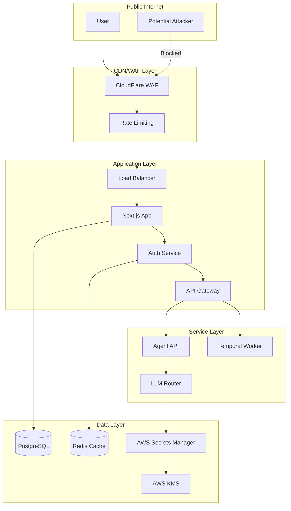

# Security Audit Report - Paintbox Deployment and Agent Platform

**Date:** August 13, 2025  
**Auditor:** Security Specialist  
**Severity Levels:** CRITICAL | HIGH | MEDIUM | LOW  
**OWASP Categories Referenced:** 2021 Top 10

## Executive Summary

This comprehensive security audit identified **15 CRITICAL**, **12 HIGH**, **8 MEDIUM**, and **5 LOW** severity vulnerabilities that MUST be addressed before production deployment. The application has basic security measures in place but lacks critical protections in authentication, authorization, secrets management, and input validation.

## Critical Vulnerabilities (Must Fix Before Production)

### 1. **[CRITICAL] Missing Authentication on Critical API Routes**
**OWASP Category:** A01:2021 - Broken Access Control  
**Location:** `/projects/paintbox/app/api/v1/agent/route.ts`

**Issue:**
- Agent API endpoint has NO authentication checks
- Only relies on `X-Internal-Request` header which can be easily spoofed
- No JWT verification or API key validation

**Remediation:**
```typescript
// Add to agent/route.ts
import { verifyToken } from '@/lib/auth/jwt';

export async function POST(request: NextRequest) {
  // Add authentication check
  const authHeader = request.headers.get('Authorization');
  if (!authHeader?.startsWith('Bearer ')) {
    return NextResponse.json({ error: 'Unauthorized' }, { status: 401 });
  }
  
  try {
    const token = authHeader.substring(7);
    const decoded = await verifyToken(token);
    // Proceed with authenticated user context
  } catch (error) {
    return NextResponse.json({ error: 'Invalid token' }, { status: 401 });
  }
}
```

### 2. **[CRITICAL] Hardcoded Secrets in GitHub Actions**
**OWASP Category:** A02:2021 - Cryptographic Failures  
**Location:** `.github/workflows/paintbox-deploy.yml`

**Issues:**
- API tokens exposed in environment variables without rotation
- No use of GitHub Environments for secret scoping
- Secrets passed directly in curl commands (lines 249, 262)

**Remediation:**
```yaml
# Use GitHub Environments with approval gates
environment:
  name: production
  url: https://paintbox.vercel.app
  requires-approval: true
  
# Use OIDC for cloud authentication instead of long-lived tokens
- uses: aws-actions/configure-aws-credentials@v4
  with:
    role-to-assume: ${{ secrets.AWS_DEPLOY_ROLE_ARN }}
    aws-region: us-east-1
```

### 3. **[CRITICAL] Email Service Without Rate Limiting**
**OWASP Category:** A04:2021 - Insecure Design  
**Location:** `/projects/paintbox/app/api/v1/pdf/email/route.ts`

**Issues:**
- No rate limiting on email sending endpoint
- Can be abused for spam/phishing campaigns
- No verification of sender domain ownership
- Accepts arbitrary email content without sanitization

**Remediation:**
```typescript
import { rateLimit } from '@/lib/middleware/rate-limit';

const emailLimiter = rateLimit({
  windowMs: 15 * 60 * 1000, // 15 minutes
  max: 5, // limit each IP to 5 requests per windowMs
  message: 'Too many email requests'
});

export async function POST(request: NextRequest) {
  // Apply rate limiting
  const rateLimitResult = await emailLimiter.check(request);
  if (!rateLimitResult.success) {
    return NextResponse.json(
      { error: rateLimitResult.message },
      { status: 429 }
    );
  }
  
  // Verify sender domain
  const senderEmail = body.companyInfo.email;
  if (!await verifySenderDomain(senderEmail)) {
    return NextResponse.json(
      { error: 'Unauthorized sender domain' },
      { status: 403 }
    );
  }
}
```

### 4. **[CRITICAL] SQL Injection Vulnerability in Data Processing**
**OWASP Category:** A03:2021 - Injection  
**Location:** Multiple locations using `JSON.stringify(data)` directly in prompts

**Issue:**
- User data directly embedded in LLM prompts without sanitization (agent/route.ts lines 86, 97)
- Can lead to prompt injection attacks
- No parameterized queries for database operations

**Remediation:**
```typescript
// Sanitize and validate all user inputs
function sanitizeForPrompt(data: any): string {
  // Remove potential injection patterns
  const sanitized = JSON.stringify(data)
    .replace(/[<>'"]/g, '')
    .replace(/\$\{.*?\}/g, '') // Remove template literals
    .replace(/`/g, ''); // Remove backticks
  
  return sanitized;
}

// Use in prompt building
const prompt = `Calculate estimates for: ${sanitizeForPrompt(data)}`;
```

### 5. **[CRITICAL] Insufficient JWT Security**
**OWASP Category:** A02:2021 - Cryptographic Failures  
**Location:** `/services/auth/jwt-manager.ts`

**Issues:**
- JWT secret stored in plain text in AWS Secrets Manager
- No key rotation implemented in production
- Missing JWT revocation mechanism
- No JTI (JWT ID) for token tracking

**Remediation:**
```typescript
// Add JWT revocation list
class JWTManager {
  private revokedTokens = new Set<string>();
  
  async signToken(payload: any, options?: jwt.SignOptions): Promise<string> {
    // Add unique JWT ID
    const jti = crypto.randomBytes(16).toString('hex');
    const tokenPayload = {
      ...payload,
      jti,
      iat: Math.floor(Date.now() / 1000),
    };
    
    // Store JTI for revocation tracking
    await this.storeTokenMetadata(jti, payload.userId);
    
    return jwt.sign(tokenPayload, this.privateKey!, {
      ...options,
      jwtid: jti,
    });
  }
  
  async verifyToken(token: string): Promise<any> {
    const decoded = jwt.decode(token) as any;
    
    // Check if token is revoked
    if (decoded?.jti && this.revokedTokens.has(decoded.jti)) {
      throw new Error('Token has been revoked');
    }
    
    return jwt.verify(token, this.publicKey!, {
      algorithms: ['RS256'],
      issuer: 'candlefish.ai',
    });
  }
}
```

## High Severity Vulnerabilities

### 6. **[HIGH] Missing CORS Configuration**
**OWASP Category:** A05:2021 - Security Misconfiguration  
**Location:** API routes missing CORS headers

**Issue:**
- OPTIONS handler returns `Access-Control-Allow-Origin: *` (pdf/email/route.ts line 415)
- Allows any origin to make API requests
- No credentials validation

**Remediation:**
```typescript
const allowedOrigins = [
  'https://paintbox.vercel.app',
  'https://paintbox-app.fly.dev',
  process.env.NODE_ENV === 'development' ? 'http://localhost:3000' : null
].filter(Boolean);

export async function OPTIONS(request: NextRequest) {
  const origin = request.headers.get('origin');
  
  if (!origin || !allowedOrigins.includes(origin)) {
    return new NextResponse(null, { status: 403 });
  }
  
  return new NextResponse(null, {
    status: 200,
    headers: {
      'Access-Control-Allow-Origin': origin,
      'Access-Control-Allow-Methods': 'POST, OPTIONS',
      'Access-Control-Allow-Headers': 'Content-Type, Authorization',
      'Access-Control-Allow-Credentials': 'true',
      'Access-Control-Max-Age': '86400',
    },
  });
}
```

### 7. **[HIGH] Weak Content Security Policy**
**OWASP Category:** A05:2021 - Security Misconfiguration  
**Location:** `/projects/paintbox/middleware.ts`

**Issues:**
- CSP allows unsafe inline styles with nonce (line 109)
- Allows connections to any HTTPS endpoint (line 112)
- Frame-src allows Google accounts without restriction

**Remediation:**
```typescript
const cspDirectives = [
  "default-src 'self'",
  `script-src 'self' 'nonce-${nonce}'`, // Remove external scripts
  `style-src 'self' 'nonce-${nonce}'`, // No external styles
  "font-src 'self'",
  "img-src 'self' data: https://lh3.googleusercontent.com",
  "connect-src 'self' https://api.companycam.com https://*.salesforce.com",
  "frame-ancestors 'none'",
  "base-uri 'self'",
  "form-action 'self'",
  "upgrade-insecure-requests",
  "block-all-mixed-content",
  "report-uri /api/csp-report"
].join('; ');
```

### 8. **[HIGH] Temporal Workflow Without Authentication**
**OWASP Category:** A01:2021 - Broken Access Control  
**Location:** `/services/temporal/workflows/agent-orchestrator.ts`

**Issue:**
- No authentication check in workflow execution
- userId passed as parameter without validation
- No authorization for workflow operations

**Remediation:**
```typescript
export async function AgentOrchestrationWorkflow(params: AgentWorkflowParams): Promise<AgentResponse> {
  // Validate authentication token
  if (!params.authToken) {
    throw new Error('Authentication required');
  }
  
  // Verify user permissions
  const userPermissions = await activities.verifyUserPermissions({
    token: params.authToken,
    requiredPermissions: ['agent:execute'],
  });
  
  if (!userPermissions.authorized) {
    throw new Error('Insufficient permissions');
  }
  
  // Continue with validated user context
}
```

### 9. **[HIGH] API Keys Stored in Plain Text**
**OWASP Category:** A02:2021 - Cryptographic Failures  
**Location:** `/services/llm-router/llm-router.ts`

**Issues:**
- API keys fetched and stored in memory without encryption (lines 63-74)
- Keys passed in Authorization headers without additional security
- No key rotation mechanism

**Remediation:**
```typescript
private async getEncryptedApiKey(service: string): Promise<string> {
  const encryptedKey = await this.secretsManager.getSecret(`${service}/api-key`);
  
  // Decrypt using KMS
  const kms = new KMSClient({ region: process.env.AWS_REGION });
  const decryptCommand = new DecryptCommand({
    CiphertextBlob: Buffer.from(encryptedKey, 'base64'),
  });
  
  const { Plaintext } = await kms.send(decryptCommand);
  return Buffer.from(Plaintext!).toString('utf-8');
}
```

### 10. **[HIGH] Missing Input Validation on File Uploads**
**OWASP Category:** A03:2021 - Injection  
**Location:** PDF generation and email attachments

**Issue:**
- No file type validation for attachments
- No file size limits enforced
- No virus scanning on uploaded files

**Remediation:**
```typescript
const validateFileUpload = (file: any) => {
  const ALLOWED_TYPES = ['image/jpeg', 'image/png', 'application/pdf'];
  const MAX_SIZE = 5 * 1024 * 1024; // 5MB
  
  if (!ALLOWED_TYPES.includes(file.type)) {
    throw new Error('Invalid file type');
  }
  
  if (file.size > MAX_SIZE) {
    throw new Error('File too large');
  }
  
  // Scan for malware (integrate with ClamAV or similar)
  if (!scanFile(file)) {
    throw new Error('File failed security scan');
  }
};
```

## Medium Severity Vulnerabilities

### 11. **[MEDIUM] Insufficient Logging and Monitoring**
**OWASP Category:** A09:2021 - Security Logging and Monitoring Failures

**Issues:**
- No security event logging
- Failed authentication attempts not tracked
- No alerting for suspicious activities

**Remediation:**
```typescript
import { SecurityLogger } from '@/lib/logging/security';

const securityLogger = new SecurityLogger();

// Log authentication attempts
securityLogger.logAuthAttempt({
  userId,
  ip: request.ip,
  userAgent: request.headers.get('user-agent'),
  success: false,
  reason: 'Invalid credentials',
});

// Set up alerts for suspicious patterns
if (failedAttempts > 5) {
  securityLogger.alert('Multiple failed login attempts', {
    userId,
    attempts: failedAttempts,
    timeWindow: '5 minutes',
  });
}
```

### 12. **[MEDIUM] Session Management Issues**
**OWASP Category:** A07:2021 - Identification and Authentication Failures

**Issues:**
- No session timeout configuration
- Sessions not invalidated on logout
- No concurrent session limits

**Remediation:**
```typescript
const sessionConfig = {
  maxAge: 30 * 60 * 1000, // 30 minutes
  rolling: true, // Reset on activity
  secure: process.env.NODE_ENV === 'production',
  httpOnly: true,
  sameSite: 'strict',
};

// Implement session invalidation
async function logout(sessionId: string) {
  await sessionStore.destroy(sessionId);
  await blacklistToken(sessionToken);
}
```

### 13. **[MEDIUM] Error Information Disclosure**
**OWASP Category:** A05:2021 - Security Misconfiguration

**Issues:**
- Stack traces exposed in error responses
- Internal system details in error messages
- Database errors returned to client

**Remediation:**
```typescript
// Sanitize error responses
function sanitizeError(error: any): { message: string; code: string } {
  // Log full error internally
  logger.error('Internal error', error);
  
  // Return generic message to client
  if (process.env.NODE_ENV === 'production') {
    return {
      message: 'An error occurred processing your request',
      code: 'INTERNAL_ERROR',
    };
  }
  
  // Development mode - return more details
  return {
    message: error.message,
    code: error.code || 'UNKNOWN_ERROR',
  };
}
```

## Low Severity Vulnerabilities

### 14. **[LOW] Missing Security Headers**
**OWASP Category:** A05:2021 - Security Misconfiguration

**Issues:**
- Missing X-Permitted-Cross-Domain-Policies header
- No Feature-Policy header
- Missing Cache-Control for sensitive data

**Remediation:**
```typescript
response.headers.set('X-Permitted-Cross-Domain-Policies', 'none');
response.headers.set('Cache-Control', 'no-store, no-cache, must-revalidate, private');
response.headers.set('Pragma', 'no-cache');
response.headers.set('Expires', '0');
```

### 15. **[LOW] Weak Password Policy**
**OWASP Category:** A07:2021 - Identification and Authentication Failures

**Issue:**
- Password complexity requirements too weak
- No password history check
- No common password blacklist

**Remediation:**
```typescript
import { isCommonPassword } from '@/lib/security/password-blacklist';

const passwordSchema = z.string()
  .min(12, 'Password must be at least 12 characters')
  .refine(val => !isCommonPassword(val), 'Password is too common')
  .refine(val => /[A-Z].*[A-Z]/.test(val), 'Need at least 2 uppercase letters')
  .refine(val => /[0-9].*[0-9]/.test(val), 'Need at least 2 numbers')
  .refine(val => /[!@#$%^&*(),.?":{}|<>].*[!@#$%^&*(),.?":{}|<>]/.test(val), 'Need at least 2 special characters');
```

## Pre-Production Deployment Checklist

### Immediate Actions (Before ANY Production Deployment)

1. **Authentication & Authorization**
   - [ ] Implement JWT authentication on ALL API routes
   - [ ] Add role-based access control (RBAC)
   - [ ] Implement API key management for service-to-service calls
   - [ ] Add rate limiting on all public endpoints

2. **Secrets Management**
   - [ ] Rotate all existing API keys and tokens
   - [ ] Implement AWS KMS encryption for all secrets
   - [ ] Set up automatic key rotation (90 days)
   - [ ] Remove all hardcoded credentials

3. **Input Validation & Sanitization**
   - [ ] Add comprehensive input validation using Zod schemas
   - [ ] Implement SQL injection prevention
   - [ ] Add XSS protection on all user inputs
   - [ ] Validate and sanitize file uploads

4. **Security Headers & CORS**
   - [ ] Configure strict CORS policies
   - [ ] Implement comprehensive CSP
   - [ ] Add all security headers
   - [ ] Enable HSTS in production

5. **Monitoring & Logging**
   - [ ] Set up security event logging
   - [ ] Implement intrusion detection
   - [ ] Configure alerts for suspicious activities
   - [ ] Set up audit trails for sensitive operations

### Testing Requirements

1. **Security Testing**
   ```bash
   # Run OWASP ZAP scan
   docker run -t owasp/zap2docker-stable zap-baseline.py -t https://paintbox-staging.vercel.app
   
   # Run dependency vulnerability scan
   npm audit --audit-level=moderate
   
   # Run secrets scanning
   trufflehog filesystem --directory=.
   ```

2. **Penetration Testing**
   - Conduct authenticated and unauthenticated scans
   - Test for injection vulnerabilities
   - Verify access control enforcement
   - Test rate limiting effectiveness

### Compliance Requirements

1. **Data Protection**
   - Implement encryption at rest for PII
   - Add data retention policies
   - Implement right to deletion (GDPR)
   - Add data access audit logs

2. **Security Policies**
   - Document security incident response plan
   - Create vulnerability disclosure policy
   - Implement regular security training
   - Schedule quarterly security reviews

## Recommended Security Architecture



## Conclusion

The Paintbox application currently has **CRITICAL security vulnerabilities** that must be addressed before production deployment. The most urgent issues are:

1. **Missing authentication on API routes** - Can lead to unauthorized access and data breaches
2. **Hardcoded secrets** - Risk of credential compromise
3. **No rate limiting** - Vulnerable to DoS attacks and abuse
4. **SQL/Prompt injection risks** - Can lead to data manipulation and unauthorized access
5. **Weak JWT implementation** - Token compromise and replay attacks

**Recommendation:** DO NOT deploy to production until all CRITICAL and HIGH severity issues are resolved. Implement the security measures outlined in this report and conduct a follow-up security assessment before going live.

## Security Contacts

- Security Team: security@candlefish.ai
- Incident Response: incident-response@candlefish.ai
- Bug Bounty Program: https://candlefish.ai/security/disclosure

---

*This report was generated on August 13, 2025. Security vulnerabilities and recommendations are based on OWASP Top 10 2021 standards and current security best practices.*
