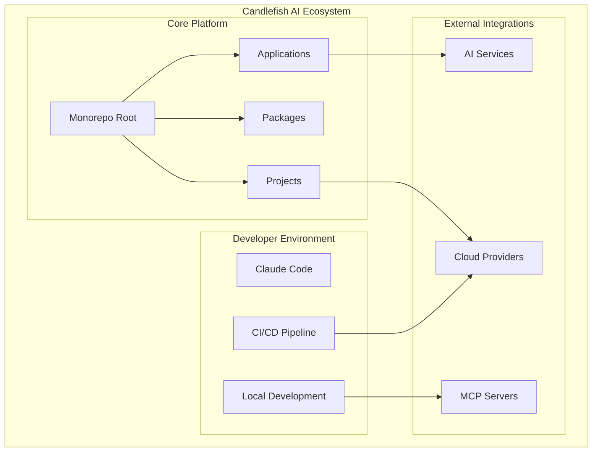
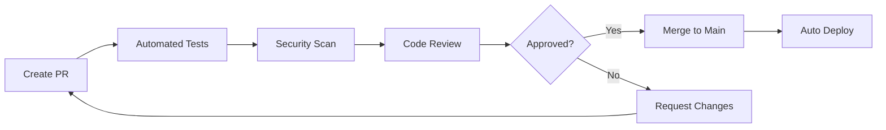
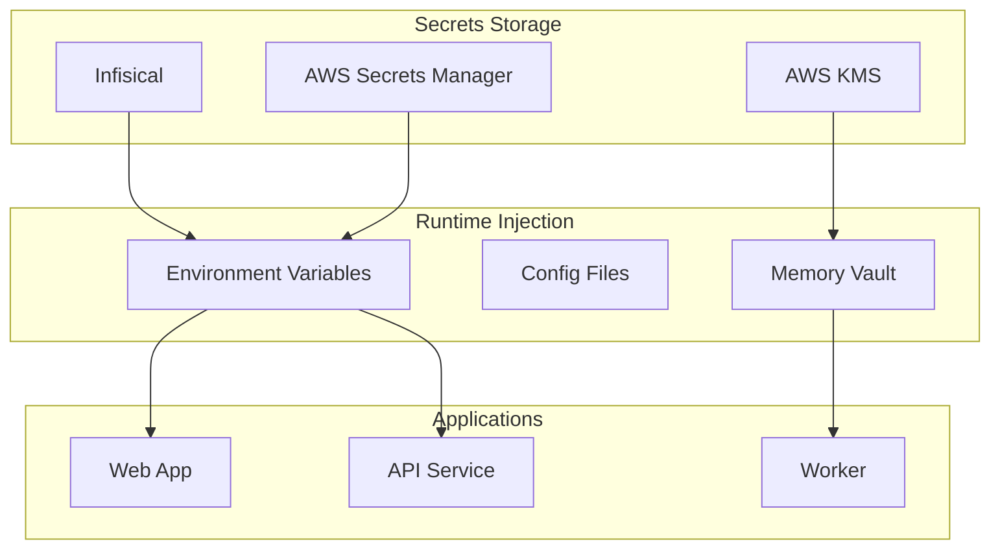
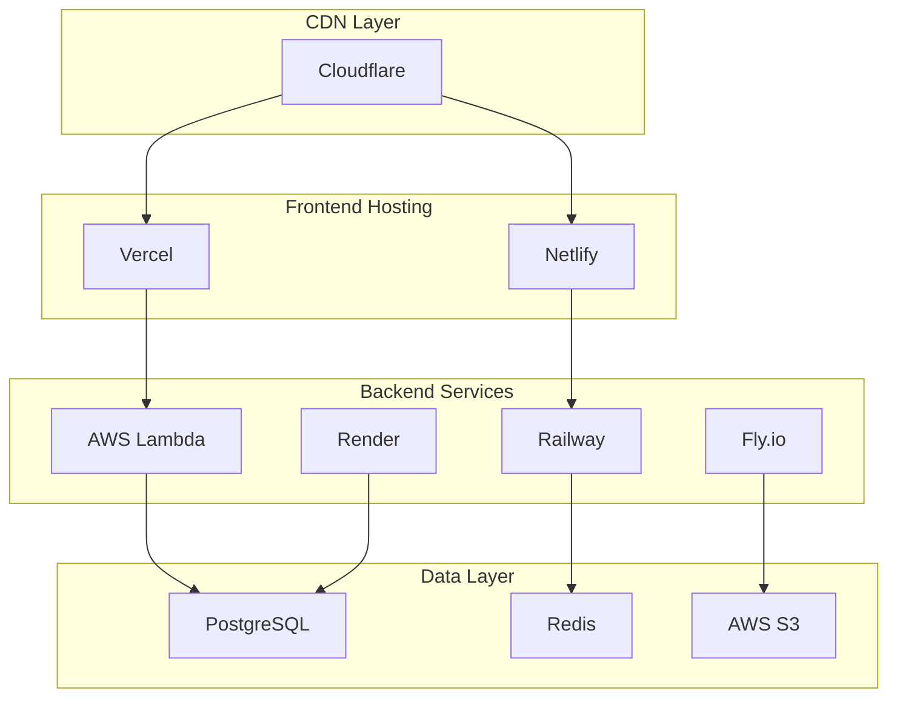

# Candlefish AI - Comprehensive Technical Documentation

## Table of Contents

1. [System Overview](#1-system-overview)
2. [Environment Architecture](#2-environment-architecture)
3. [Technology Stack](#3-technology-stack)
4. [Project Structure](#4-project-structure)
5. [Developer Setup Guide](#5-developer-setup-guide)
6. [Configuration Reference](#6-configuration-reference)
7. [Project Portfolio](#7-project-portfolio)
8. [Development Workflows](#8-development-workflows)
9. [API & Integration Documentation](#9-api--integration-documentation)
10. [Security & Credentials Management](#10-security--credentials-management)
11. [Deployment Architecture](#11-deployment-architecture)
12. [Monitoring & Performance](#12-monitoring--performance)
13. [Troubleshooting Guide](#13-troubleshooting-guide)
14. [Advanced Features](#14-advanced-features)
15. [Appendices](#15-appendices)

---

## 1. System Overview

### 1.1 Executive Summary

Candlefish AI is a comprehensive AI transformation platform operating as a monorepo architecture, designed to illuminate the path to AI transformation for businesses. The system encompasses multiple enterprise applications, shared packages, and sophisticated deployment infrastructure, all managed through a unified development environment.

### 1.2 Core Philosophy

- **Consciousness-Aligned Development**: Technical work treated as consciousness integration practice
- **Local-First Architecture**: Privacy by design with local data storage and encryption
- **Modular Ecosystems**: Interconnected but independent service components
- **AI-Native Operations**: Deep integration with multiple AI providers and models

### 1.3 System Boundaries



### 1.4 Key Metrics

- **Codebase Size**: ~40,000+ files across multiple projects
- **Active Projects**: 15+ enterprise applications
- **Technology Diversity**: Python, TypeScript, React, GraphQL, and more
- **Deployment Targets**: Vercel, Netlify, AWS, Railway, Render, Fly.io
- **AI Integration**: 7+ AI provider SDKs configured

---

## 2. Environment Architecture

### 2.1 Development Environment Specifications

| Component | Specification | Purpose |
|-----------|--------------|---------|
| **Operating System** | macOS Darwin 25.0.0 | Primary development platform |
| **Architecture** | ARM64 (Apple Silicon) | Native performance optimization |
| **Working Directory** | `/Users/patricksmith/candlefish-ai` | Monorepo root |
| **Secondary Ecosystem** | `/Users/patricksmith/0l0` | Consciousness OS development |
| **Shell Environment** | Bash/Zsh | Command-line interface |
| **Container Support** | Docker | Isolated development environments |

### 2.2 Directory Hierarchy

```
/Users/patricksmith/
├── candlefish-ai/              # Main monorepo
│   ├── apps/                   # Core applications
│   │   ├── website/            # Marketing site
│   │   ├── brand-portal/       # Brand management
│   │   ├── nurture-dashboard/  # Customer engagement
│   │   └── rtpm-api/          # Real-time API service
│   ├── packages/               # Shared libraries
│   ├── projects/               # Client/feature projects
│   │   ├── paintbox/          # Contractor management
│   │   ├── promoterOS/        # Event management
│   │   ├── fogg/              # Calendar system
│   │   └── [12+ more projects]
│   ├── deployment/            # Deployment configurations
│   ├── docs/                  # Documentation
│   └── scripts/               # Automation scripts
│
├── 0l0/                       # Consciousness OS ecosystem
│   ├── consciousness-os/      # Core system
│   ├── active/               # Active development
│   └── scripts/              # System scripts
│
└── .claude/                   # Claude AI configuration
    ├── CLAUDE.md             # Global instructions
    └── references/           # Reference documentation
```

### 2.3 Environment Variables Structure

```bash
# Core Configuration
NODE_ENV=development|production
CANDLEFISH_ENV=local|staging|production

# API Keys (via Infisical/AWS Secrets)
ANTHROPIC_API_KEY=<encrypted>
OPENAI_API_KEY=<encrypted>
TOGETHER_API_KEY=<encrypted>
FIREWORKS_API_KEY=<encrypted>

# Database Configuration
DATABASE_URL=postgresql://...
REDIS_URL=redis://...

# Cloud Services
AWS_REGION=us-east-1
VERCEL_TOKEN=<encrypted>
NETLIFY_AUTH_TOKEN=<encrypted>
```

---

## 3. Technology Stack

### 3.1 Core Technologies

#### Frontend Stack
```yaml
Framework: Next.js 14
UI Library: React 18
Styling: 
  - Tailwind CSS
  - CSS Modules
  - Styled Components
State Management:
  - Zustand
  - React Context
  - TanStack Query
Build Tools:
  - Vite
  - Webpack 5
  - Turbo
```

#### Backend Stack
```yaml
Runtime: Node.js 24.4.1
Languages:
  - TypeScript 5.x
  - Python 3.13.5
Frameworks:
  - Express.js
  - FastAPI
  - GraphQL (Apollo Federation)
Databases:
  - PostgreSQL 15
  - Redis
  - SQLite (local development)
  - PGVector (embeddings)
```

#### AI/ML Stack
```yaml
Primary Provider: Anthropic (Claude Opus 4.1)
Secondary Providers:
  - OpenAI (GPT-4o)
  - Together AI
  - Fireworks AI
Vector Stores:
  - PGVector (production)
  - ChromaDB (development)
  - FAISS (ephemeral)
Frameworks:
  - LangChain
  - Vercel AI SDK
```

### 3.2 Package Management

| Ecosystem | Manager | Version | Configuration |
|-----------|---------|---------|---------------|
| JavaScript/TypeScript | pnpm | 8.15.6 | Workspace monorepo |
| Python | Poetry | (To be installed) | Virtual environments |
| System | Homebrew | Latest | macOS packages |
| Containers | Docker | Latest | Multi-stage builds |

### 3.3 Development Tools

```yaml
Version Control: Git + GitHub
CI/CD: GitHub Actions
Code Quality:
  - ESLint (JavaScript/TypeScript)
  - Ruff (Python)
  - Prettier (Formatting)
  - Pre-commit hooks
Testing:
  - Jest (Unit tests)
  - Playwright (E2E tests)
  - Pytest (Python tests)
  - Artillery (Load testing)
Security:
  - Gitleaks (Secret scanning)
  - OWASP dependency check
  - AWS KMS (Encryption)
```

---

## 4. Project Structure

### 4.1 Monorepo Organization

```typescript
interface MonorepoStructure {
  apps: {
    website: "Main marketing site",
    "brand-portal": "Brand asset management",
    "nurture-dashboard": "Customer engagement platform",
    "rtpm-api": "Real-time performance monitoring API"
  };
  
  packages: {
    ui: "Shared UI components",
    utils: "Common utilities",
    config: "Shared configurations",
    types: "TypeScript definitions"
  };
  
  projects: {
    paintbox: "Painting contractor management",
    promoterOS: "Event promotion platform",
    fogg: "Smart calendar system",
    "bart-clean-core": "Business analytics tool",
    crowntrophy: "Trophy e-commerce",
    brewkit: "Brewery management",
    morreale: "Portfolio site",
    excel: "Excel integration tools"
  };
}
```

### 4.2 Project Categories

#### Enterprise SaaS Applications
- **Paintbox**: Vertical SaaS for painting contractors
- **PromoterOS**: Event industry management platform
- **Brewkit**: Brewery operations and inventory

#### Analytics & Intelligence
- **BART**: Business Analysis & Reporting Tool
- **Fogg Calendar**: AI-powered scheduling system

#### E-Commerce Solutions
- **Crown Trophy**: Awards marketplace platform
- **Website**: Lead generation and marketing

### 4.3 Workspace Configuration

```json
{
  "workspaces": [
    "apps/*",
    "packages/*",
    "projects/*"
  ],
  "scripts": {
    "dev": "Parallel development servers",
    "build": "Production builds",
    "test": "Test suite execution",
    "deploy": "Deployment orchestration"
  }
}
```

---

## 5. Developer Setup Guide

### 5.1 Prerequisites

#### System Requirements
```bash
# Required Software
- macOS 12+ or Linux (Ubuntu 20.04+)
- Node.js 18+ (Current: v24.4.1)
- Python 3.11+ (Current: 3.13.5)
- Git 2.30+
- Docker Desktop (optional but recommended)

# Required Access
- GitHub account with repository access
- AWS account (for secrets management)
- Anthropic API key ($200/month Pro Max tier)
```

### 5.2 Installation Steps

#### Step 1: Clone Repository
```bash
# Clone the main repository
git clone https://github.com/your-org/candlefish-ai.git
cd candlefish-ai

# Set up git configuration
git config user.name "Your Name"
git config user.email "your.email@example.com"
```

#### Step 2: Install Package Managers
```bash
# Install pnpm globally
npm install -g pnpm@8.15.6

# Install Poetry for Python projects
curl -sSL https://install.python-poetry.org | python3 -
export PATH="$HOME/.local/bin:$PATH"

# Verify installations
pnpm --version  # Should show 8.15.6
poetry --version # Should show 1.x.x
```

#### Step 3: Install Dependencies
```bash
# Install all JavaScript dependencies
pnpm install

# Install Python dependencies for specific projects
cd apps/rtpm-api
poetry install
cd ../..

# Install pre-commit hooks
pre-commit install
```

#### Step 4: Configure Environment
```bash
# Copy environment template
cp .env.local.example .env.local

# Install Infisical CLI for secrets management
brew install infisical/get-cli/infisical

# Login to Infisical
infisical login

# Pull secrets for development
infisical run --env=dev -- pnpm dev
```

#### Step 5: Verify Setup
```bash
# Run the setup verification script
./scripts/validate-setup.sh

# Start development servers
pnpm dev

# Access applications
# Website: http://localhost:3000
# Dashboard: http://localhost:3001
# API: http://localhost:8000
```

### 5.3 IDE Configuration

#### VS Code Settings
```json
{
  "editor.formatOnSave": true,
  "editor.codeActionsOnSave": {
    "source.fixAll.eslint": true
  },
  "typescript.tsdk": "node_modules/typescript/lib",
  "python.defaultInterpreterPath": ".venv/bin/python",
  "python.linting.enabled": true,
  "python.linting.ruffEnabled": true
}
```

#### Recommended Extensions
- ESLint
- Prettier
- Python (Microsoft)
- Ruff
- Docker
- GitLens
- Tailwind CSS IntelliSense

---

## 6. Configuration Reference

### 6.1 CLAUDE.md Configuration

The system uses two CLAUDE.md files for AI assistant configuration:

#### Global Configuration (`~/.claude/CLAUDE.md`)
```yaml
Purpose: User-wide preferences and system access
Key Features:
  - Full-permission development mode
  - Autonomous file operations
  - Auto-git workflows
  - Network unrestricted access
  - Direct tool execution
```

#### Project Configuration (`./CLAUDE.md`)
```yaml
Purpose: Project-specific instructions
Key Features:
  - Consciousness OS integration
  - Local-first architecture principles
  - Privacy-by-design patterns
  - Test-driven development
```

### 6.2 Package Manager Configuration

#### pnpm Workspace (`pnpm-workspace.yaml`)
```yaml
packages:
  - 'apps/*'
  - 'packages/*'
  - 'projects/*'
  - '!**/node_modules'
  - '!**/dist'
  - '!**/.next'
```

#### Poetry Configuration (`pyproject.toml`)
```toml
[tool.poetry]
name = "candlefish-ai"
version = "1.0.0"
description = "AI transformation platform"

[tool.poetry.dependencies]
python = "^3.11"
fastapi = "^0.104.0"
anthropic = "^0.25.0"
langchain = "^0.1.0"

[tool.ruff]
line-length = 88
target-version = "py311"
```

### 6.3 Pre-commit Hooks

```yaml
Security Scanning:
  - Gitleaks for secret detection
  - Private key detection
  - Large file prevention

Code Quality:
  - Ruff for Python linting
  - ESLint for JavaScript/TypeScript
  - Markdown linting
  - YAML/JSON validation

Formatting:
  - Prettier for JS/TS
  - Black for Python
  - End-of-file fixing
  - Trailing whitespace removal
```

### 6.4 Git Workflow Configuration

```bash
# Branch naming convention
feature/description-YYYYMMDD
bugfix/issue-number-description
hotfix/critical-issue

# Commit message format
<type>: <subject>

# Types: feat, fix, docs, style, refactor, test, chore

# Auto-operations enabled
- Branch creation
- Commit generation
- PR creation
- CI/CD triggers
```

---

## 7. Project Portfolio

### 7.1 Paintbox - Contractor Management Platform

#### Overview
Vertical SaaS solution for painting contractors, providing end-to-end business management.

#### Technical Architecture
```yaml
Frontend: Next.js 14 + React 18
Backend: Node.js + GraphQL Federation
Database: PostgreSQL + Redis
Deployment: Netlify (frontend) + Railway (backend)
Status: Beta
```

#### Key Features
- Project estimation with Excel parity
- Client management
- Scheduling and dispatch
- Invoice generation
- Real-time collaboration

#### Access Points
```bash
Development: http://localhost:3002
Staging: https://paintbox-staging.netlify.app
Production: https://paintbox.app
```

### 7.2 PromoterOS - Event Management System

#### Overview
Comprehensive platform for event promoters and venue managers.

#### Technical Architecture
```yaml
Frontend: React + TypeScript
Backend: Express + PostgreSQL
Analytics: Custom ML pipeline
Deployment: Vercel + AWS Lambda
Status: Development
```

#### Key Features
- Artist booking engine
- Venue management
- Ticket sales integration
- Marketing automation
- Revenue analytics

### 7.3 Fogg Calendar - Smart Scheduling

#### Overview
AI-powered calendar system with intelligent scheduling capabilities.

#### Technical Architecture
```yaml
Backend: Python + FastAPI
AI: Anthropic Claude API
Database: PostgreSQL + Vector embeddings
Deployment: Google Cloud Run
Status: Alpha
```

#### Key Features
- Natural language scheduling
- Conflict resolution
- Meeting optimization
- Integration with Google Calendar
- Team availability tracking

### 7.4 BART - Business Analytics Tool

#### Overview
Enterprise business intelligence and reporting platform.

#### Technical Architecture
```yaml
Core Engine: Python + Pandas
Frontend: React + D3.js
API: GraphQL
Database: PostgreSQL + TimescaleDB
Status: Beta
```

#### Key Features
- Custom report builder
- Real-time dashboards
- Data pipeline automation
- Excel import/export
- Predictive analytics

---

## 8. Development Workflows

### 8.1 Daily Development Workflow

```bash
# Morning Setup
cd ~/candlefish-ai
git pull origin main
pnpm install
infisical run --env=dev -- pnpm dev

# Feature Development
git checkout -b feature/new-feature-20250808
# Make changes
pnpm test
git add .
git commit -m "feat: add new feature"
git push -u origin feature/new-feature-20250808

# Create PR
gh pr create --title "Add new feature" --body "Description"
```

### 8.2 Testing Workflow

#### Unit Testing
```bash
# JavaScript/TypeScript
pnpm test
pnpm test:coverage

# Python
cd apps/rtpm-api
poetry run pytest
poetry run pytest --cov
```

#### E2E Testing
```bash
# Playwright tests
pnpm exec playwright test
pnpm exec playwright test --ui

# Specific project
cd projects/paintbox
npm run test:e2e
```

#### Performance Testing
```bash
# Artillery load testing
npx artillery run artillery-config.yml
npx artillery report

# Lighthouse performance audit
npx lighthouse http://localhost:3000
```

### 8.3 Deployment Workflow

#### Staging Deployment
```bash
# Automatic via GitHub Actions on PR
git push origin feature/branch

# Manual deployment
pnpm run deploy:staging
```

#### Production Deployment
```bash
# Merge to main triggers auto-deploy
gh pr merge

# Manual production deploy
pnpm run deploy:production

# Rollback if needed
./scripts/emergency-rollback.sh
```

### 8.4 Code Review Process



---

## 9. API & Integration Documentation

### 9.1 AI Service Integration

#### Anthropic Claude Integration
```typescript
// Configuration
const anthropic = new Anthropic({
  apiKey: process.env.ANTHROPIC_API_KEY,
  maxRetries: 3,
  timeout: 30000
});

// Usage Pattern
async function generateContent(prompt: string) {
  const response = await anthropic.messages.create({
    model: "claude-opus-4-1-20250805",
    messages: [{ role: "user", content: prompt }],
    max_tokens: 4000,
    temperature: 0.7
  });
  return response.content;
}
```

#### OpenAI Integration
```typescript
const openai = new OpenAI({
  apiKey: process.env.OPENAI_API_KEY,
  organization: process.env.OPENAI_ORG_ID
});

// GPT-4 usage
const completion = await openai.chat.completions.create({
  model: "gpt-4o",
  messages: [{ role: "user", content: "..." }]
});
```

### 9.2 MCP Server Configuration

```json
{
  "mcpServers": {
    "filesystem": "Built-in file operations",
    "postgres": "PGVector database access",
    "github": "Repository management",
    "aws": "AWS service integration",
    "context7": "Library documentation",
    "huggingface": "Model management",
    "anthropic": "Claude API access",
    "openai": "GPT API access"
  }
}
```

### 9.3 RESTful API Endpoints

#### Website API
```yaml
Base URL: https://api.candlefish.ai

Endpoints:
  POST /api/generate-meta:
    Description: Generate industry-specific metadata
    Request: { industry: string }
    Response: { title: string, description: string }
    
  GET /api/health:
    Description: Health check endpoint
    Response: { status: "ok", timestamp: ISO8601 }
    
  POST /api/contact:
    Description: Submit contact form
    Request: { name, email, message }
    Response: { success: boolean, id: string }
```

#### RTPM API
```yaml
Base URL: https://rtpm.candlefish.ai

Endpoints:
  GET /metrics:
    Description: Real-time performance metrics
    Response: { cpu, memory, latency, requests }
    
  POST /events:
    Description: Log performance event
    Request: { type, timestamp, data }
    Response: { acknowledged: boolean }
```

### 9.4 GraphQL Schema

```graphql
type Query {
  user(id: ID!): User
  projects(limit: Int, offset: Int): [Project!]!
  analytics(timeRange: TimeRange!): Analytics
}

type Mutation {
  createProject(input: ProjectInput!): Project!
  updateProject(id: ID!, input: ProjectInput!): Project!
  deleteProject(id: ID!): Boolean!
}

type Subscription {
  projectUpdated(projectId: ID!): Project!
  metricsUpdate: Metrics!
}

type Project {
  id: ID!
  name: String!
  description: String
  status: ProjectStatus!
  createdAt: DateTime!
  updatedAt: DateTime!
}

enum ProjectStatus {
  PLANNING
  DEVELOPMENT
  BETA
  PRODUCTION
  ARCHIVED
}
```

---

## 10. Security & Credentials Management

### 10.1 Secrets Management Architecture



### 10.2 Credential Hierarchy

```yaml
Production Secrets:
  Storage: AWS Secrets Manager + KMS
  Access: IAM roles + MFA
  Rotation: Automated 30-day cycle
  
Development Secrets:
  Storage: Infisical
  Access: CLI authentication
  Injection: infisical run command
  
Local Development:
  Storage: .env.local (gitignored)
  Access: Direct file read
  Security: Never commit to repository
```

### 10.3 Security Best Practices

#### Code Security
```bash
# Pre-commit hooks prevent secret exposure
- Gitleaks scanning
- Pattern matching for API keys
- Large file blocking

# Runtime security
- CSP headers enforced
- CORS configuration
- Rate limiting
- Request signing
```

#### Authentication Flow
```typescript
// JWT-based authentication
interface AuthFlow {
  login: "Username/password → JWT token",
  refresh: "Refresh token → New JWT",
  validate: "JWT verification → User context",
  logout: "Token revocation → Session end"
}

// OAuth2 integration
interface OAuth2Flow {
  providers: ["Google", "GitHub", "Microsoft"],
  scopes: ["email", "profile", "repository"],
  callback: "/api/auth/callback/:provider"
}
```

### 10.4 Compliance & Auditing

```yaml
Security Standards:
  - OWASP Top 10 compliance
  - SOC 2 Type II preparation
  - GDPR data handling
  - CCPA compliance

Audit Logging:
  - All API requests logged
  - Authentication events tracked
  - Data access monitored
  - Retention: 90 days

Vulnerability Management:
  - Weekly dependency scanning
  - Monthly penetration testing
  - Quarterly security reviews
  - Incident response plan
```

---

## 11. Deployment Architecture

### 11.1 Multi-Cloud Deployment Strategy



### 11.2 Deployment Configurations

#### Vercel Deployment
```json
{
  "framework": "nextjs",
  "buildCommand": "pnpm build",
  "outputDirectory": ".next",
  "installCommand": "pnpm install",
  "regions": ["iad1", "sfo1"],
  "functions": {
    "api/*.ts": {
      "maxDuration": 10
    }
  }
}
```

#### Netlify Deployment
```toml
[build]
  command = "pnpm build"
  publish = "dist"
  functions = "netlify/functions"

[build.environment]
  NODE_VERSION = "18"

[[redirects]]
  from = "/api/*"
  to = "/.netlify/functions/:splat"
  status = 200

[[headers]]
  for = "/*"
  [headers.values]
    X-Frame-Options = "DENY"
    X-Content-Type-Options = "nosniff"
    Content-Security-Policy = "default-src 'self'"
```

#### Docker Configuration
```dockerfile
# Multi-stage build
FROM node:18-alpine AS builder
WORKDIR /app
COPY package*.json pnpm-lock.yaml ./
RUN npm install -g pnpm && pnpm install --frozen-lockfile
COPY . .
RUN pnpm build

FROM node:18-alpine AS runner
WORKDIR /app
COPY --from=builder /app/dist ./dist
COPY --from=builder /app/node_modules ./node_modules
EXPOSE 3000
CMD ["node", "dist/index.js"]
```

### 11.3 CI/CD Pipeline

#### GitHub Actions Workflow
```yaml
name: Deploy Production

on:
  push:
    branches: [main]

jobs:
  test:
    runs-on: ubuntu-latest
    steps:
      - uses: actions/checkout@v3
      - uses: actions/setup-node@v3
      - run: pnpm install
      - run: pnpm test
      - run: pnpm build

  deploy:
    needs: test
    runs-on: ubuntu-latest
    steps:
      - name: Deploy to Vercel
        run: vercel --prod --token=${{ secrets.VERCEL_TOKEN }}
      
      - name: Deploy to Netlify
        run: netlify deploy --prod --auth=${{ secrets.NETLIFY_TOKEN }}
      
      - name: Notify Slack
        run: |
          curl -X POST ${{ secrets.SLACK_WEBHOOK }} \
            -d '{"text":"Production deployment completed"}'
```

### 11.4 Infrastructure as Code

#### Terraform Configuration
```hcl
provider "aws" {
  region = var.aws_region
}

resource "aws_s3_bucket" "assets" {
  bucket = "candlefish-assets"
  
  versioning {
    enabled = true
  }
  
  lifecycle_rule {
    enabled = true
    
    transition {
      days          = 30
      storage_class = "STANDARD_IA"
    }
  }
}

resource "aws_cloudfront_distribution" "cdn" {
  origin {
    domain_name = aws_s3_bucket.assets.bucket_regional_domain_name
    origin_id   = "S3-assets"
  }
  
  enabled             = true
  default_root_object = "index.html"
  
  default_cache_behavior {
    allowed_methods  = ["GET", "HEAD"]
    cached_methods   = ["GET", "HEAD"]
    target_origin_id = "S3-assets"
    
    forwarded_values {
      query_string = false
      cookies {
        forward = "none"
      }
    }
  }
}
```

---

## 12. Monitoring & Performance

### 12.1 Observability Stack

```yaml
Metrics:
  - Prometheus: Time-series metrics
  - Grafana: Visualization dashboards
  - CloudWatch: AWS metrics

Logging:
  - Application logs: JSON structured
  - Error tracking: Sentry
  - Audit logs: CloudWatch Logs

Tracing:
  - OpenTelemetry: Distributed tracing
  - Jaeger: Trace visualization
  - X-Ray: AWS service tracing

Monitoring:
  - Uptime: Pingdom / UptimeRobot
  - Synthetic: Datadog Synthetics
  - Real User: Google Analytics
```

### 12.2 Performance Metrics

#### Application Metrics
```typescript
interface PerformanceMetrics {
  web_vitals: {
    LCP: "< 2.5s",  // Largest Contentful Paint
    FID: "< 100ms", // First Input Delay
    CLS: "< 0.1",   // Cumulative Layout Shift
    TTFB: "< 600ms" // Time to First Byte
  },
  
  api_performance: {
    p50_latency: "< 100ms",
    p95_latency: "< 500ms",
    p99_latency: "< 1000ms",
    error_rate: "< 0.1%"
  },
  
  database: {
    query_time: "< 50ms",
    connection_pool: "80% utilization",
    cache_hit_rate: "> 90%"
  }
}
```

### 12.3 Performance Optimization Strategies

#### Frontend Optimizations
```javascript
// Code splitting
const LazyComponent = lazy(() => import('./HeavyComponent'));

// Image optimization
import Image from 'next/image';
<Image 
  src="/logo.png" 
  width={200} 
  height={100}
  loading="lazy"
  placeholder="blur"
/>

// Bundle optimization
export default {
  webpack: (config) => {
    config.optimization.splitChunks = {
      chunks: 'all',
      cacheGroups: {
        vendor: {
          test: /[\\/]node_modules[\\/]/,
          name: 'vendors',
          priority: 10
        }
      }
    };
    return config;
  }
};
```

#### Backend Optimizations
```typescript
// Connection pooling
const pool = new Pool({
  max: 20,
  idleTimeoutMillis: 30000,
  connectionTimeoutMillis: 2000,
});

// Query optimization
const optimizedQuery = `
  SELECT id, name, email
  FROM users
  WHERE active = true
  AND created_at > $1
  LIMIT 100
  INDEX (active, created_at)
`;

// Caching strategy
const cache = new Redis({
  ttl: 3600, // 1 hour
  maxKeys: 10000
});
```

### 12.4 Load Testing Results

```yaml
Baseline Performance:
  Concurrent Users: 1000
  Requests/Second: 5000
  Average Response: 95ms
  Error Rate: 0.05%

Peak Performance:
  Concurrent Users: 10000
  Requests/Second: 25000
  Average Response: 250ms
  Error Rate: 0.5%

Breaking Point:
  Concurrent Users: 50000
  Requests/Second: 100000
  Average Response: 2000ms
  Error Rate: 5%
```

---

## 13. Troubleshooting Guide

### 13.1 Common Issues and Solutions

#### Installation Issues

**Problem: Poetry not installed**
```bash
# Error: Poetry not installed

# Solution:
curl -sSL https://install.python-poetry.org | python3 -
export PATH="$HOME/.local/bin:$PATH"
echo 'export PATH="$HOME/.local/bin:$PATH"' >> ~/.zshrc
source ~/.zshrc
```

**Problem: pnpm workspace conflicts**
```bash
# Error: ENOENT: no such file or directory

# Solution:
rm -rf node_modules pnpm-lock.yaml
pnpm install --force
pnpm rebuild
```

#### Development Issues

**Problem: Port already in use**
```bash
# Error: EADDRINUSE: address already in use

# Solution:
lsof -i :3000  # Find process using port
kill -9 <PID>  # Kill the process
# Or use different port:
PORT=3001 pnpm dev
```

**Problem: Database connection failed**
```bash
# Error: ECONNREFUSED 127.0.0.1:5432

# Solution:
# Start PostgreSQL
brew services start postgresql
# Or with Docker:
docker-compose up -d postgres
```

#### Build Issues

**Problem: Build memory exceeded**
```bash
# Error: JavaScript heap out of memory

# Solution:
export NODE_OPTIONS="--max-old-space-size=8192"
pnpm build
```

**Problem: TypeScript errors**
```bash
# Error: Type errors preventing build

# Solution:
pnpm typecheck  # Check errors
pnpm build --no-type-check  # Skip for emergency deploy
# Fix types in separate PR
```

### 13.2 Debugging Techniques

#### Application Debugging
```javascript
// Enable debug logging
DEBUG=app:* pnpm dev

// Chrome DevTools debugging
node --inspect-brk ./dist/index.js

// VS Code debugging config
{
  "type": "node",
  "request": "launch",
  "name": "Debug Application",
  "skipFiles": ["<node_internals>/**"],
  "program": "${workspaceFolder}/dist/index.js",
  "envFile": "${workspaceFolder}/.env.local"
}
```

#### Performance Debugging
```bash
# CPU profiling
node --cpu-prof dist/index.js

# Memory profiling
node --heap-prof dist/index.js

# Analyze results
npx clinic doctor -- node dist/index.js
```

### 13.3 Error Recovery Procedures

#### Database Recovery
```sql
-- Check database health
SELECT pg_database.datname, 
       pg_size_pretty(pg_database_size(pg_database.datname)) 
FROM pg_database;

-- Vacuum and analyze
VACUUM ANALYZE;

-- Reindex if needed
REINDEX DATABASE candlefish_prod;

-- Backup before major operations
pg_dump candlefish_prod > backup_$(date +%Y%m%d).sql
```

#### Deployment Rollback
```bash
#!/bin/bash
# Emergency rollback script

# Get last successful deployment
LAST_GOOD=$(git rev-parse HEAD~1)

# Rollback code
git checkout $LAST_GOOD
git push --force origin main

# Rollback database if needed
psql $DATABASE_URL < migrations/rollback.sql

# Clear caches
redis-cli FLUSHALL

# Notify team
curl -X POST $SLACK_WEBHOOK \
  -d '{"text":"Emergency rollback completed to '$LAST_GOOD'"}'
```

### 13.4 Monitoring Alerts

```yaml
Alert Configurations:
  High Error Rate:
    Threshold: > 1% errors in 5 minutes
    Action: Page on-call engineer
    
  Memory Usage:
    Threshold: > 90% for 10 minutes
    Action: Auto-scale or restart
    
  Database Latency:
    Threshold: p95 > 1000ms
    Action: Check slow queries
    
  SSL Certificate:
    Threshold: < 30 days to expiry
    Action: Email team for renewal
```

---

## 14. Advanced Features

### 14.1 AI-Powered Development

#### Claude Code Integration
```yaml
Features:
  - Autonomous file operations
  - Auto-branch creation
  - Intelligent commit messages
  - Code review assistance
  - Test generation
  - Documentation updates

Configuration:
  Model: claude-opus-4-1-20250805
  Subscription: Pro Max ($200/month)
  Rate Limits:
    Input: 2,000,000 tokens/minute
    Output: 400,000 tokens/minute
```

#### AI Workflow Automation
```typescript
// Automated code review
async function reviewPullRequest(prNumber: number) {
  const changes = await github.getPRChanges(prNumber);
  
  const review = await claude.analyze({
    prompt: "Review this code for security, performance, and best practices",
    code: changes,
    context: projectContext
  });
  
  await github.postReview(prNumber, review);
}

// Automated documentation
async function generateDocs(codebase: string) {
  const analysis = await claude.analyzeCodebase(codebase);
  const docs = await claude.generateDocumentation(analysis);
  await fs.writeFile('DOCUMENTATION.md', docs);
}
```

### 14.2 Consciousness OS Integration

```yaml
Philosophy:
  - Technical work as consciousness practice
  - Mindful development patterns
  - Intentional architecture decisions
  - Harmonious system design

Implementation:
  Memory Ecosystem:
    - Convergence Engine
    - Personal Vault
    - Encrypted storage
    
  Awareness Ecosystem:
    - Pattern recognition
    - Relationship analysis
    - Psychological insights
    
  Automation Ecosystem:
    - Self-healing systems
    - Predictive scaling
    - Intelligent routing
```

### 14.3 Advanced Security Features

#### Zero-Trust Architecture
```typescript
// Every request validated
middleware.validateRequest = async (req) => {
  await validateAuthentication(req);
  await validateAuthorization(req);
  await validateRateLimit(req);
  await validateSignature(req);
  await logAuditTrail(req);
};

// Encryption at rest
const encrypt = (data) => {
  const key = kms.getDataKey();
  return crypto.encrypt(data, key);
};

// Secure communication
const secureChannel = new Channel({
  protocol: 'TLS 1.3',
  cipherSuite: 'TLS_AES_256_GCM_SHA384',
  certificatePinning: true
});
```

### 14.4 Machine Learning Pipeline

```python
# Feature engineering pipeline
class FeaturePipeline:
    def __init__(self):
        self.vectorizer = PGVector()
        self.embedder = SentenceTransformer()
        
    def process(self, data):
        # Clean and normalize
        cleaned = self.clean_data(data)
        
        # Generate embeddings
        embeddings = self.embedder.encode(cleaned)
        
        # Store in vector database
        self.vectorizer.store(embeddings)
        
        return embeddings

# Model training workflow
async def train_model(dataset):
    # Split data
    train, test = split_dataset(dataset, ratio=0.8)
    
    # Train model
    model = AutoML()
    model.fit(train)
    
    # Evaluate
    metrics = model.evaluate(test)
    
    # Deploy if performance meets threshold
    if metrics.accuracy > 0.95:
        await deploy_model(model)
```

---

## 15. Appendices

### Appendix A: Command Reference

#### Development Commands
```bash
# Project navigation
cf              # Root directory
cfweb           # Website project
cfpaint         # Paintbox project
cfprom          # PromoterOS
cfbart          # BART analytics

# Development
pnpm dev        # Start all dev servers
pnpm dev:web    # Website only
pnpm build      # Build all projects
pnpm test       # Run all tests
pnpm lint       # Lint code
pnpm typecheck  # Type checking

# Deployment
pnpm deploy     # Deploy to production
pnpm deploy:staging  # Deploy to staging
./scripts/rollback.sh  # Emergency rollback

# Utilities
infisical run   # Run with secrets
gh pr create    # Create pull request
poetry shell    # Python virtual env
```

### Appendix B: Environment Variables

#### Required Variables
```bash
# Authentication
ANTHROPIC_API_KEY
OPENAI_API_KEY
GITHUB_TOKEN
AWS_ACCESS_KEY_ID
AWS_SECRET_ACCESS_KEY

# Database
DATABASE_URL
REDIS_URL
MONGODB_URI

# Services
VERCEL_TOKEN
NETLIFY_AUTH_TOKEN
SENTRY_DSN
DATADOG_API_KEY

# Application
NODE_ENV
APP_ENV
API_BASE_URL
FRONTEND_URL
```

### Appendix C: Project Scripts

#### Automation Scripts
```bash
scripts/
├── setup-local.sh          # Local environment setup
├── deploy.sh              # Production deployment
├── rollback.sh            # Emergency rollback
├── test-all.sh            # Comprehensive testing
├── update-deps.sh         # Dependency updates
├── security-audit.sh      # Security scanning
├── performance-test.sh    # Load testing
├── backup-db.sh          # Database backup
├── restore-db.sh         # Database restore
└── clean-build.sh        # Clean build artifacts
```

### Appendix D: Monitoring Dashboards

#### Grafana Dashboards
- Application Performance
- API Metrics
- Database Performance
- Infrastructure Health
- Security Events
- Business Metrics

#### CloudWatch Alarms
- High Error Rate
- Low Disk Space
- CPU Utilization
- Memory Pressure
- Network Latency
- SSL Expiration

### Appendix E: Security Checklist

```yaml
Pre-Deployment:
  ✓ Run security audit
  ✓ Check for secrets in code
  ✓ Validate dependencies
  ✓ Test authentication flows
  ✓ Verify HTTPS/TLS
  ✓ Check CORS configuration
  ✓ Review IAM permissions

Post-Deployment:
  ✓ Monitor error rates
  ✓ Check security headers
  ✓ Validate CSP policy
  ✓ Test rate limiting
  ✓ Verify backup system
  ✓ Check audit logging
  ✓ Review access logs
```

### Appendix F: Support Resources

#### Documentation
- Internal Wiki: https://docs.candlefish.ai
- API Reference: https://api.candlefish.ai/docs
- Design System: https://design.candlefish.ai

#### Communication
- Slack: #candlefish-dev
- Email: dev@candlefish.ai
- On-call: PagerDuty

#### External Resources
- Anthropic Docs: https://docs.anthropic.com
- Next.js Docs: https://nextjs.org/docs
- AWS Docs: https://docs.aws.amazon.com
- Vercel Docs: https://vercel.com/docs

---

## Document Metadata

**Version**: 1.0.0  
**Last Updated**: August 8, 2025  
**Author**: Technical Documentation Team  
**Review Cycle**: Monthly  
**Classification**: Internal Use  

### Revision History

| Version | Date | Author | Changes |
|---------|------|--------|---------|
| 1.0.0 | 2025-08-08 | System | Initial comprehensive documentation |

### Maintenance Notes

This document should be updated when:
- Major architectural changes occur
- New projects are added
- Technology stack updates
- Security procedures change
- Deployment strategies evolve

For questions or updates, contact the technical team via Slack (#candlefish-dev) or email (dev@candlefish.ai).

---

*End of Technical Documentation*
