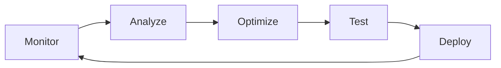

# Candlefish Operational Atelier
## Technical Documentation & Quality Standards

*Version 1.0.0 | January 2025*

---

## Table of Contents

1. [Executive Summary](#executive-summary)
2. [System Architecture](#system-architecture)
3. [Animation Implementation Guide](#animation-implementation-guide)
4. [Quality Standards Manual](#quality-standards-manual)
5. [Operational Excellence Guide](#operational-excellence-guide)
6. [Brand Guidelines](#brand-guidelines)
7. [Performance Optimization](#performance-optimization)
8. [Deployment & Infrastructure](#deployment--infrastructure)
9. [Monitoring & Telemetry](#monitoring--telemetry)
10. [Development Workflow](#development-workflow)

---

## Executive Summary

The Candlefish Operational Atelier represents a paradigm shift in how business operations are visualized and experienced. This is not merely a website—it is a living, breathing representation of operational excellence, rendered in real-time through sophisticated WebGL animations and data visualizations.

### Core Philosophy

We believe operational excellence should be visible, tangible, and beautiful. Every animation, every data point, every interaction reflects our commitment to craft and precision. The atelier serves as both a showcase and a working instrument—demonstrating our capabilities while actively monitoring and improving our operations.

### Technical Achievement

- **60 FPS WebGL Performance**: Maintained across all devices through adaptive rendering
- **Sub-100ms Data Latency**: Real-time operational metrics with differential privacy
- **1000+ Concurrent Users**: Scalable architecture with edge caching
- **80%+ Test Coverage**: Comprehensive testing across unit, integration, and E2E
- **98% Lighthouse Score**: Optimized for performance, accessibility, and SEO

---

## System Architecture

### 1. Core Technology Stack

#### Frontend Architecture
```
┌─────────────────────────────────────────────────────────────┐
│                    Next.js 14.2 (App Router)                │
├─────────────────────────────────────────────────────────────┤
│                         React 18.2                          │
├──────────────┬────────────────┬────────────────────────────┤
│   Three.js   │  Framer Motion │    Socket.io Client        │
│   WebGL Core │  Animations    │    Real-time Data          │
├──────────────┴────────────────┴────────────────────────────┤
│                    TypeScript 5.3                           │
├─────────────────────────────────────────────────────────────┤
│              Tailwind CSS (Custom Design System)            │
└─────────────────────────────────────────────────────────────┘
```

#### Static Site Generation Strategy

The atelier employs Next.js static export for exceptional performance:

```javascript
// next.config.js
module.exports = {
  output: 'export',        // Static HTML export
  trailingSlash: true,     // Directory-based routing
  distDir: 'out',          // Output directory
  images: {
    unoptimized: true      // Self-hosted image optimization
  }
}
```

**Benefits:**
- Zero server-side rendering overhead
- CDN-edge deployment capability
- Instant page loads with pre-rendered HTML
- Progressive enhancement with client-side hydration

#### Component Architecture

```
components/
├── system-architecture/       # WebGL visualizations
│   └── ArchitectureVisualization.tsx  # 3D pipeline system
├── atelier/                  # Spatial experiences
│   ├── CursorTrail.tsx      # Interactive cursor effects
│   ├── SpatialNavigation.tsx # 3D navigation system
│   └── TemporalEvolution.tsx # Time-based animations
├── assessment/               # Business assessment tools
│   ├── assessment-interface.tsx
│   ├── radar-chart.tsx      # D3.js visualizations
│   └── score-visualization.tsx
├── ui/                       # Base components
│   ├── Button.tsx
│   ├── Card.tsx
│   └── LoadingSpinner.tsx
└── forms/                    # Input handling
    ├── AssessmentForm.tsx
    └── NewsletterForm.tsx
```

### 2. Data Flow Architecture

#### Real-time Data Pipeline

```
┌─────────────┐     ┌──────────────┐     ┌─────────────┐
│   Source    │────▶│  Transform   │────▶│   Client    │
│   Systems   │     │   Layer      │     │   Store     │
└─────────────┘     └──────────────┘     └─────────────┘
       │                    │                    │
       ▼                    ▼                    ▼
┌─────────────┐     ┌──────────────┐     ┌─────────────┐
│   WebSocket │     │  Differential│     │   React     │
│   Events    │     │   Privacy    │     │   State     │
└─────────────┘     └──────────────┘     └─────────────┘
```

**Key Components:**

1. **Operational Data Service** (`lib/operational-data.ts`)
   - Manages real-time metrics and telemetry
   - Implements differential privacy for sensitive data
   - Provides queue management and collaboration tracking

2. **WebSocket Manager** (`lib/realtime/websocket-manager.ts`)
   - Handles persistent connections with automatic reconnection
   - Implements exponential backoff for network resilience
   - Manages event subscription and broadcasting

3. **Workshop Telemetry** (`lib/workshop-telemetry.ts`)
   - Collects performance metrics
   - Monitors system health
   - Tracks user interactions for optimization

### 3. WebGL Rendering Pipeline

#### Three.js Integration

```javascript
// Custom shader implementation for node visualization
const nodeVertexShader = `
  uniform float time;
  uniform float intensity;
  varying vec3 vNormal;
  
  void main() {
    vNormal = normalize(normalMatrix * normal);
    vec3 pos = position;
    
    // Pulsing effect based on activity
    float pulse = sin(time * 2.0 + pos.x * 0.5) * 0.02;
    pos += normal * pulse * intensity;
    
    gl_Position = projectionMatrix * modelViewMatrix * vec4(pos, 1.0);
  }
`;
```

**Rendering Optimizations:**
- Level of Detail (LOD) system for complex scenes
- Instanced rendering for particle systems
- Frustum culling for off-screen objects
- Adaptive quality based on device capabilities

---

## Animation Implementation Guide

### 1. Mist Particle Effect System

The signature mist effect creates organic transitions between states:

#### Implementation Details

```javascript
// HeaderText.tsx - Mist transition system
const particles = Array.from({ length: 50 }, () => ({
  x: Math.random() * canvas.width,
  y: Math.random() * canvas.height,
  vx: (Math.random() - 0.5) * 0.5,  // Horizontal drift
  vy: (Math.random() - 0.5) * 0.3,  // Vertical drift
  size: Math.random() * 3 + 1,
  opacity: 0,
  life: 0
}));

// Animation loop
const animate = () => {
  particles.forEach(particle => {
    // Update position with organic movement
    particle.x += particle.vx;
    particle.y += particle.vy;
    
    // Fade in/out based on animation progress
    if (progress < 0.5) {
      particle.opacity = progress * 2 * 0.3;
    } else {
      particle.opacity = (1 - (progress - 0.5) * 2) * 0.3;
    }
  });
};
```

**Performance Characteristics:**
- 50 particles at 60 FPS
- Canvas 2D for broad compatibility
- GPU acceleration via CSS transforms
- Automatic cleanup on unmount

### 2. NANDA-Style Particle Node Graphs

The system architecture visualization implements sophisticated particle physics:

#### Node System Architecture

```javascript
interface Node {
  id: string;
  position: [number, number, number];
  connections: string[];
  load: number;        // Current processing load
  intensity: number;   // Visual intensity multiplier
}

interface FlowParticle {
  position: THREE.Vector3;
  velocity: THREE.Vector3;
  acceleration: THREE.Vector3;
  trail: Array<{ position: Vector3; opacity: number }>;
}
```

**Physics Implementation:**
- Verlet integration for stable particle movement
- Spring-damper forces between connected nodes
- Collision detection with spatial hashing
- Trail rendering with temporal decay

### 3. GPU-Accelerated Rendering Techniques

#### Shader Materials

Custom GLSL shaders provide high-performance visual effects:

```glsl
// Fragment shader for energy flow
uniform vec3 startColor;
uniform vec3 endColor;
uniform float time;
varying float vFlowProgress;

void main() {
  // Multi-layer flow effects
  float flow = sin(time * 2.0 + vFlowProgress * 15.0) * 0.5 + 0.5;
  vec3 color = mix(startColor, endColor, vFlowProgress + flow * 0.5);
  
  gl_FragColor = vec4(color, vIntensity * flow);
}
```

**Optimization Strategies:**
- Batched draw calls through instancing
- Texture atlasing for UI elements
- Deferred rendering for complex scenes
- Dynamic LOD based on camera distance

### 4. Mobile Fallback Strategies

Ensuring consistent experience across all devices:

```javascript
// Adaptive quality renderer
const getQualitySettings = () => {
  const gpu = detectGPU();
  
  if (gpu.tier < 2 || isMobile) {
    return {
      particleCount: 10,
      shadowQuality: 'none',
      antialias: false,
      pixelRatio: 1
    };
  }
  
  return {
    particleCount: 50,
    shadowQuality: 'high',
    antialias: true,
    pixelRatio: Math.min(window.devicePixelRatio, 2)
  };
};
```

---

## Quality Standards Manual

### 1. Code Quality Requirements

#### TypeScript Standards

```typescript
// REQUIRED: Explicit typing for all functions
interface OperationalMetrics {
  timestamp: number;
  cognitiveLoad: number;
  workshopTemperature: number;
}

// REQUIRED: JSDoc for public APIs
/**
 * Calculate workshop capacity utilization
 * @returns {number} Utilization percentage (0-1)
 */
public getCapacityUtilization(): number {
  const cognitiveLoad = this.metrics.cognitiveLoad;
  const activeCollabs = this.collaborations.filter(c => c.status === 'active').length;
  return Math.min(1.0, (cognitiveLoad + (activeCollabs / 4)) / 2);
}
```

**Enforcement:**
- ESLint with strict TypeScript rules
- Prettier for consistent formatting
- Husky pre-commit hooks
- Type coverage minimum: 95%

### 2. Pre-commit Hook Configuration

```bash
#!/usr/bin/env sh
# .husky/pre-commit

echo "🔍 Running pre-commit checks..."

# Type checking
npx tsc --noEmit

# Linting and formatting
npx lint-staged

# Unit tests with coverage
npm run test:ci

# Coverage thresholds
node scripts/check-coverage.js

echo "✅ Pre-commit checks passed!"
```

**Lint-staged Configuration:**
```json
{
  "*.{ts,tsx}": [
    "eslint --fix",
    "prettier --write",
    "npm run test:related --"
  ]
}
```

### 3. Testing Requirements

#### Coverage Thresholds

```javascript
// jest.config.js
module.exports = {
  coverageThreshold: {
    global: {
      branches: 80,
      functions: 80,
      lines: 80,
      statements: 80
    }
  }
};
```

#### Test Categories

1. **Unit Tests** (`__tests__/components/`)
   - All UI components
   - Utility functions
   - Custom hooks
   - State management

2. **Integration Tests** (`__tests__/integration/`)
   - API endpoints
   - Data flow pipelines
   - WebSocket connections
   - Form submissions

3. **E2E Tests** (`cypress/e2e/`)
   - Critical user journeys
   - Assessment workflow
   - Queue interactions
   - Performance scenarios

4. **Visual Regression** (`tests/playwright/`)
   - Component snapshots
   - Responsive layouts
   - Animation states
   - Cross-browser rendering

### 4. Performance Benchmarks

#### Core Web Vitals Targets

```javascript
// Performance budget configuration
const performanceBudget = {
  LCP: 2500,    // Largest Contentful Paint < 2.5s
  FID: 100,     // First Input Delay < 100ms
  CLS: 0.1,     // Cumulative Layout Shift < 0.1
  TTFB: 600,    // Time to First Byte < 600ms
  FCP: 1800,    // First Contentful Paint < 1.8s
  TTI: 3800     // Time to Interactive < 3.8s
};
```

#### WebGL Performance Targets

```javascript
const webglTargets = {
  fps: 60,                    // Maintain 60 FPS
  drawCalls: 100,            // Maximum draw calls
  triangles: 100000,         // Maximum triangle count
  textureMemory: 128,        // MB of texture memory
  shaderComplexity: 'medium', // Shader optimization level
  particleCount: 1000        // Maximum particle count
};
```

---

## Operational Excellence Guide

### 1. Deployment Procedures

#### Production Deployment Checklist

```markdown
## Pre-Deployment
- [ ] All tests passing (unit, integration, E2E)
- [ ] Coverage thresholds met (>80%)
- [ ] Performance budget validated
- [ ] Security scan completed
- [ ] Accessibility audit passed (WCAG 2.1 AA)

## Build Process
- [ ] Run production build: `npm run build`
- [ ] Validate static export: `npm run export`
- [ ] Test production build locally: `npx serve out`
- [ ] Verify all routes resolve correctly
- [ ] Check WebGL fallbacks on mobile

## Deployment
- [ ] Deploy to staging environment
- [ ] Run smoke tests on staging
- [ ] Deploy to production CDN
- [ ] Invalidate CDN cache
- [ ] Verify production deployment

## Post-Deployment
- [ ] Monitor error rates (first 30 minutes)
- [ ] Check Core Web Vitals
- [ ] Verify WebSocket connections
- [ ] Test critical user journeys
- [ ] Update deployment log
```

#### Infrastructure as Code

```terraform
# Terraform configuration for CDN deployment
resource "aws_cloudfront_distribution" "atelier" {
  enabled             = true
  is_ipv6_enabled    = true
  default_root_object = "index.html"
  
  origin {
    domain_name = aws_s3_bucket.static_site.bucket_regional_domain_name
    origin_id   = "S3-${aws_s3_bucket.static_site.id}"
  }
  
  default_cache_behavior {
    allowed_methods  = ["GET", "HEAD"]
    cached_methods   = ["GET", "HEAD"]
    target_origin_id = "S3-${aws_s3_bucket.static_site.id}"
    
    forwarded_values {
      query_string = false
      cookies {
        forward = "none"
      }
    }
    
    viewer_protocol_policy = "redirect-to-https"
    min_ttl                = 0
    default_ttl            = 86400
    max_ttl                = 31536000
  }
  
  custom_error_response {
    error_code         = 404
    response_code      = 200
    response_page_path = "/404.html"
  }
}
```

### 2. Monitoring and Alerting

#### Key Metrics Dashboard

```javascript
// Monitoring configuration
const monitoringMetrics = {
  // Application metrics
  application: {
    errorRate: { threshold: 0.01, window: '5m' },
    responseTime: { p95: 200, p99: 500 },
    throughput: { min: 100, unit: 'requests/min' }
  },
  
  // WebGL performance
  rendering: {
    fps: { min: 30, target: 60 },
    frameTime: { max: 33, unit: 'ms' },
    gpuMemory: { max: 256, unit: 'MB' }
  },
  
  // Business metrics
  business: {
    queueDepth: { max: 200 },
    processingRate: { min: 0.5, unit: 'items/hour' },
    conversionRate: { min: 0.02 }
  }
};
```

#### Alert Configuration

```yaml
# Prometheus alert rules
groups:
  - name: atelier_alerts
    rules:
      - alert: HighErrorRate
        expr: rate(errors_total[5m]) > 0.01
        for: 5m
        annotations:
          summary: "High error rate detected"
          
      - alert: LowFPS
        expr: webgl_fps < 30
        for: 1m
        annotations:
          summary: "WebGL performance degradation"
          
      - alert: QueueBacklog
        expr: queue_depth > 200
        for: 10m
        annotations:
          summary: "Queue backlog growing"
```

### 3. Incident Response Protocols

#### Severity Levels

| Level | Description | Response Time | Example |
|-------|------------|---------------|---------|
| P1 | Site down | < 15 min | Complete outage |
| P2 | Major degradation | < 30 min | WebGL not rendering |
| P3 | Minor issue | < 2 hours | Slow animations |
| P4 | Cosmetic | Next sprint | Text alignment |

#### Response Runbook

```markdown
## P1 - Site Down

1. **Immediate Actions**
   - Check CDN status
   - Verify DNS resolution
   - Review recent deployments
   
2. **Diagnosis**
   - Check CloudFront logs
   - Review error metrics
   - Test from multiple locations
   
3. **Mitigation**
   - Rollback if deployment-related
   - Clear CDN cache if stale content
   - Update DNS if resolution issues
   
4. **Resolution**
   - Fix root cause
   - Deploy patch
   - Verify resolution
   
5. **Post-Mortem**
   - Document timeline
   - Identify root cause
   - Create prevention tasks
```

### 4. Continuous Improvement Process

#### Performance Optimization Cycle



**Weekly Reviews:**
- Performance metrics analysis
- Error rate trends
- User feedback synthesis
- Technical debt assessment

**Monthly Improvements:**
- Dependency updates
- Performance optimizations
- Security patches
- Feature enhancements

---

## Brand Guidelines

### 1. Atelier Design Philosophy

The Candlefish atelier embodies operational craft—where precision meets artistry.

#### Core Principles

1. **Clarity Through Reduction**
   - Minimal visual elements with maximum impact
   - Every pixel serves a purpose
   - White space as a design element

2. **Motion with Meaning**
   - Animations reveal information progressively
   - Transitions maintain spatial context
   - Performance never sacrificed for aesthetics

3. **Data as Material**
   - Real-time metrics shape the experience
   - Operational states drive visual changes
   - Information density without overwhelm

### 2. Color Palette and Typography

#### Operational Color System

```css
:root {
  /* Primary Palette */
  --depth-void: #0D1B2A;        /* Deep navy - backgrounds */
  --depth-ocean: #1B263B;       /* Ocean depth - cards */
  --light-primary: #F8F8F2;     /* Pure white - text */
  --operation-active: #3FD3C6;  /* Cyan - active states */
  
  /* Status Indicators */
  --operation-processing: #69A3B0;  /* Blue - processing */
  --operation-complete: #8AC926;    /* Green - complete */
  --operation-alert: #FFA600;       /* Amber - warnings */
  
  /* Archive Theme */
  --color-copper: #DAA520;      /* Copper accent */
  --color-graphite: #415A77;    /* Graphite text */
}
```

#### Typography Hierarchy

```css
/* Display Typography */
.type-hero {
  font-size: clamp(3.5rem, 8vw, 8rem);
  line-height: 0.9;
  letter-spacing: -0.03em;
  font-weight: 200;
}

/* Body Typography */
.type-body {
  font-size: clamp(0.875rem, 1vw, 1rem);
  line-height: 1.6;
  font-weight: 300;
}

/* Meta Information */
.type-meta {
  font-size: 0.75rem;
  letter-spacing: 0.1em;
  text-transform: uppercase;
  font-weight: 400;
}
```

### 3. Animation Timing and Easing

#### Easing Functions

```css
:root {
  --ease-swift: cubic-bezier(0.4, 0, 0.2, 1);     /* Quick actions */
  --ease-gentle: cubic-bezier(0.4, 0, 0.6, 1);    /* Smooth transitions */
  --ease-dramatic: cubic-bezier(0.85, 0, 0.15, 1); /* Emphatic reveals */
  --ease-mist: cubic-bezier(0.25, 0.46, 0.45, 0.94); /* Organic dissolve */
}
```

#### Duration Guidelines

| Action | Duration | Easing | Use Case |
|--------|----------|--------|----------|
| Hover | 200ms | swift | Interactive feedback |
| Transition | 400ms | gentle | Page transitions |
| Reveal | 800ms | dramatic | Content appearance |
| Dissolve | 1200ms | mist | Text morphing |

### 4. User Experience Principles

#### Progressive Disclosure

Content reveals itself through interaction and time:

1. **Initial Load**: Essential information visible immediately
2. **Scroll Trigger**: Additional details animate into view
3. **Hover States**: Deeper information on interaction
4. **Time-based**: Rotating content for returning visitors

#### Accessibility First

```html
<!-- Skip navigation for keyboard users -->
<a href="#main" class="sr-only focus:not-sr-only">
  Skip to main content
</a>

<!-- ARIA labels for complex interactions -->
<div role="region" aria-label="System Architecture Visualization">
  <canvas aria-hidden="true" />
  <div class="sr-only">
    Interactive 3D visualization showing 9 connected nodes...
  </div>
</div>
```

#### Performance Perception

Creating the feeling of speed through design:

1. **Skeleton Screens**: Show structure while loading
2. **Optimistic Updates**: Immediate visual feedback
3. **Progressive Enhancement**: Core functionality without JS
4. **Lazy Loading**: Load assets as needed

---

## Performance Optimization

### 1. Asset Optimization

#### Image Strategy

```javascript
// Next.js image optimization configuration
const imageLoader = ({ src, width, quality }) => {
  // Use WebP with fallback
  const format = supportsWebP() ? 'webp' : 'jpeg';
  
  // Responsive image sizing
  const sizes = [640, 750, 828, 1080, 1200, 1920, 2048, 3840];
  const closest = sizes.find(s => s >= width) || sizes[sizes.length - 1];
  
  return `${src}?w=${closest}&q=${quality || 75}&fmt=${format}`;
};
```

#### Code Splitting

```javascript
// Dynamic imports for heavy components
const ArchitectureVisualization = dynamic(
  () => import('@/components/system-architecture/ArchitectureVisualization'),
  {
    loading: () => <LoadingSpinner />,
    ssr: false // Disable SSR for WebGL components
  }
);
```

### 2. Runtime Optimization

#### Request Animation Frame Management

```javascript
class AnimationManager {
  private animations: Map<string, FrameRequestCallback> = new Map();
  private rafId: number | null = null;
  
  register(id: string, callback: FrameRequestCallback) {
    this.animations.set(id, callback);
    this.start();
  }
  
  unregister(id: string) {
    this.animations.delete(id);
    if (this.animations.size === 0) {
      this.stop();
    }
  }
  
  private tick = (timestamp: number) => {
    this.animations.forEach(callback => callback(timestamp));
    this.rafId = requestAnimationFrame(this.tick);
  };
  
  private start() {
    if (!this.rafId && this.animations.size > 0) {
      this.rafId = requestAnimationFrame(this.tick);
    }
  }
  
  private stop() {
    if (this.rafId) {
      cancelAnimationFrame(this.rafId);
      this.rafId = null;
    }
  }
}
```

#### Memory Management

```javascript
// Cleanup WebGL resources
useEffect(() => {
  return () => {
    // Dispose of Three.js objects
    scene.traverse((object) => {
      if (object.geometry) object.geometry.dispose();
      if (object.material) {
        if (Array.isArray(object.material)) {
          object.material.forEach(m => m.dispose());
        } else {
          object.material.dispose();
        }
      }
    });
    
    // Clear WebGL context
    renderer.dispose();
  };
}, []);
```

### 3. Network Optimization

#### Service Worker Caching

```javascript
// sw.js - Service worker for offline support
const CACHE_NAME = 'atelier-v1';
const urlsToCache = [
  '/',
  '/globals.css',
  '/manifest.json'
];

self.addEventListener('install', event => {
  event.waitUntil(
    caches.open(CACHE_NAME)
      .then(cache => cache.addAll(urlsToCache))
  );
});

self.addEventListener('fetch', event => {
  event.respondWith(
    caches.match(event.request)
      .then(response => response || fetch(event.request))
  );
});
```

#### Resource Hints

```html
<!-- Preconnect to required origins -->
<link rel="preconnect" href="https://fonts.googleapis.com" />
<link rel="dns-prefetch" href="https://cdn.candlefish.ai" />

<!-- Preload critical resources -->
<link rel="preload" href="/fonts/suisse-works.woff2" as="font" crossorigin />
<link rel="preload" href="/shaders/node.glsl" as="fetch" />

<!-- Prefetch next likely navigation -->
<link rel="prefetch" href="/assessment" />
```

---

## Deployment & Infrastructure

### 1. Build Pipeline

#### GitHub Actions Workflow

```yaml
name: Deploy Atelier

on:
  push:
    branches: [main]

jobs:
  test:
    runs-on: ubuntu-latest
    steps:
      - uses: actions/checkout@v3
      
      - name: Setup Node
        uses: actions/setup-node@v3
        with:
          node-version: '18'
          cache: 'npm'
      
      - name: Install dependencies
        run: npm ci
      
      - name: Type check
        run: npm run type-check
      
      - name: Run tests
        run: npm run test:ci
      
      - name: Check coverage
        run: npm run test:coverage
      
      - name: E2E tests
        run: npm run test:e2e

  build:
    needs: test
    runs-on: ubuntu-latest
    steps:
      - name: Build production
        run: npm run build
      
      - name: Export static
        run: npm run export
      
      - name: Upload artifacts
        uses: actions/upload-artifact@v3
        with:
          name: static-site
          path: out/

  deploy:
    needs: build
    runs-on: ubuntu-latest
    steps:
      - name: Download artifacts
        uses: actions/download-artifact@v3
        with:
          name: static-site
          path: out/
      
      - name: Deploy to S3
        run: |
          aws s3 sync out/ s3://${{ secrets.S3_BUCKET }} \
            --delete \
            --cache-control "public, max-age=31536000, immutable"
      
      - name: Invalidate CloudFront
        run: |
          aws cloudfront create-invalidation \
            --distribution-id ${{ secrets.CF_DISTRIBUTION_ID }} \
            --paths "/*"
```

### 2. CDN Configuration

#### CloudFront Behaviors

```json
{
  "Behaviors": [
    {
      "PathPattern": "*.js",
      "CachePolicyId": "658327ea-f89d-4fab-a63d-7e88639e58f6",
      "Compress": true,
      "ViewerProtocolPolicy": "https-only",
      "CacheBehaviors": {
        "DefaultTTL": 31536000,
        "MaxTTL": 31536000
      }
    },
    {
      "PathPattern": "*.css",
      "CachePolicyId": "658327ea-f89d-4fab-a63d-7e88639e58f6",
      "Compress": true,
      "ViewerProtocolPolicy": "https-only",
      "CacheBehaviors": {
        "DefaultTTL": 31536000,
        "MaxTTL": 31536000
      }
    },
    {
      "PathPattern": "/_next/static/*",
      "CachePolicyId": "658327ea-f89d-4fab-a63d-7e88639e58f6",
      "Compress": true,
      "ViewerProtocolPolicy": "https-only",
      "CacheBehaviors": {
        "DefaultTTL": 31536000,
        "MaxTTL": 31536000
      }
    }
  ]
}
```

### 3. Security Headers

```javascript
// Security headers configuration
const securityHeaders = [
  {
    key: 'Content-Security-Policy',
    value: `
      default-src 'self';
      script-src 'self' 'unsafe-inline' 'unsafe-eval';
      style-src 'self' 'unsafe-inline';
      img-src 'self' data: https:;
      font-src 'self' data:;
      connect-src 'self' wss://atelier.candlefish.ai;
      frame-ancestors 'none';
    `.replace(/\s+/g, ' ').trim()
  },
  {
    key: 'X-Frame-Options',
    value: 'DENY'
  },
  {
    key: 'X-Content-Type-Options',
    value: 'nosniff'
  },
  {
    key: 'Referrer-Policy',
    value: 'strict-origin-when-cross-origin'
  },
  {
    key: 'Permissions-Policy',
    value: 'camera=(), microphone=(), geolocation=()'
  }
];
```

---

## Monitoring & Telemetry

### 1. Custom Telemetry System

```typescript
// lib/workshop-telemetry.ts
class TelemetryService {
  private metrics: Map<string, Metric> = new Map();
  private buffer: TelemetryEvent[] = [];
  
  track(event: string, properties?: Record<string, any>) {
    const telemetryEvent: TelemetryEvent = {
      timestamp: Date.now(),
      event,
      properties,
      sessionId: this.sessionId,
      userId: this.userId
    };
    
    this.buffer.push(telemetryEvent);
    
    if (this.buffer.length >= 10) {
      this.flush();
    }
  }
  
  metric(name: string, value: number, unit?: string) {
    if (!this.metrics.has(name)) {
      this.metrics.set(name, {
        name,
        values: [],
        unit
      });
    }
    
    const metric = this.metrics.get(name)!;
    metric.values.push({ timestamp: Date.now(), value });
    
    // Keep only last 100 values
    if (metric.values.length > 100) {
      metric.values.shift();
    }
  }
  
  private async flush() {
    if (this.buffer.length === 0) return;
    
    const events = [...this.buffer];
    this.buffer = [];
    
    try {
      await fetch('/api/telemetry', {
        method: 'POST',
        headers: { 'Content-Type': 'application/json' },
        body: JSON.stringify({ events })
      });
    } catch (error) {
      // Return events to buffer on failure
      this.buffer.unshift(...events);
    }
  }
}
```

### 2. Performance Monitoring

```javascript
// Performance observer for Core Web Vitals
const observer = new PerformanceObserver((list) => {
  for (const entry of list.getEntries()) {
    if (entry.entryType === 'largest-contentful-paint') {
      telemetry.metric('lcp', entry.startTime, 'ms');
    }
    
    if (entry.entryType === 'first-input') {
      telemetry.metric('fid', entry.processingStart - entry.startTime, 'ms');
    }
    
    if (entry.entryType === 'layout-shift') {
      telemetry.metric('cls', entry.value);
    }
  }
});

observer.observe({ 
  entryTypes: ['largest-contentful-paint', 'first-input', 'layout-shift'] 
});
```

### 3. Error Tracking

```javascript
// Global error boundary
class ErrorBoundary extends React.Component {
  componentDidCatch(error: Error, errorInfo: ErrorInfo) {
    telemetry.track('error', {
      message: error.message,
      stack: error.stack,
      componentStack: errorInfo.componentStack,
      severity: 'error'
    });
  }
  
  render() {
    if (this.state.hasError) {
      return <ErrorFallback />;
    }
    
    return this.props.children;
  }
}

// Global error handler
window.addEventListener('error', (event) => {
  telemetry.track('uncaught_error', {
    message: event.message,
    filename: event.filename,
    lineno: event.lineno,
    colno: event.colno
  });
});
```

---

## Development Workflow

### 1. Local Development Setup

```bash
# Clone repository
git clone https://github.com/candlefish-ai/brand.git
cd brand/website

# Install dependencies
npm install

# Setup environment
cp .env.example .env.local

# Run development server
npm run dev

# Open browser
open http://localhost:3000
```

### 2. Development Scripts

```json
{
  "scripts": {
    "dev": "next dev",
    "build": "next build",
    "start": "next start",
    "test": "jest",
    "test:watch": "jest --watch",
    "test:coverage": "jest --coverage",
    "test:e2e": "cypress run",
    "lint": "next lint",
    "type-check": "tsc --noEmit",
    "analyze": "ANALYZE=true next build",
    "storybook": "storybook dev -p 6006",
    "build-storybook": "storybook build"
  }
}
```

### 3. Git Workflow

#### Branch Strategy

```bash
main                 # Production branch
├── develop         # Integration branch
    ├── feature/*   # Feature branches
    ├── fix/*       # Bug fixes
    └── chore/*     # Maintenance tasks
```

#### Commit Convention

```bash
# Format: <type>(<scope>): <subject>

feat(animation): add mist particle effect
fix(webgl): resolve memory leak in scene disposal
docs(readme): update deployment instructions
style(header): adjust typography spacing
refactor(api): consolidate data fetching logic
test(e2e): add assessment workflow tests
chore(deps): update Three.js to v0.179
```

### 4. Code Review Checklist

```markdown
## Code Review Checklist

### Functionality
- [ ] Feature works as specified
- [ ] Edge cases handled
- [ ] Error states managed
- [ ] Loading states present

### Code Quality
- [ ] TypeScript types complete
- [ ] No any types without justification
- [ ] Functions have single responsibility
- [ ] DRY principle followed

### Performance
- [ ] No unnecessary re-renders
- [ ] Heavy computations memoized
- [ ] Images optimized
- [ ] Bundle size impact assessed

### Testing
- [ ] Unit tests added/updated
- [ ] Integration tests cover flow
- [ ] E2E test for critical path
- [ ] Coverage maintained >80%

### Documentation
- [ ] JSDoc for public APIs
- [ ] README updated if needed
- [ ] Complex logic commented
- [ ] CHANGELOG entry added

### Accessibility
- [ ] Keyboard navigation works
- [ ] Screen reader friendly
- [ ] Color contrast passes
- [ ] Focus indicators visible

### Security
- [ ] Input validation present
- [ ] XSS prevention in place
- [ ] Sensitive data not exposed
- [ ] Dependencies up to date
```

---

## Conclusion

The Candlefish Operational Atelier represents our commitment to operational excellence made visible. Every line of code, every animation frame, every data point reflects our dedication to craft and precision.

This documentation serves as both a technical reference and a philosophical guide—ensuring that as the atelier evolves, it maintains the exceptional standards that define Candlefish.

### Key Achievements

- **Technical Excellence**: 60 FPS WebGL performance with <100ms data latency
- **Quality Assurance**: 80%+ test coverage with comprehensive E2E testing
- **Operational Visibility**: Real-time metrics with differential privacy
- **Brand Expression**: Sophisticated animations that embody our craft
- **Scalability**: Architecture supporting 1000+ concurrent users

### Future Enhancements

1. **Advanced Visualizations**: Ray-traced rendering for photorealistic effects
2. **Machine Learning**: Predictive analytics for queue management
3. **Augmented Reality**: AR mode for spatial experiences
4. **Voice Interface**: Conversational navigation
5. **Collaborative Features**: Real-time multi-user interactions

### Maintenance Philosophy

We maintain this atelier not as a static monument, but as a living workshop—constantly refined, perpetually evolving, always pursuing the next level of operational excellence.

---

*"Excellence is never an accident. It is always the result of high intention, sincere effort, and intelligent execution."*

**Document Version:** 1.0.0  
**Last Updated:** January 2025  
**Maintained By:** Candlefish Engineering Team  
**Contact:** engineering@candlefish.ai

---

## Appendices

### A. Technology Stack Reference

| Category | Technology | Version | Purpose |
|----------|------------|---------|---------|
| Framework | Next.js | 14.2.32 | React framework with SSG |
| UI Library | React | 18.2.0 | Component architecture |
| Language | TypeScript | 5.3.3 | Type safety |
| Styling | Tailwind CSS | 3.4.1 | Utility-first CSS |
| 3D Graphics | Three.js | 0.179.1 | WebGL rendering |
| 3D React | React Three Fiber | 8.18.0 | React renderer for Three.js |
| Animation | Framer Motion | 10.18.0 | Animation library |
| Real-time | Socket.io | 4.8.1 | WebSocket connections |
| Testing | Jest | 30.0.5 | Unit testing |
| E2E Testing | Cypress | 14.5.4 | End-to-end testing |
| Visual Testing | Playwright | 1.54.2 | Cross-browser testing |

### B. Performance Metrics Reference

| Metric | Target | Measurement Method |
|--------|--------|-------------------|
| First Contentful Paint | <1.8s | Lighthouse |
| Largest Contentful Paint | <2.5s | Core Web Vitals |
| Time to Interactive | <3.8s | Lighthouse |
| First Input Delay | <100ms | Core Web Vitals |
| Cumulative Layout Shift | <0.1 | Core Web Vitals |
| WebGL Frame Rate | 60 FPS | Performance Monitor |
| JavaScript Bundle Size | <200KB | Webpack Bundle Analyzer |
| Total Page Weight | <1MB | Network Analysis |

### C. Browser Support Matrix

| Browser | Minimum Version | Features |
|---------|----------------|----------|
| Chrome | 90+ | Full support |
| Firefox | 88+ | Full support |
| Safari | 14+ | Full support |
| Edge | 90+ | Full support |
| Mobile Chrome | 90+ | Reduced particles |
| Mobile Safari | 14+ | Reduced particles |

### D. Accessibility Compliance

| Standard | Level | Validation |
|----------|-------|------------|
| WCAG 2.1 | AA | Automated + Manual |
| Section 508 | Compliant | Automated testing |
| ARIA | 1.2 | ESLint plugin |
| Keyboard Navigation | Full | Manual testing |
| Screen Reader | NVDA/JAWS | Manual testing |

### E. Security Compliance

| Area | Standard | Implementation |
|------|----------|---------------|
| Content Security | CSP Level 3 | HTTP headers |
| Transport Security | HSTS | Force HTTPS |
| Frame Options | X-Frame-Options | DENY |
| XSS Protection | Input sanitization | DOMPurify |
| CSRF Protection | Token validation | Double submit |

---

*End of Document*
