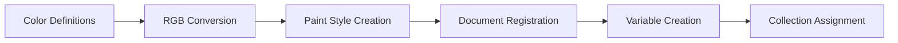
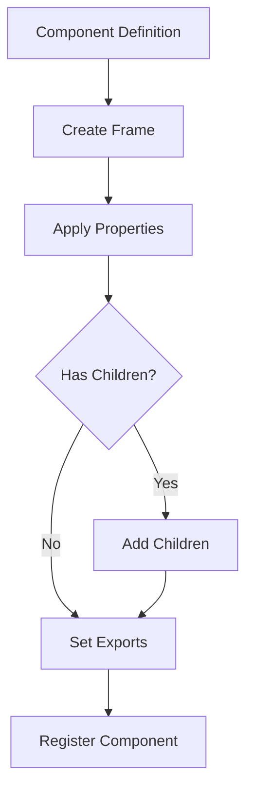

# Candlefish Figma Plugin - Architecture Documentation

## System Architecture

### Overview

The Candlefish Figma Plugin follows a modular, event-driven architecture designed for maintainability, extensibility, and performance.

```
┌──────────────────────────────────────────────────────────┐
│                    User Interface Layer                   │
│                   (Figma Desktop Client)                  │
└────────────────────┬─────────────────────────────────────┘
                     │
┌────────────────────▼─────────────────────────────────────┐
│                  Plugin Runtime Layer                     │
│              (Sandboxed JavaScript Context)               │
├───────────────────────────────────────────────────────────┤
│                    Core Plugin Logic                      │
│                   (main.ts - 383 LOC)                    │
├─────────┬──────────┬──────────┬──────────┬──────────────┤
│  Color  │Typography│Component │   Page    │   Asset      │
│ Module  │  Module  │  Module  │ Manager   │  Handler     │
├─────────┴──────────┴──────────┴──────────┴──────────────┤
│                    Figma Plugin API                       │
│                  (Document Manipulation)                  │
└───────────────────────────────────────────────────────────┘
                     │
┌────────────────────▼─────────────────────────────────────┐
│                  External Integration                     │
│                        Scripts                            │
├───────────────────────────────────────────────────────────┤
│  Token      │  Asset     │  API        │    AWS         │
│ Generator   │  Exporter  │  Client     │  Integration   │
└─────────────┴────────────┴─────────────┴────────────────┘
```

## Core Architecture Principles

### 1. Separation of Concerns

Each module handles a specific domain:

- **Color Module**: Color conversion, style creation, variable management
- **Typography Module**: Font loading, text style generation
- **Component Module**: UI component creation and configuration
- **Page Manager**: Document structure and organization
- **Asset Handler**: Image processing and embedding

### 2. Functional Programming

The plugin uses functional programming patterns:

```typescript
// Pure functions for transformations
const hexToRgb = (hex: string): RGB => { /* ... */ };

// Composition over inheritance
const createStyledComponent = compose(
  createComponent,
  applyStyles,
  setExportSettings
);
```

### 3. Async-First Design

All potentially blocking operations are asynchronous:

```typescript
async function run(bytes?: Uint8Array): Promise<void> {
  await ensurePage('Cover');
  await figma.loadFontAsync({ family: 'Inter', style: 'Medium' });
  await importLogoToComponent(bytes);
}
```

### 4. Fail-Safe Operations

Graceful degradation for missing resources:

```typescript
try {
  await figma.loadFontAsync({ family: 'Inter', style: 'Medium' });
  // Create text elements
} catch (e) {
  // Continue without text, plugin still functions
}
```

## Module Architecture

### Color System Module

```typescript
// Color System Architecture
ColorModule {
  // Utilities
  ├── hexToRgb(hex: string): RGB
  │   └── Converts hex colors to Figma RGB format
  │
  // Style Creation
  ├── makePaintStyle(name: string, hex: string): PaintStyle
  │   ├── Creates named paint style
  │   └── Registers in document styles
  │
  // System Generation
  └── createColorStylesAndVariables(): void
      ├── Brand colors (3)
      ├── Neutral scale (9)
      ├── Accent colors (2)
      └── Variables (Light/Dark collections)
}
```

**Data Flow:**
1. Hex color input → RGB conversion
2. RGB values → Paint style creation
3. Paint styles → Document registration
4. Variables → Collection assignment

### Typography Module

```typescript
// Typography Architecture
TypographyModule {
  // Style Definition
  ├── styles: Array<TypeStyle>
  │   ├── H1: { size: 40, line: 48, weight: 'Medium' }
  │   ├── H2: { size: 28, line: 36, weight: 'Medium' }
  │   ├── H3: { size: 20, line: 28, weight: 'Medium' }
  │   ├── Body: { size: 16, line: 24, weight: 'Regular' }
  │   └── Small: { size: 14, line: 20, weight: 'Regular' }
  │
  // Style Creation
  └── createTypographyStyles(): void
      ├── Iterates style definitions
      ├── Creates Figma text styles
      └── Applies font properties
}
```

### Component Creation Module

```typescript
// Component Architecture
ComponentModule {
  // Base Components
  ├── createBaseComponents(): ComponentSet
  │   ├── Grid/Container (Layout foundation)
  │   ├── Grid/Stack (Vertical/Horizontal layouts)
  │   ├── Card/Base (Content containers)
  │   ├── Button/Primary (CTA elements)
  │   └── Button/Quiet (Secondary actions)
  │
  // Logo Components
  └── importLogoToComponent(bytes?: Uint8Array): ComponentNode
      ├── Creates component frame
      ├── Embeds image or fallback
      ├── Sets export configurations
      └── Returns component reference
}
```

### Page Management

```typescript
// Page Management Architecture
PageManager {
  // Page Creation
  └── ensurePage(name: string): Promise<PageNode>
      ├── Searches existing pages
      ├── Returns if found
      └── Creates if missing
  
  // Page Structure
  Pages {
    ├── Cover (Overview)
    ├── 01 Brand Assets (Logos, marks)
    ├── 02 Type & Color (Styles)
    ├── 03 Components (UI elements)
    └── 04 Specimens (Examples)
  }
}
```

## Data Flow Architecture

### Initialization Flow

```mermaid
graph TD
    A[Plugin Start] --> B[Show Hidden UI]
    B --> C{Logo Bytes Available?}
    C -->|Yes| D[Load from embedded]
    C -->|No| E[Use fallback]
    D --> F[Execute run()]
    E --> F
    F --> G[Create Pages]
    G --> H[Generate Styles]
    H --> I[Create Components]
    I --> J[Build Specimens]
    J --> K[Notify Success]
    K --> L[Close Plugin]
```

### Style Generation Flow



### Component Creation Flow



## State Management

### Plugin State

The plugin maintains minimal state:

```typescript
// Implicit state through Figma API
const state = {
  currentPage: figma.currentPage,
  selection: figma.currentPage.selection,
  document: figma.root
};
```

### Document Modifications

All modifications are immediate and persistent:

1. **Styles**: Immediately available in UI
2. **Components**: Instantly in Assets panel
3. **Variables**: Live in collections
4. **Pages**: Visible in pages list

## Performance Architecture

### Optimization Strategies

#### 1. Batch Operations

```typescript
// Inefficient: Individual operations
for (const color of colors) {
  const style = figma.createPaintStyle();
  style.name = color.name;
  style.paints = [{ type: 'SOLID', color: color.rgb }];
}

// Efficient: Batch creation
const styles = colors.map(color => {
  const style = figma.createPaintStyle();
  style.name = color.name;
  style.paints = [{ type: 'SOLID', color: color.rgb }];
  return style;
});
```

#### 2. Lazy Loading

```typescript
// Load fonts only when needed
async function createTextElements() {
  const fontsNeeded = detectRequiredFonts();
  await Promise.all(fontsNeeded.map(font => 
    figma.loadFontAsync(font)
  ));
}
```

#### 3. Memory Management

```typescript
// Clear references for garbage collection
function processLargeData() {
  let data = loadData();
  const result = transform(data);
  data = null; // Explicit cleanup
  return result;
}
```

### Performance Metrics

| Operation | Average Time | Items Created |
|-----------|-------------|---------------|
| Color Styles | ~100ms | 14 styles |
| Typography | ~50ms | 5 styles |
| Components | ~200ms | 5+ components |
| Variables | ~150ms | 20 variables |
| Total | ~500ms | Complete system |

## Security Architecture

### Sandboxed Execution

The plugin runs in a sandboxed environment:

- No direct file system access
- No network requests from plugin code
- Limited to Figma API operations
- Isolated from other plugins

### API Key Management

```typescript
// Never in plugin code
// ❌ const API_KEY = 'secret-key';

// External script management
// ✅ Loaded from AWS Secrets Manager
const token = await getSecretValue('figma-token');
```

### Input Validation

```typescript
function validateInput(hex: string): boolean {
  const hexPattern = /^#?[0-9A-Fa-f]{6}$/;
  return hexPattern.test(hex);
}

function safeColorConversion(hex: string): RGB {
  if (!validateInput(hex)) {
    console.warn(`Invalid hex: ${hex}`);
    return { r: 0, g: 0, b: 0 };
  }
  return hexToRgb(hex);
}
```

## Extension Architecture

### Plugin Extension Points

#### 1. Custom Color Schemes

```typescript
interface ColorScheme {
  brand: Record<string, string>;
  neutral: Record<string, string>;
  accent: Record<string, string>;
}

function applyColorScheme(scheme: ColorScheme) {
  Object.entries(scheme.brand).forEach(([name, hex]) => {
    makePaintStyle(`Brand/${name}`, hex);
  });
}
```

#### 2. Component Templates

```typescript
interface ComponentTemplate {
  name: string;
  width: number;
  height: number;
  properties: Record<string, any>;
}

function createFromTemplate(template: ComponentTemplate) {
  const component = figma.createComponent();
  component.name = template.name;
  component.resize(template.width, template.height);
  // Apply properties
  return component;
}
```

#### 3. Style Presets

```typescript
interface StylePreset {
  name: string;
  styles: Array<{ type: string; properties: any }>;
}

function applyPreset(preset: StylePreset) {
  preset.styles.forEach(style => {
    if (style.type === 'color') createColorStyle(style);
    if (style.type === 'text') createTextStyle(style);
  });
}
```

## Integration Architecture

### External Script Integration

```
Plugin ←→ Message Passing ←→ UI Layer ←→ External Scripts
                                            ├── Token Generator
                                            ├── Asset Exporter
                                            └── API Client
```

### Message Protocol

```typescript
// Plugin → UI
figma.ui.postMessage({
  type: 'export-complete',
  data: { assets: [...] }
});

// UI → Plugin
figma.ui.onmessage = (msg) => {
  switch (msg.type) {
    case 'import-logo':
      handleLogoImport(msg.data);
      break;
    case 'update-colors':
      updateColorScheme(msg.data);
      break;
  }
};
```

## Deployment Architecture

### Build Pipeline

```
Source (TypeScript)
    ↓
Transpilation (esbuild)
    ↓
Bundling (single file)
    ↓
Output (main.js)
    ↓
Plugin Package
```

### Distribution Methods

1. **Local Development**
   - Direct manifest import
   - File system reference

2. **Team Distribution**
   - Shared network location
   - Version control system

3. **Public Distribution**
   - Figma Community
   - Plugin marketplace

## Monitoring and Debugging

### Debug Architecture

```typescript
// Debug wrapper
const DEBUG = process.env.NODE_ENV === 'development';

function debug(message: string, data?: any) {
  if (DEBUG) {
    console.log(`[Candlefish] ${message}`, data);
  }
}

// Usage
debug('Creating color styles', { count: colors.length });
```

### Performance Monitoring

```typescript
class PerformanceMonitor {
  private marks: Map<string, number> = new Map();
  
  start(label: string) {
    this.marks.set(label, Date.now());
  }
  
  end(label: string) {
    const start = this.marks.get(label);
    if (start) {
      const duration = Date.now() - start;
      console.log(`${label}: ${duration}ms`);
      this.marks.delete(label);
    }
  }
}

const perf = new PerformanceMonitor();
perf.start('style-generation');
createColorStylesAndVariables();
perf.end('style-generation');
```

## Future Architecture Considerations

### Planned Enhancements

1. **Plugin UI**: Rich interface for configuration
2. **Real-time Sync**: Live token updates
3. **Multi-brand Support**: Theme switching
4. **Collaboration Features**: Shared libraries
5. **AI Integration**: Smart suggestions

### Scalability Considerations

- **Large Files**: Pagination for many components
- **Performance**: Web Workers for heavy operations
- **Memory**: Streaming for large assets
- **Concurrency**: Parallel processing where possible

---

*This architecture document represents the current implementation and planned evolution of the Candlefish Figma Plugin.*
