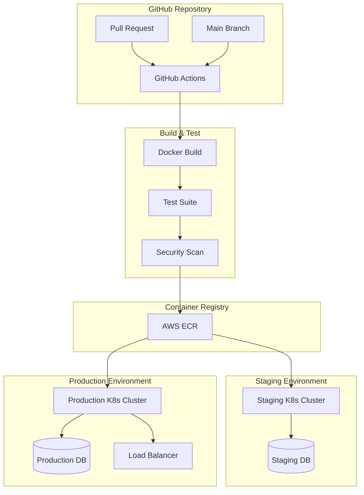

# Candlefish AI Deployment Infrastructure - Technology Stack

## Executive Summary

This document outlines the recommended technology stack for implementing the deployment management API for Candlefish AI's documentation platform. The design prioritizes **reliability**, **observability**, and **operational simplicity** while maintaining the ability to scale horizontally.

## Core Technology Decisions

### 1. API Framework & Language
**Recommendation: TypeScript + Express.js with tRPC**

**Rationale:**
- **Type Safety**: TypeScript ensures end-to-end type safety across the stack
- **Developer Experience**: tRPC provides excellent TypeScript integration and eliminates the need for API documentation generation
- **Ecosystem**: Rich ecosystem with mature deployment and monitoring tools
- **Team Familiarity**: Aligns with existing Next.js expertise

**Alternative Considered:** Go with Gin - Better performance but steeper learning curve

```typescript
// Example tRPC router structure
export const deploymentRouter = router({
  create: publicProcedure
    .input(createDeploymentSchema)
    .mutation(async ({ input, ctx }) => {
      return await ctx.deploymentService.createDeployment(input);
    }),
  
  list: publicProcedure
    .input(listDeploymentsSchema)
    .query(async ({ input, ctx }) => {
      return await ctx.deploymentService.listDeployments(input);
    }),
});
```

### 2. Database Layer
**Recommendation: PostgreSQL 15+ with connection pooling**

**Rationale:**
- **ACID Compliance**: Critical for deployment state management
- **JSON Support**: Native JSONB for flexible metadata storage
- **Partitioning**: Built-in table partitioning for metrics data
- **Monitoring Integration**: Excellent observability with standard tools

**Connection Pooling:** PgBouncer for connection management
**Migrations:** Prisma or raw SQL with version control

```sql
-- Example partition setup for metrics
CREATE TABLE monitoring_metrics_y2025m01 PARTITION OF monitoring_metrics
FOR VALUES FROM ('2025-01-01') TO ('2025-02-01');
```

### 3. Caching Layer
**Recommendation: Redis 7+ with Redis Cluster**

**Use Cases:**
- API response caching (deployment status, health checks)
- Rate limiting counters
- Session storage for admin interface
- Pub/sub for real-time deployment updates

```typescript
// Example caching strategy
const getDeploymentWithCache = async (id: string): Promise<Deployment> => {
  const cached = await redis.get(`deployment:${id}`);
  if (cached) return JSON.parse(cached);
  
  const deployment = await db.deployment.findUnique({ where: { id } });
  if (deployment) {
    await redis.setex(`deployment:${id}`, 300, JSON.stringify(deployment));
  }
  return deployment;
};
```

### 4. Message Queue & Background Jobs
**Recommendation: BullMQ with Redis**

**Rationale:**
- **Reliability**: Built-in retry logic and dead letter queues
- **Observability**: Excellent monitoring dashboard (Bull Board)
- **TypeScript Support**: First-class TypeScript support
- **Scalability**: Horizontal scaling with multiple workers

**Job Types:**
- Deployment execution
- Health check monitoring
- Metric collection
- Alert evaluation
- Secret rotation

```typescript
// Example job definition
export const deploymentQueue = new Queue<DeploymentJobData>('deployments', {
  connection: redisConnection,
  defaultJobOptions: {
    attempts: 3,
    backoff: { type: 'exponential', delay: 2000 },
    removeOnComplete: 100,
    removeOnFail: 50
  }
});
```

### 5. Container Orchestration
**Recommendation: Kubernetes (EKS) with ArgoCD**

**Service Deployment Strategy:**
- **API Service**: 3-10 replicas with HPA
- **Worker Nodes**: 2-5 replicas for background jobs  
- **Monitoring Stack**: Prometheus, Grafana, AlertManager

**Why Kubernetes:**
- **Auto-scaling**: HPA based on CPU/memory and custom metrics
- **Self-healing**: Automatic restart of failed pods
- **Rolling Updates**: Zero-downtime deployments
- **Resource Management**: Fine-grained resource allocation

```yaml
# Example HPA configuration
apiVersion: autoscaling/v2
kind: HorizontalPodAutoscaler
metadata:
  name: deployment-api-hpa
spec:
  scaleTargetRef:
    apiVersion: apps/v1
    kind: Deployment
    name: deployment-api
  minReplicas: 3
  maxReplicas: 10
  metrics:
  - type: Resource
    resource:
      name: cpu
      target:
        type: Utilization
        averageUtilization: 70
  - type: Pods
    pods:
      metric:
        name: active_deployments
      target:
        type: AverageValue
        averageValue: "5"
```

### 6. Monitoring & Observability Stack

**Core Stack:**
- **Metrics**: Prometheus + Grafana
- **Logs**: Loki + Promtail  
- **Tracing**: Jaeger or DataDog APM
- **Alerting**: AlertManager + PagerDuty
- **Uptime**: StatusPage or custom status dashboard

**Custom Metrics:**
```typescript
const deploymentDuration = new prometheus.Histogram({
  name: 'deployment_duration_seconds',
  help: 'Time taken for deployments to complete',
  labelNames: ['site', 'environment', 'strategy', 'status'],
  buckets: [30, 60, 120, 300, 600, 1200, 1800, 3600]
});

const deploymentCounter = new prometheus.Counter({
  name: 'deployments_total',
  help: 'Total number of deployments',
  labelNames: ['site', 'environment', 'status']
});
```

### 7. External Service Integrations

**GitHub Integration:**
```typescript
interface GitHubIntegration {
  // Use Octokit for GitHub API interactions
  client: Octokit;
  
  // Webhook signature verification
  verifyWebhook(payload: string, signature: string): boolean;
  
  // Deployment status updates
  updateDeploymentStatus(repo: string, deployment: GitHubDeployment): Promise<void>;
}
```

**Netlify Integration:**
```typescript
interface NetlifyIntegration {
  // Use official Netlify API client
  client: NetlifyAPI;
  
  // Site deployment management
  createDeploy(siteId: string, options: DeployOptions): Promise<Deploy>;
  getDeployStatus(deployId: string): Promise<Deploy>;
  
  // Build hooks and logs
  triggerBuild(hookId: string): Promise<void>;
  getBuildLogs(deployId: string): Promise<string[]>;
}
```

**AWS Services:**
- **Secrets Manager**: Centralized secret storage with rotation
- **CloudWatch**: Metrics and log aggregation
- **S3**: Build artifact storage and deployment snapshots
- **SES**: Email notifications for critical alerts

### 8. Security & Compliance

**Authentication & Authorization:**
```typescript
// JWT-based API authentication
const authenticateRequest = async (req: Request): Promise<User> => {
  const token = extractBearerToken(req);
  const payload = jwt.verify(token, process.env.JWT_SECRET);
  return await getUserFromToken(payload);
};

// Role-based access control
const authorize = (requiredRole: Role) => {
  return (req: AuthenticatedRequest, res: Response, next: NextFunction) => {
    if (!hasRole(req.user, requiredRole)) {
      return res.status(403).json({ error: 'Insufficient permissions' });
    }
    next();
  };
};
```

**Audit Logging:**
- All API calls logged with user context
- Deployment state changes tracked
- Secret access logged
- Failed authentication attempts monitored

## Deployment Pipeline Architecture



## Performance & Scaling Considerations

### Database Optimization
- **Connection Pooling**: 20-100 connections per service instance
- **Read Replicas**: For reporting and analytics queries
- **Partitioning**: Metrics tables partitioned by date
- **Indexing Strategy**: Composite indexes on frequently queried columns

### Caching Strategy
- **L1 Cache**: In-memory caching for frequently accessed data (5 minutes TTL)
- **L2 Cache**: Redis cluster for shared cache (15 minutes TTL)
- **CDN**: CloudFlare for static assets and API responses

### Rate Limiting
```typescript
// Redis-based rate limiting
const rateLimiter = rateLimit({
  store: new RedisStore({
    client: redisClient,
  }),
  windowMs: 15 * 60 * 1000, // 15 minutes
  max: 1000, // limit each IP to 1000 requests per windowMs
  message: 'Too many requests from this IP',
  standardHeaders: true,
  legacyHeaders: false,
});
```

## Infrastructure Costs (Monthly Estimates)

| Component | Service | Configuration | Est. Cost |
|-----------|---------|---------------|-----------|
| **Compute** | EKS Cluster | 3x t3.medium nodes | $150 |
| **Database** | RDS PostgreSQL | db.t3.micro | $25 |
| **Cache** | ElastiCache Redis | cache.t3.micro | $20 |
| **Monitoring** | CloudWatch | Standard usage | $50 |
| **Storage** | S3 + EBS | 100GB total | $15 |
| **Load Balancer** | ALB | Standard usage | $20 |
| **External** | GitHub Actions | 2000 minutes | $0 |
| **External** | Netlify | Team plan | $19 |
| **Total** | | | **~$299/month** |

## Migration Strategy

### Phase 1: Core API (Weeks 1-2)
- Set up basic CRUD operations for deployments
- Implement PostgreSQL schema
- Basic health checks and monitoring
- GitHub webhook integration

### Phase 2: Orchestration (Weeks 3-4)  
- Implement deployment orchestration
- Netlify integration for builds
- Basic rollback functionality
- Slack notifications

### Phase 3: Advanced Features (Weeks 5-6)
- Blue-green deployment strategy
- Advanced health checking
- Metrics collection and alerting
- Secret rotation

### Phase 4: Production Hardening (Weeks 7-8)
- Performance optimization
- Security audit and compliance
- Load testing and scaling
- Documentation and runbooks

## Risk Mitigation

### Technical Risks
- **Database Connection Exhaustion**: Use connection pooling with circuit breakers
- **Third-party API Limits**: Implement exponential backoff and retry logic
- **Memory Leaks**: Regular health checks and automatic pod restarts
- **Data Corruption**: Database backups every 6 hours with point-in-time recovery

### Operational Risks
- **Key Personnel Dependency**: Comprehensive documentation and runbooks
- **Service Dependencies**: Circuit breakers for all external integrations
- **Data Loss**: Multi-AZ deployments with automated backups
- **Security Breaches**: Regular security scans and secret rotation

## Success Metrics

### Performance Metrics
- **API Response Time**: < 100ms (95th percentile)
- **Deployment Success Rate**: > 99%
- **System Uptime**: > 99.9%
- **Time to Recovery**: < 5 minutes

### Business Metrics
- **Deployment Frequency**: Track deployments per day
- **Lead Time**: Time from commit to production
- **Mean Time to Recovery**: Average time to resolve incidents
- **Error Rate**: Percentage of failed deployments

## Conclusion

This technology stack provides a robust foundation for the Candlefish AI deployment management system. The emphasis on TypeScript, PostgreSQL, and Kubernetes ensures both developer productivity and operational reliability. The phased migration approach allows for iterative improvements while maintaining system stability.

The estimated infrastructure cost of ~$300/month is reasonable for a production deployment management system supporting three sites with comprehensive monitoring and high availability requirements.
