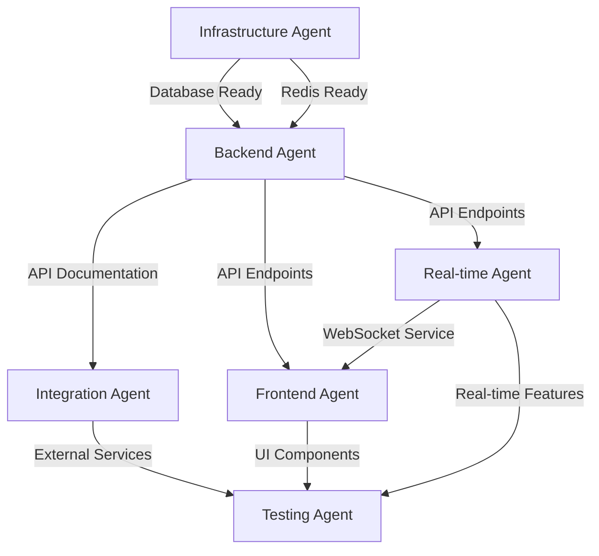

# Multi-Agent Coordination Strategy for Candlefish AI Deployment

## Agent Roles & Responsibilities

### 1. Infrastructure Agent (DevOps Specialist)
**Primary Focus**: Fly.io infrastructure, databases, caching, monitoring

**Key Responsibilities**:
- Provision and configure all Fly.io resources
- Set up PostgreSQL with TimescaleDB
- Configure Redis clusters
- Implement monitoring and alerting
- Manage SSL certificates and security
- Configure backup and disaster recovery

**Tools & Access Needed**:
- `flyctl` CLI
- Terraform for infrastructure as code
- Prometheus/Grafana access
- AWS CLI for S3 configuration
- Database migration tools

**Output Artifacts**:
- Infrastructure configuration files
- Deployment scripts
- Monitoring dashboards
- Backup procedures documentation

### 2. Backend Development Agent (API Specialist)
**Primary Focus**: REST APIs, business logic, database operations

**Key Responsibilities**:
- Develop FastAPI/Express endpoints
- Implement business logic
- Design and optimize database schemas
- Create data models and validators
- Write unit and integration tests
- Generate API documentation

**Tools & Access Needed**:
- Python/Node.js development environment
- Database access for migrations
- API testing tools (Postman/Insomnia)
- OpenAPI documentation tools

**Output Artifacts**:
- API endpoint implementations
- Database migration scripts
- API documentation (OpenAPI)
- Test suites

### 3. Frontend Development Agent (UI/UX Specialist)
**Primary Focus**: React applications, user interfaces, user experience

**Key Responsibilities**:
- Fix website deployment issues
- Develop React components
- Implement document editor
- Create responsive dashboards
- Optimize performance
- Ensure accessibility

**Tools & Access Needed**:
- Node.js/npm/pnpm
- React development tools
- CSS frameworks (Tailwind)
- Testing libraries (Jest, React Testing Library)
- Netlify CLI

**Output Artifacts**:
- React components
- UI layouts
- Style systems
- Frontend tests

### 4. Real-time Systems Agent (WebSocket Specialist)
**Primary Focus**: WebSocket services, real-time synchronization, CRDT

**Key Responsibilities**:
- Implement Socket.io infrastructure
- Develop presence systems
- Create collaborative editing features
- Implement CRDT with Yjs
- Optimize real-time performance
- Handle connection management

**Tools & Access Needed**:
- Socket.io development environment
- Yjs/CRDT libraries
- WebSocket testing tools
- Performance profiling tools

**Output Artifacts**:
- WebSocket server implementation
- Real-time synchronization logic
- CRDT conflict resolution
- Connection handling code

### 5. Integration Agent (Third-party Specialist)
**Primary Focus**: External APIs, Paintbox integration, mobile apps

**Key Responsibilities**:
- Integrate Paintbox API
- Connect CompanyCam services
- Configure AWS services (S3, SES)
- Set up Auth0 integration
- Coordinate mobile app development
- Implement webhook handlers

**Tools & Access Needed**:
- API keys for all services
- Webhook testing tools
- Mobile development environment
- API mocking tools

**Output Artifacts**:
- Integration adapters
- API client libraries
- Mobile application code
- Integration documentation

### 6. Testing & QA Agent (Quality Specialist)
**Primary Focus**: Test coverage, performance testing, security audits

**Key Responsibilities**:
- Create test strategies
- Write automated tests
- Perform load testing
- Conduct security audits
- Validate integrations
- Monitor test coverage

**Tools & Access Needed**:
- Testing frameworks (Jest, Pytest)
- Load testing tools (K6, Locust)
- Security scanning tools
- Coverage reporting tools

**Output Artifacts**:
- Test suites
- Performance reports
- Security audit results
- Coverage reports

## Coordination Mechanisms

### 1. Context Handoff Protocol

```yaml
handoff_template:
  from_agent: "Agent Name"
  to_agent: "Target Agent"
  timestamp: "ISO 8601"
  task_completed: 
    - "List of completed items"
  dependencies_ready:
    - "List of ready dependencies"
  blockers:
    - "Any blocking issues"
  next_steps:
    - "Recommended next actions"
  artifacts:
    - path: "File paths"
      description: "What the artifact contains"
  notes: "Additional context"
```

### 2. Dependency Management



### 3. Communication Channels

#### Async Communication (Via Files)
```
/deployment/
  /handoffs/
    YYYY-MM-DD-agent-handoff.md
  /status/
    current-status.md
    blockers.md
  /decisions/
    architecture-decisions.md
    tech-choices.md
```

#### Status Updates
Each agent updates their section in `/deployment/status/current-status.md`:

```markdown
## Infrastructure Agent Status
**Last Updated**: 2025-08-10 14:00
**Current Task**: PostgreSQL deployment
**Progress**: 60%
**Blockers**: None
**Next Update**: 2025-08-10 18:00

## Backend Agent Status
**Last Updated**: 2025-08-10 14:30
**Current Task**: Waiting for database
**Progress**: 0%
**Blockers**: Database not ready
**Next Update**: When unblocked
```

### 4. Task Queue Management

```yaml
task_queue:
  high_priority:
    - id: "FIX-001"
      task: "Fix website deployment"
      agent: "Frontend"
      deadline: "2025-08-12"
      dependencies: []
      
  medium_priority:
    - id: "INFRA-001"
      task: "Deploy PostgreSQL"
      agent: "Infrastructure"
      deadline: "2025-08-13"
      dependencies: []
      
  low_priority:
    - id: "MOB-001"
      task: "Mobile app setup"
      agent: "Integration"
      deadline: "2025-09-20"
      dependencies: ["API-001", "AUTH-001"]
```

### 5. Parallel Execution Strategy

#### Week 1 Parallel Tasks
```
Infrastructure Agent:
  - PostgreSQL setup (2 days)
  - Redis setup (1 day)
  - Monitoring setup (2 days)

Frontend Agent:
  - Fix Netlify build (1 day)
  - Component library setup (2 days)
  - Dashboard wireframes (2 days)

Backend Agent:
  - Database schema design (2 days)
  - API structure setup (1 day)
  - Auth middleware (2 days)
```

#### Synchronization Points
- **Daily**: 9 AM - Quick status check
- **Weekly**: Monday 10 AM - Sprint planning
- **Blockers**: Immediate notification via status file

### 6. Conflict Resolution

#### Resource Conflicts
```yaml
conflict_resolution:
  database_schema:
    owner: "Backend Agent"
    reviewers: ["Infrastructure Agent"]
    decision_maker: "Backend Agent"
    
  api_contracts:
    owner: "Backend Agent"
    reviewers: ["Frontend Agent", "Integration Agent"]
    decision_maker: "Backend Agent"
    
  deployment_config:
    owner: "Infrastructure Agent"
    reviewers: ["Backend Agent"]
    decision_maker: "Infrastructure Agent"
```

#### Decision Making Process
1. Proposing agent creates decision document
2. Reviewers provide feedback within 24 hours
3. Decision maker makes final call
4. Decision logged in `/deployment/decisions/`

### 7. Performance Monitoring

```yaml
agent_metrics:
  task_completion_rate:
    target: 90%
    measurement: "Tasks completed on time / Total tasks"
    
  handoff_quality:
    target: 95%
    measurement: "Successful handoffs / Total handoffs"
    
  blocker_resolution_time:
    target: "< 4 hours"
    measurement: "Time from blocker raised to resolved"
    
  test_coverage:
    target: 80%
    measurement: "Lines covered / Total lines"
```

### 8. Emergency Procedures

#### Critical Issue Response
```yaml
severity_levels:
  P0_critical:
    description: "Production down"
    response_time: "15 minutes"
    agents_required: ["Infrastructure", "Backend"]
    
  P1_high:
    description: "Major feature broken"
    response_time: "1 hour"
    agents_required: ["Relevant feature owner"]
    
  P2_medium:
    description: "Minor feature issue"
    response_time: "4 hours"
    agents_required: ["Feature owner"]
    
  P3_low:
    description: "Cosmetic issue"
    response_time: "Next business day"
    agents_required: ["Any available"]
```

## Implementation Timeline

### Phase 1: Foundation (Week 1)
**Parallel Execution**:
- Infrastructure Agent: Database/Cache setup
- Frontend Agent: Website fixes
- Backend Agent: Schema design

**Synchronization**: End of Week 1
- All agents sync on completed foundations
- API contracts finalized
- Infrastructure ready for applications

### Phase 2: Core Development (Week 2-3)
**Parallel Execution**:
- Backend Agent: API development
- Frontend Agent: UI components
- Integration Agent: External service setup

**Synchronization**: Mid-week check-ins
- API endpoint availability updates
- UI component completion status
- Integration readiness checks

### Phase 3: Real-time Features (Week 4-5)
**Sequential Execution**:
- Real-time Agent: WebSocket setup (depends on Backend)
- Frontend Agent: Real-time UI (depends on WebSocket)
- Testing Agent: Integration tests (depends on all)

**Synchronization**: Daily updates critical
- Real-time feature integration
- Performance testing results
- Bug tracking and fixes

### Phase 4: Polish & Launch (Week 6+)
**Parallel Execution**:
- All agents: Bug fixes and optimizations
- Testing Agent: Final validation
- Integration Agent: Paintbox/Mobile apps

**Synchronization**: Multiple daily syncs
- Launch readiness checks
- Performance validations
- User acceptance testing

## Success Metrics

### Agent Performance
- Task completion rate > 90%
- Handoff success rate > 95%
- Zero critical blockers lasting > 4 hours
- Test coverage > 80%

### System Performance
- API response time < 200ms
- WebSocket latency < 50ms
- 99.9% uptime
- Zero data loss incidents

### Project Delivery
- Week 1 milestones: 100% complete
- Week 2-3 milestones: 100% complete
- Week 4-5 milestones: 100% complete
- Week 6+ milestones: On track

## Tools & Automation

### Automated Status Collection
```bash
#!/bin/bash
# collect-status.sh
# Run hourly to collect agent status

for agent in infrastructure backend frontend realtime integration testing; do
  echo "Collecting status for $agent..."
  # Check last commit time
  # Check open PRs
  # Check task completion
  # Update master status file
done
```

### Dependency Checker
```python
# check-dependencies.py
import yaml
import json

def check_dependencies():
    with open('dependencies.yaml', 'r') as f:
        deps = yaml.safe_load(f)
    
    ready = []
    blocked = []
    
    for task in deps['tasks']:
        if all(d in ready for d in task['dependencies']):
            ready.append(task['id'])
        else:
            blocked.append(task['id'])
    
    return ready, blocked
```

### Progress Dashboard
```yaml
dashboard_config:
  refresh_interval: 300  # 5 minutes
  
  widgets:
    - type: "progress_bar"
      data: "overall_completion"
      
    - type: "agent_status"
      data: "all_agents"
      
    - type: "blocker_list"
      data: "current_blockers"
      
    - type: "timeline"
      data: "milestone_progress"
      
    - type: "metrics"
      data: "performance_metrics"
```

## Continuous Improvement

### Daily Retrospectives
- What was completed today?
- What blockers were encountered?
- What can be improved tomorrow?

### Weekly Reviews
- Milestone progress assessment
- Process improvement suggestions
- Resource reallocation if needed

### Post-Launch Analysis
- Full project retrospective
- Lessons learned documentation
- Process optimization for future projects

---

## Quick Reference

### Agent Commands
```bash
# Infrastructure Agent
flyctl deploy
flyctl postgres create
flyctl redis create

# Backend Agent
poetry run pytest
poetry run uvicorn

# Frontend Agent
pnpm build
pnpm test

# Real-time Agent
npm run websocket:dev
npm run test:realtime

# Integration Agent
npm run test:integration
npm run mock:external

# Testing Agent
npm run test:all
npm run test:load
```

### File Locations
- Context: `/deployment/CANDLEFISH_AI_CONTEXT_MASTER.md`
- Status: `/deployment/status/current-status.md`
- Handoffs: `/deployment/handoffs/`
- Decisions: `/deployment/decisions/`
- Scripts: `/deployment/scripts/`

### Emergency Contacts
- Infrastructure: Fly.io support
- Database: PostgreSQL team
- Integration: Paintbox API team
- Monitoring: DevOps on-call
