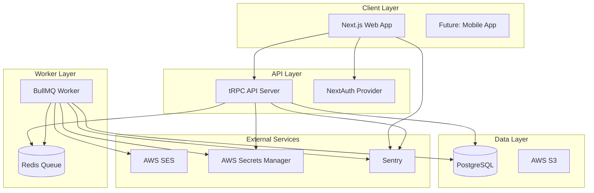

# PromoterOS Architecture

## System Overview

PromoterOS is a multi-tenant event management platform built with modern web technologies, designed for mid-size venues (1,200-3,500 capacity).



## Component Architecture

### Frontend (apps/promoteros-web)
- **Framework**: Next.js 14 with App Router
- **Styling**: Tailwind CSS + shadcn/ui
- **State**: React Query via tRPC
- **Auth**: NextAuth with JWT sessions
- **Forms**: React Hook Form + Zod validation

### API (services/promoteros-api)
- **Framework**: Express + tRPC
- **ORM**: Prisma with PostgreSQL
- **Auth**: JWT with role-based access
- **Validation**: Zod schemas
- **Rate Limiting**: Express middleware

### Worker (services/promoteros-worker)
- **Queue**: BullMQ with Redis
- **Jobs**: Email delivery, PDF generation
- **Monitoring**: Prometheus metrics
- **Retries**: Exponential backoff

### Shared Types (libs/ts/promoteros-types)
- Zod schemas
- TypeScript interfaces
- Constants and enums
- Utility functions

## Data Flow

### Event Request Submission
1. User fills public intake form
2. Form validates with Zod
3. tRPC mutation to API
4. API validates and stores in PostgreSQL
5. Email job queued to Redis
6. Worker sends confirmation email
7. Managers notified via email

### Event Approval Workflow
1. Manager reviews request in console
2. Updates status via tRPC
3. Decision logged with audit trail
4. Status change triggers email
5. Approved requests create Event
6. Task templates instantiated

## Multi-Tenancy Model

### Organization Hierarchy
```
Organization (Root Tenant)
├── Venues (Physical Locations)
├── Users (via Membership)
├── Events (Scoped to Venues)
└── Configuration (Templates, Settings)
```

### Data Isolation
- Row-level security via `organizationId`
- Middleware enforces tenant context
- No cross-tenant data leakage
- Audit logs track all access

## Security Architecture

### Authentication Flow
1. Magic link or OAuth login
2. Session created with organization context
3. JWT contains user + org claims
4. Every request validates membership
5. Role-based access control enforced

### Authorization Layers
- **Public**: Intake forms only
- **Authenticated**: Must have valid session
- **Organization**: Must be member
- **Role-Based**: OWNER > MANAGER > STAFF > PROMOTER

## Deployment Architecture

### Infrastructure
- **Hosting**: Fly.io (3 apps + Postgres + Redis)
- **CDN**: Fly.io edge network
- **Secrets**: AWS Secrets Manager
- **Monitoring**: Sentry + OpenTelemetry
- **CI/CD**: GitHub Actions

### Scaling Strategy
- Horizontal scaling for web/API
- Redis cluster for queue scaling
- Read replicas for database
- CDN for static assets

## Performance Considerations

### Optimizations
- Server Components for initial load
- Optimistic updates via tRPC
- Database indexing on common queries
- Redis caching for hot data
- Edge caching for public pages

### Monitoring
- Real User Monitoring (RUM)
- Application Performance Monitoring (APM)
- Error tracking with Sentry
- Custom business metrics

## Development Workflow

### Local Development
```bash
# Start all services
pnpm dev

# Individual services
pnpm --filter @candlefish/promoteros-web dev
pnpm --filter @candlefish/promoteros-api dev
pnpm --filter @candlefish/promoteros-worker dev
```

### Testing Strategy
- Unit tests with Vitest
- Integration tests for API
- E2E tests with Playwright
- Load testing with k6

## Future Considerations

### Phase 2 Features
- Mobile application
- Advanced analytics
- Ticketing integration
- Payment processing
- Multi-language support

### Technical Debt
- Consider GraphQL for complex queries
- Evaluate event sourcing for audit trail
- Implement caching strategy
- Add request tracing
