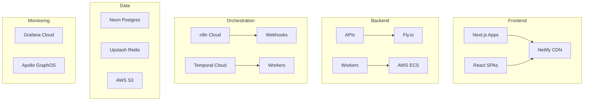

# Candlefish AI Deployment Guide

## Platform Architecture



## Service Deployment Matrix

| Service | Platform | Deployment | URL |
|---------|----------|------------|-----|
| Paintbox Frontend | Netlify | Auto on PR/main | paintbox.candlefish.ai |
| Paintbox API | Fly.io | GitHub Actions | api.paintbox.candlefish.ai |
| PromoterOS | Netlify | Auto on PR/main | promoteros.candlefish.ai |
| Crown Trophy | Netlify | Auto on PR/main | crown.candlefish.ai |
| NANDA Workers | AWS ECS | Terraform | Internal |
| GraphQL Gateway | Apollo Router | Managed | graphql.candlefish.ai |

## Deployment Configurations

### Netlify (Frontend)

**File**: `apps/*/netlify.toml`
```toml
[build]
  command = "pnpm build"
  publish = "dist"

[build.environment]
  NODE_VERSION = "22"

[[redirects]]
  from = "/api/*"
  to = "https://api.:splat"
  status = 200
```

### Fly.io (APIs)

**File**: `services/*/fly.toml`
```toml
app = "candlefish-api"
primary_region = "iad"

[http_service]
  internal_port = 8080
  force_https = true
  auto_stop_machines = true
  auto_start_machines = true

[env]
  NODE_ENV = "production"

[[services]]
  protocol = "tcp"
  internal_port = 8080
  
  [[services.ports]]
    port = 80
    handlers = ["http"]
    
  [[services.ports]]
    port = 443
    handlers = ["tls", "http"]
```

### AWS ECS (Workers)

**File**: `infra/terraform/ecs.tf`
```hcl
resource "aws_ecs_service" "worker" {
  name            = "candlefish-worker"
  cluster         = aws_ecs_cluster.main.id
  task_definition = aws_ecs_task_definition.worker.arn
  desired_count   = 2
  
  deployment_configuration {
    maximum_percent         = 200
    minimum_healthy_percent = 100
  }
}
```

## CI/CD Pipelines

### Deploy Frontend (Netlify)
```yaml
# .github/workflows/deploy-frontend.yml
name: Deploy Frontend
on:
  push:
    branches: [main]
    paths:
      - 'apps/**'
      
jobs:
  deploy:
    runs-on: ubuntu-latest
    steps:
      - uses: actions/checkout@v4
      - run: pnpm install --frozen-lockfile
      - run: pnpm build
      - uses: netlify/actions/deploy@v1
        with:
          prod: true
```

### Deploy API (Fly.io)
```yaml
# .github/workflows/deploy-api.yml
name: Deploy API
on:
  push:
    branches: [main]
    paths:
      - 'services/**'
      
jobs:
  deploy:
    runs-on: ubuntu-latest
    steps:
      - uses: actions/checkout@v4
      - uses: superfly/flyctl-actions/setup-flyctl@master
      - run: flyctl deploy --remote-only
        env:
          FLY_API_TOKEN: ${{ secrets.FLY_API_TOKEN }}
```

## Environment Variables

### Development
```bash
# Load from AWS Secrets Manager
bash scripts/secrets-bootstrap.sh paintbox dev
```

### Staging
```bash
# Auto-injected in CI/CD
aws secretsmanager get-secret-value \
  --secret-id candlefish/stage/paintbox
```

### Production
```bash
# Managed through platform dashboards
# Netlify: Environment Variables UI
# Fly.io: fly secrets set KEY=value
# ECS: Task Definition environment
```

## Database Management

### Neon (Postgres)
- Branch databases for each PR
- Connection pooling enabled
- Auto-pause after 5 minutes idle
- Point-in-time recovery

### Upstash (Redis)
- Global replication
- Auto-eviction policies
- Durable storage option
- REST API for edge functions

## Monitoring Setup

### Grafana Cloud
```javascript
// libs/ts/monitoring/grafana.ts
import { metrics } from '@opentelemetry/api-metrics';

const meter = metrics.getMeter('candlefish');
const requestCounter = meter.createCounter('requests', {
  description: 'Count of requests'
});
```

### Apollo GraphOS
```javascript
// services/graphql/apollo.config.js
module.exports = {
  service: {
    name: 'candlefish-graph',
    url: 'https://graphql.candlefish.ai'
  }
};
```

## Rollback Procedures

### Netlify
```bash
# List deployments
netlify deploy --list

# Rollback to previous
netlify rollback
```

### Fly.io
```bash
# List releases
fly releases

# Rollback
fly deploy --image <previous-image>
```

### ECS
```bash
# Update service to previous task definition
aws ecs update-service \
  --service candlefish-worker \
  --task-definition worker:previous
```

## Disaster Recovery

1. **Database Backup**: Daily automated backups to S3
2. **Code Backup**: Git serves as source of truth
3. **Secrets Backup**: AWS Secrets Manager with versioning
4. **DNS Failover**: Cloudflare with multiple origins
5. **Monitoring**: PagerDuty integration for alerts

## Cost Optimization

- **Netlify**: ~$19/month per site
- **Fly.io**: ~$5-20/month per app
- **Neon**: ~$19/month for branching
- **Upstash**: ~$0.20 per 100k commands
- **Grafana Cloud**: Free tier sufficient
- **Apollo GraphOS**: Free for <10M requests

**Total Estimated**: ~$100-200/month

## Security Checklist

- [ ] Secrets in AWS Secrets Manager
- [ ] 2FA on all platform accounts
- [ ] API rate limiting configured
- [ ] CORS properly configured
- [ ] SSL/TLS on all endpoints
- [ ] Security headers configured
- [ ] Dependency scanning enabled
- [ ] Container scanning in CI
