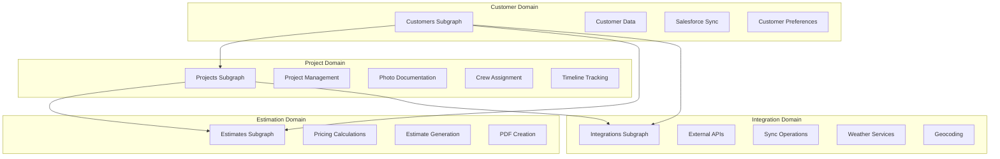

# Apollo GraphOS Federation - Service Boundaries and Communication Patterns

## Overview
This document defines the service boundaries, data ownership, and communication patterns for the Paintbox Apollo GraphOS federation. The architecture follows Domain-Driven Design principles with clear service responsibilities and efficient inter-service communication.

## Service Boundaries and Domain Ownership

### 1. Domain Decomposition



### 2. Service Responsibility Matrix

| Domain | Service | Primary Responsibilities | Data Ownership | External Dependencies |
|--------|---------|------------------------|----------------|---------------------|
| **Customer Management** | Customers Subgraph | Customer CRUD, Salesforce sync, contact management, account hierarchy | Customer profiles, addresses, contact info, Salesforce mappings | Salesforce API, Email service |
| **Project Management** | Projects Subgraph | Project lifecycle, photo management, crew scheduling, permits | Project details, photos, assignments, timelines, permits | Company Cam API, Weather API |
| **Estimation** | Estimates Subgraph | Price calculations, estimate generation, PDF creation, pricing tiers | Estimates, calculations, pricing models, documents | PDF generation service |
| **Integration Orchestration** | Integrations Subgraph | API coordination, sync operations, health monitoring, rate limiting | Sync logs, API credentials, health status, cache metadata | All external APIs |

### 3. Data Ownership Rules

```typescript
// Data ownership and access patterns
interface DataOwnership {
  service: string;
  entities: string[];
  readAccess: string[]; // Services that can read this data
  writeAccess: string[]; // Services that can modify this data
  federatedFields: string[]; // Fields available for federation
}

const DATA_OWNERSHIP: DataOwnership[] = [
  {
    service: 'customers',
    entities: ['Customer', 'SalesforceUser', 'CustomerSyncLog'],
    readAccess: ['customers', 'projects', 'estimates', 'integrations'],
    writeAccess: ['customers'],
    federatedFields: [
      'Customer.id',
      'Customer.firstName', 
      'Customer.lastName',
      'Customer.email',
      'Customer.company',
      'Customer.status',
      'Customer.accountType'
    ]
  },
  
  {
    service: 'projects',
    entities: ['Project', 'ProjectPhoto', 'CrewMember', 'TimelineEvent'],
    readAccess: ['projects', 'estimates', 'integrations'],
    writeAccess: ['projects'],
    federatedFields: [
      'Project.id',
      'Project.customerId',
      'Project.name',
      'Project.status',
      'Project.type',
      'Project.scheduledStartDate',
      'Project.scheduledEndDate'
    ]
  },
  
  {
    service: 'estimates',
    entities: ['Estimate', 'PricingCalculation', 'EstimateDocument'],
    readAccess: ['estimates', 'projects', 'customers'],
    writeAccess: ['estimates'],
    federatedFields: [
      'Estimate.id',
      'Estimate.customerId',
      'Estimate.projectId',
      'Estimate.status',
      'Estimate.goodPrice',
      'Estimate.betterPrice',
      'Estimate.bestPrice',
      'Estimate.selectedTier'
    ]
  },
  
  {
    service: 'integrations',
    entities: ['SyncLog', 'IntegrationHealth', 'ExternalEntityCache'],
    readAccess: ['integrations', 'customers', 'projects'],
    writeAccess: ['integrations'],
    federatedFields: [
      'IntegrationHealth.service',
      'IntegrationHealth.status',
      'IntegrationHealth.lastSuccessfulSync'
    ]
  }
];
```

## Federation Patterns and Relationships

### 1. Entity Relationships

```graphql
# Federation relationship patterns

# 1:1 Relationship - Customer to CustomerSyncStatus
type Customer @key(fields: "id") {
  id: ID!
  # ... other fields
  syncStatus: CustomerSyncStatus @provides(fields: "lastSyncAt status")
}

# 1:Many Relationship - Customer to Estimates
type Customer @key(fields: "id") {
  id: ID!
  estimates: [Estimate!]! # Resolved by estimates subgraph
}

extend type Estimate @key(fields: "id") {
  id: ID! @external
  customerId: ID! @external
  customer: Customer! @requires(fields: "customerId")
}

# Many:Many Relationship - Projects to CrewMembers
type Project @key(fields: "id") {
  id: ID!
  assignedCrew: [CrewMember!]! 
}

type CrewMember @key(fields: "id") {
  id: ID!
  assignedProjects: [Project!]!
}

# Cross-domain computed fields
extend type Customer @key(fields: "id") {
  id: ID! @external
  estimates: [Estimate!]! @external
  projects: [Project!]! @external
  
  # Computed fields requiring data from multiple subgraphs
  totalEstimateValue: Float! @requires(fields: "estimates { goodPrice betterPrice bestPrice selectedTier }")
  activeProjectsCount: Int! @requires(fields: "projects { status }")
  lastActivityDate: String! @requires(fields: "estimates { updatedAt } projects { updatedAt }")
}
```

### 2. Cross-Service Query Patterns

```typescript
// Query resolution patterns across service boundaries

interface QueryResolutionPattern {
  pattern: string;
  description: string;
  services: string[];
  complexity: 'low' | 'medium' | 'high';
  cachingStrategy: string;
  example: string;
}

const FEDERATION_PATTERNS: QueryResolutionPattern[] = [
  {
    pattern: 'Entity Reference',
    description: 'Simple entity lookup by ID across services',
    services: ['customers', 'projects'],
    complexity: 'low',
    cachingStrategy: 'entity-cache',
    example: `
      query GetCustomerProjects($customerId: ID!) {
        customer(id: $customerId) {  # customers subgraph
          name
          email
          projects {                 # projects subgraph
            name
            status
          }
        }
      }
    `
  },
  
  {
    pattern: 'Aggregated Data',
    description: 'Computed fields requiring data from multiple services',
    services: ['customers', 'estimates', 'projects'],
    complexity: 'medium',
    cachingStrategy: 'computed-field-cache',
    example: `
      query CustomerDashboard($customerId: ID!) {
        customer(id: $customerId) {
          name
          totalEstimateValue    # requires estimates data
          activeProjectsCount   # requires projects data
          lastActivityDate      # requires both estimates and projects data
        }
      }
    `
  },
  
  {
    pattern: 'Filtered Cross-Service',
    description: 'Filtering data across service boundaries',
    services: ['projects', 'estimates'],
    complexity: 'high',
    cachingStrategy: 'query-cache',
    example: `
      query ActiveProjectsWithEstimates($status: ProjectStatus!) {
        projects(filter: { status: $status }) {
          name
          status
          estimates {              # estimates subgraph
            status
            selectedTier
            goodPrice
          }
        }
      }
    `
  },
  
  {
    pattern: 'Integration Status',
    description: 'Real-time status across integration points',
    services: ['integrations', 'customers', 'projects'],
    complexity: 'medium',
    cachingStrategy: 'real-time',
    example: `
      query SystemHealth {
        allIntegrationStatuses { # integrations subgraph
          service
          status
          lastSuccessfulSync
        }
        customers(limit: 5) {    # customers subgraph
          syncStatus {
            status
            lastSyncAt
          }
        }
      }
    `
  }
];
```

### 3. Data Flow Architecture

```typescript
// Data flow patterns and event propagation

interface DataFlowPattern {
  trigger: string;
  sourceService: string;
  affectedServices: string[];
  propagationMethod: 'sync' | 'async' | 'event-driven';
  consistency: 'strong' | 'eventual';
  rollbackStrategy: string;
}

const DATA_FLOWS: DataFlowPattern[] = [
  {
    trigger: 'Customer Created',
    sourceService: 'customers',
    affectedServices: ['integrations'],
    propagationMethod: 'event-driven',
    consistency: 'eventual',
    rollbackStrategy: 'compensating-transaction'
  },
  
  {
    trigger: 'Project Status Changed',
    sourceService: 'projects',
    affectedServices: ['customers', 'integrations'],
    propagationMethod: 'event-driven',
    consistency: 'eventual',
    rollbackStrategy: 'event-sourcing-revert'
  },
  
  {
    trigger: 'Estimate Approved',
    sourceService: 'estimates',
    affectedServices: ['projects', 'customers'],
    propagationMethod: 'sync',
    consistency: 'strong',
    rollbackStrategy: 'two-phase-commit'
  },
  
  {
    trigger: 'Salesforce Sync',
    sourceService: 'integrations',
    affectedServices: ['customers'],
    propagationMethod: 'async',
    consistency: 'eventual',
    rollbackStrategy: 'retry-with-backoff'
  },
  
  {
    trigger: 'Photo Upload',
    sourceService: 'projects',
    affectedServices: ['integrations'],
    propagationMethod: 'async',
    consistency: 'eventual',
    rollbackStrategy: 'manual-reconciliation'
  }
];
```

## Communication Patterns

### 1. Synchronous Communication

```typescript
// Service-to-service HTTP communication patterns

interface ServiceEndpoint {
  service: string;
  endpoint: string;
  method: 'GET' | 'POST' | 'PUT' | 'DELETE';
  purpose: string;
  authentication: 'internal-jwt' | 'api-key' | 'oauth2';
  rateLimit: {
    requests: number;
    window: string;
  };
  timeout: number;
  retryPolicy: {
    maxRetries: number;
    backoffMs: number;
  };
}

const INTERNAL_APIS: ServiceEndpoint[] = [
  {
    service: 'customers',
    endpoint: '/internal/customers/validate',
    method: 'POST',
    purpose: 'Validate customer existence for foreign key checks',
    authentication: 'internal-jwt',
    rateLimit: { requests: 1000, window: '1m' },
    timeout: 5000,
    retryPolicy: { maxRetries: 3, backoffMs: 1000 }
  },
  
  {
    service: 'projects',
    endpoint: '/internal/projects/by-customer',
    method: 'GET',
    purpose: 'Get project summaries for customer dashboard',
    authentication: 'internal-jwt',
    rateLimit: { requests: 500, window: '1m' },
    timeout: 3000,
    retryPolicy: { maxRetries: 2, backoffMs: 500 }
  },
  
  {
    service: 'estimates',
    endpoint: '/internal/estimates/calculate',
    method: 'POST',
    purpose: 'Calculate pricing for project estimates',
    authentication: 'internal-jwt',
    rateLimit: { requests: 200, window: '1m' },
    timeout: 10000,
    retryPolicy: { maxRetries: 2, backoffMs: 2000 }
  },
  
  {
    service: 'integrations',
    endpoint: '/internal/health/check',
    method: 'GET',
    purpose: 'Check external service health status',
    authentication: 'internal-jwt',
    rateLimit: { requests: 100, window: '1m' },
    timeout: 2000,
    retryPolicy: { maxRetries: 1, backoffMs: 500 }
  }
];

// Internal service client implementation
class InternalServiceClient {
  private baseUrl: string;
  private timeout: number;
  private authToken: string;
  
  constructor(service: string) {
    this.baseUrl = process.env[`${service.toUpperCase()}_SERVICE_URL`]!;
    this.timeout = 5000;
    this.authToken = process.env.INTERNAL_SERVICE_TOKEN!;
  }
  
  async request<T>(
    endpoint: string,
    method: string = 'GET',
    data?: any,
    options: RequestOptions = {}
  ): Promise<T> {
    const config = {
      method,
      url: `${this.baseUrl}${endpoint}`,
      timeout: options.timeout || this.timeout,
      headers: {
        'Authorization': `Bearer ${this.authToken}`,
        'Content-Type': 'application/json',
        'X-Service-Name': process.env.SERVICE_NAME,
        'X-Request-ID': options.requestId || crypto.randomUUID()
      },
      data
    };
    
    try {
      const response = await axios(config);
      return response.data;
    } catch (error) {
      if (axios.isAxiosError(error)) {
        throw new ServiceCommunicationError(
          `Failed to communicate with ${this.baseUrl}: ${error.message}`,
          error.response?.status,
          error.response?.data
        );
      }
      throw error;
    }
  }
}
```

### 2. Asynchronous Communication (Event-Driven)

```typescript
// Event-driven communication using Redis pub/sub

interface DomainEvent {
  eventId: string;
  eventType: string;
  aggregateId: string;
  aggregateType: string;
  version: number;
  timestamp: string;
  data: any;
  metadata: {
    userId?: string;
    traceId: string;
    source: string;
  };
}

interface EventHandler {
  eventType: string;
  handler: (event: DomainEvent) => Promise<void>;
  retryPolicy: {
    maxRetries: number;
    backoffMs: number;
  };
}

class EventBus {
  private redis: Redis;
  private handlers = new Map<string, EventHandler[]>();
  private deadLetterQueue: string = 'events:dead-letter';
  
  constructor() {
    this.redis = new Redis(process.env.REDIS_URL!);
  }
  
  // Publish event
  async publish(event: DomainEvent): Promise<void> {
    const channel = `events:${event.aggregateType}`;
    await this.redis.publish(channel, JSON.stringify(event));
    
    // Also store in event store for replay/audit
    await this.redis.zadd(
      `eventstore:${event.aggregateType}:${event.aggregateId}`,
      Date.now(),
      JSON.stringify(event)
    );
  }
  
  // Subscribe to events
  subscribe(eventType: string, handler: EventHandler): void {
    if (!this.handlers.has(eventType)) {
      this.handlers.set(eventType, []);
    }
    this.handlers.get(eventType)!.push(handler);
  }
  
  // Start listening for events
  async startListening(): Promise<void> {
    const subscriber = this.redis.duplicate();
    
    // Subscribe to all event channels
    const channels = Array.from(this.handlers.keys())
      .map(eventType => `events:${eventType.split(':')[0]}`);
    
    await subscriber.subscribe(...channels);
    
    subscriber.on('message', async (channel, message) => {
      try {
        const event: DomainEvent = JSON.parse(message);
        await this.handleEvent(event);
      } catch (error) {
        console.error('Failed to process event:', error);
        await this.sendToDeadLetterQueue(message, error);
      }
    });
  }
  
  private async handleEvent(event: DomainEvent): Promise<void> {
    const handlers = this.handlers.get(event.eventType) || [];
    
    const handlerPromises = handlers.map(async (handlerConfig) => {
      let attempt = 0;
      
      while (attempt < handlerConfig.retryPolicy.maxRetries) {
        try {
          await handlerConfig.handler(event);
          return; // Success
        } catch (error) {
          attempt++;
          if (attempt < handlerConfig.retryPolicy.maxRetries) {
            await new Promise(resolve => 
              setTimeout(resolve, handlerConfig.retryPolicy.backoffMs * attempt)
            );
          } else {
            throw error; // Final retry failed
          }
        }
      }
    });
    
    await Promise.all(handlerPromises);
  }
  
  private async sendToDeadLetterQueue(message: string, error: any): Promise<void> {
    await this.redis.lpush(this.deadLetterQueue, JSON.stringify({
      message,
      error: error.message,
      timestamp: new Date().toISOString()
    }));
  }
}

// Event definitions for each service
const DOMAIN_EVENTS = {
  // Customer events
  CUSTOMER_CREATED: 'customer:created',
  CUSTOMER_UPDATED: 'customer:updated', 
  CUSTOMER_SYNCED: 'customer:synced',
  
  // Project events
  PROJECT_CREATED: 'project:created',
  PROJECT_STATUS_CHANGED: 'project:status_changed',
  PROJECT_PHOTO_ADDED: 'project:photo_added',
  PROJECT_COMPLETED: 'project:completed',
  
  // Estimate events
  ESTIMATE_CREATED: 'estimate:created',
  ESTIMATE_APPROVED: 'estimate:approved',
  ESTIMATE_REJECTED: 'estimate:rejected',
  
  // Integration events
  SYNC_STARTED: 'sync:started',
  SYNC_COMPLETED: 'sync:completed',
  SYNC_FAILED: 'sync:failed',
  INTEGRATION_HEALTH_CHANGED: 'integration:health_changed'
};
```

### 3. Error Handling and Circuit Breaker Pattern

```typescript
// Circuit breaker implementation for service resilience

class CircuitBreaker {
  private state: 'CLOSED' | 'OPEN' | 'HALF_OPEN' = 'CLOSED';
  private failureCount = 0;
  private lastFailureTime: number | null = null;
  private nextAttempt: number | null = null;
  
  constructor(
    private failureThreshold: number = 5,
    private recoveryTimeout: number = 60000, // 1 minute
    private monitoringPeriod: number = 10000  // 10 seconds
  ) {}
  
  async execute<T>(operation: () => Promise<T>): Promise<T> {
    if (this.state === 'OPEN') {
      if (this.shouldAttemptReset()) {
        this.state = 'HALF_OPEN';
      } else {
        throw new CircuitBreakerOpenError('Circuit breaker is OPEN');
      }
    }
    
    try {
      const result = await operation();
      this.onSuccess();
      return result;
    } catch (error) {
      this.onFailure();
      throw error;
    }
  }
  
  private onSuccess(): void {
    this.failureCount = 0;
    this.lastFailureTime = null;
    this.state = 'CLOSED';
  }
  
  private onFailure(): void {
    this.failureCount++;
    this.lastFailureTime = Date.now();
    
    if (this.failureCount >= this.failureThreshold) {
      this.state = 'OPEN';
      this.nextAttempt = Date.now() + this.recoveryTimeout;
    }
  }
  
  private shouldAttemptReset(): boolean {
    return this.nextAttempt !== null && Date.now() >= this.nextAttempt;
  }
  
  getState(): string {
    return this.state;
  }
  
  getMetrics(): CircuitBreakerMetrics {
    return {
      state: this.state,
      failureCount: this.failureCount,
      lastFailureTime: this.lastFailureTime,
      nextAttempt: this.nextAttempt
    };
  }
}

// Service-specific circuit breakers
class ServiceCircuitBreakers {
  private breakers = new Map<string, CircuitBreaker>();
  
  getBreaker(serviceName: string): CircuitBreaker {
    if (!this.breakers.has(serviceName)) {
      this.breakers.set(serviceName, new CircuitBreaker());
    }
    return this.breakers.get(serviceName)!;
  }
  
  async callService<T>(
    serviceName: string,
    operation: () => Promise<T>
  ): Promise<T> {
    const breaker = this.getBreaker(serviceName);
    return await breaker.execute(operation);
  }
  
  getAllMetrics(): Record<string, CircuitBreakerMetrics> {
    const metrics: Record<string, CircuitBreakerMetrics> = {};
    
    for (const [serviceName, breaker] of this.breakers) {
      metrics[serviceName] = breaker.getMetrics();
    }
    
    return metrics;
  }
}

interface CircuitBreakerMetrics {
  state: string;
  failureCount: number;
  lastFailureTime: number | null;
  nextAttempt: number | null;
}

class CircuitBreakerOpenError extends Error {
  constructor(message: string) {
    super(message);
    this.name = 'CircuitBreakerOpenError';
  }
}
```

## Service Discovery and Load Balancing

### 1. Service Registry

```typescript
// Service discovery and health checking

interface ServiceInstance {
  id: string;
  name: string;
  version: string;
  host: string;
  port: number;
  healthCheckUrl: string;
  lastHealthCheck: Date;
  isHealthy: boolean;
  metadata: {
    region: string;
    zone: string;
    capabilities: string[];
  };
}

class ServiceRegistry {
  private services = new Map<string, ServiceInstance[]>();
  private healthCheckInterval = 30000; // 30 seconds
  
  register(instance: ServiceInstance): void {
    const serviceName = instance.name;
    
    if (!this.services.has(serviceName)) {
      this.services.set(serviceName, []);
    }
    
    const instances = this.services.get(serviceName)!;
    const existingIndex = instances.findIndex(i => i.id === instance.id);
    
    if (existingIndex >= 0) {
      instances[existingIndex] = instance;
    } else {
      instances.push(instance);
    }
    
    // Start health checking for this instance
    this.startHealthCheck(instance);
  }
  
  deregister(serviceId: string): void {
    for (const [serviceName, instances] of this.services) {
      const index = instances.findIndex(i => i.id === serviceId);
      if (index >= 0) {
        instances.splice(index, 1);
        break;
      }
    }
  }
  
  getHealthyInstances(serviceName: string): ServiceInstance[] {
    const instances = this.services.get(serviceName) || [];
    return instances.filter(instance => instance.isHealthy);
  }
  
  selectInstance(serviceName: string, strategy: LoadBalancingStrategy = 'round-robin'): ServiceInstance | null {
    const healthyInstances = this.getHealthyInstances(serviceName);
    
    if (healthyInstances.length === 0) {
      return null;
    }
    
    switch (strategy) {
      case 'round-robin':
        return this.roundRobinSelection(serviceName, healthyInstances);
      case 'least-connections':
        return this.leastConnectionsSelection(healthyInstances);
      case 'random':
        return healthyInstances[Math.floor(Math.random() * healthyInstances.length)];
      default:
        return healthyInstances[0];
    }
  }
  
  private startHealthCheck(instance: ServiceInstance): void {
    const checkHealth = async () => {
      try {
        const response = await axios.get(instance.healthCheckUrl, {
          timeout: 5000
        });
        
        instance.isHealthy = response.status === 200;
        instance.lastHealthCheck = new Date();
      } catch (error) {
        instance.isHealthy = false;
        instance.lastHealthCheck = new Date();
      }
    };
    
    // Initial health check
    checkHealth();
    
    // Periodic health checks
    setInterval(checkHealth, this.healthCheckInterval);
  }
  
  private roundRobinSelection(serviceName: string, instances: ServiceInstance[]): ServiceInstance {
    // Simple round-robin implementation
    // In production, you'd want to track selection state
    const now = Date.now();
    const index = Math.floor(now / 1000) % instances.length;
    return instances[index];
  }
  
  private leastConnectionsSelection(instances: ServiceInstance[]): ServiceInstance {
    // This would require connection tracking
    // For now, return random as fallback
    return instances[Math.floor(Math.random() * instances.length)];
  }
}

type LoadBalancingStrategy = 'round-robin' | 'least-connections' | 'random';
```

## Security Boundaries

### 1. Inter-Service Authentication

```typescript
// JWT-based inter-service authentication

interface InternalServiceToken {
  sub: string; // service name
  iss: string; // issuer
  aud: string[]; // allowed services
  iat: number;
  exp: number;
  permissions: string[];
  serviceLevel: 'internal' | 'external';
}

class InternalAuthService {
  private privateKey: string;
  private publicKey: string;
  private tokenCache = new Map<string, InternalServiceToken>();
  
  constructor() {
    this.privateKey = process.env.INTERNAL_JWT_PRIVATE_KEY!;
    this.publicKey = process.env.INTERNAL_JWT_PUBLIC_KEY!;
  }
  
  generateServiceToken(serviceName: string, permissions: string[]): string {
    const payload: InternalServiceToken = {
      sub: serviceName,
      iss: 'paintbox-federation',
      aud: ['customers', 'projects', 'estimates', 'integrations'],
      iat: Math.floor(Date.now() / 1000),
      exp: Math.floor(Date.now() / 1000) + 3600, // 1 hour
      permissions,
      serviceLevel: 'internal'
    };
    
    return jwt.sign(payload, this.privateKey, { algorithm: 'RS256' });
  }
  
  verifyToken(token: string): InternalServiceToken | null {
    try {
      // Check cache first
      const cached = this.tokenCache.get(token);
      if (cached && cached.exp > Date.now() / 1000) {
        return cached;
      }
      
      const decoded = jwt.verify(token, this.publicKey, { 
        algorithm: 'RS256' 
      }) as InternalServiceToken;
      
      // Cache valid token
      this.tokenCache.set(token, decoded);
      
      return decoded;
    } catch (error) {
      return null;
    }
  }
  
  hasPermission(token: InternalServiceToken, requiredPermission: string): boolean {
    return token.permissions.includes(requiredPermission) ||
           token.permissions.includes('*');
  }
}

// Express middleware for inter-service auth
export const internalAuthMiddleware = (requiredPermission?: string) => {
  return (req: Request, res: Response, next: NextFunction) => {
    const authHeader = req.headers.authorization;
    
    if (!authHeader || !authHeader.startsWith('Bearer ')) {
      return res.status(401).json({ error: 'Missing or invalid authorization header' });
    }
    
    const token = authHeader.substring(7);
    const authService = new InternalAuthService();
    const decodedToken = authService.verifyToken(token);
    
    if (!decodedToken) {
      return res.status(401).json({ error: 'Invalid token' });
    }
    
    if (requiredPermission && !authService.hasPermission(decodedToken, requiredPermission)) {
      return res.status(403).json({ error: 'Insufficient permissions' });
    }
    
    // Add service info to request
    req.serviceAuth = decodedToken;
    next();
  };
};

// Service permission definitions
const SERVICE_PERMISSIONS = {
  customers: [
    'read:customers',
    'write:customers',
    'read:customer:sync-status'
  ],
  projects: [
    'read:projects', 
    'write:projects',
    'read:project:photos',
    'write:project:photos'
  ],
  estimates: [
    'read:estimates',
    'write:estimates',
    'read:pricing-calculations'
  ],
  integrations: [
    'read:integrations:health',
    'write:sync:operations',
    'read:external:data'
  ]
};
```

This comprehensive service boundaries and communication patterns documentation provides a solid foundation for implementing a scalable, maintainable Apollo GraphOS federation that can handle 100 concurrent users with proper separation of concerns and efficient inter-service communication.
