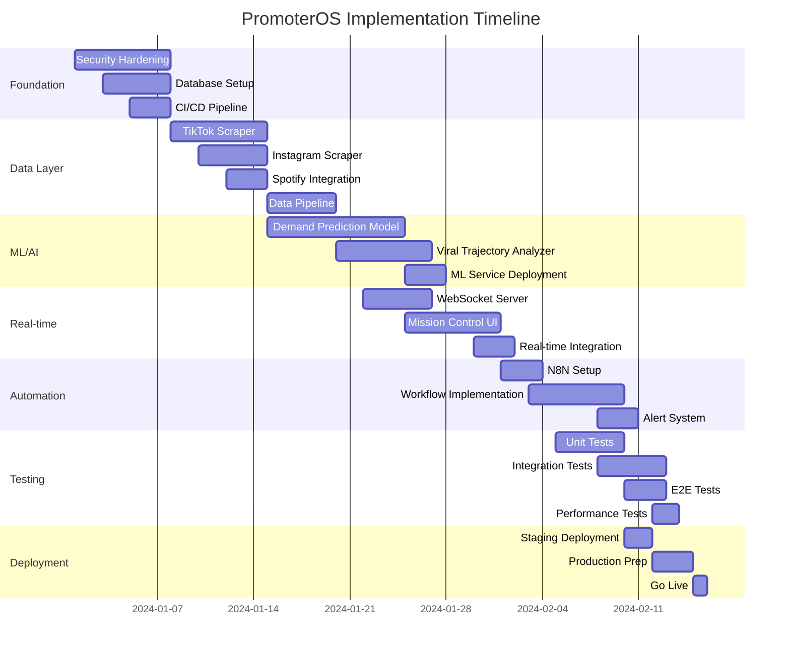

# PromoterOS Production Implementation Roadmap

## Executive Overview

This roadmap provides a detailed 10-week implementation plan to transform PromoterOS from MVP to production-ready AI-powered venue booking platform. The plan emphasizes parallel workstreams, iterative delivery, and risk mitigation.

## Timeline Overview



## Phase 1: Foundation & Security (Week 1-2)

### Week 1: Critical Security & Infrastructure

#### Day 1-2: Security Hardening
```bash
# Morning: Authentication System
- [ ] Implement JWT with refresh tokens
- [ ] Set up MFA infrastructure
- [ ] Configure OAuth2 providers
- [ ] Create user session management

# Afternoon: Authorization & Validation
- [ ] Implement RBAC system
- [ ] Add input validation middleware
- [ ] Set up rate limiting
- [ ] Configure CORS properly

# Deliverable: Secure API endpoints
```

#### Day 3-4: Database & Caching Setup
```bash
# Database Infrastructure
docker-compose up -d postgres redis influxdb

# Run migrations
npx prisma migrate deploy
npx prisma db seed

# Configure connection pooling
- [ ] Set up pgBouncer
- [ ] Configure Redis Cluster
- [ ] Set up InfluxDB retention policies

# Deliverable: Production-ready data layer
```

#### Day 5: CI/CD Pipeline
```yaml
# GitHub Actions Setup
- Build pipeline
- Test automation
- Security scanning
- Deployment automation
- Rollback procedures

# Deliverable: Automated deployment pipeline
```

### Week 2: Core Services Setup

#### Day 6-7: Monitoring & Observability
```typescript
// Implement comprehensive monitoring
- Datadog APM integration
- Custom metrics collection
- Log aggregation (ELK stack)
- Alert configuration
- Dashboard creation

// Deliverable: Full observability
```

#### Day 8-9: Error Handling & Recovery
```typescript
// Implement resilience patterns
- Circuit breakers
- Retry logic with exponential backoff
- Graceful degradation
- Error boundaries
- Fallback mechanisms

// Deliverable: Fault-tolerant system
```

#### Day 10: Performance Optimization
```bash
# Optimize application performance
- [ ] Implement caching strategy
- [ ] Database query optimization
- [ ] CDN configuration
- [ ] Asset bundling and minification
- [ ] Lazy loading implementation

# Deliverable: <200ms API response time
```

## Phase 2: Data Acquisition Layer (Week 3-4)

### Week 3: Scraper Implementation

#### Day 11-13: TikTok Scraper
```typescript
// Complete TikTok scraper with:
- Playwright automation
- Anti-detection measures
- Proxy rotation
- Rate limiting
- Error recovery
- Data validation

// Testing:
- Unit tests for parser
- Integration tests with real data
- Load testing with concurrent requests

// Deliverable: Production TikTok scraper
```

#### Day 14-15: Instagram Scraper
```typescript
// Instagram data collection:
- Public API integration
- Web scraping fallback
- Media analysis
- Engagement calculation
- Trend detection

// Deliverable: Production Instagram scraper
```

### Week 4: API Integrations

#### Day 16-17: Spotify Analytics
```typescript
// Spotify Web API integration:
- OAuth2 flow
- Artist data fetching
- Playlist monitoring
- Streaming metrics
- Genre analysis

// Deliverable: Complete Spotify integration
```

#### Day 18-20: Data Pipeline
```typescript
// Unified data pipeline:
- Data normalization
- Deduplication
- Quality checks
- Storage optimization
- Real-time streaming

// Deliverable: Scalable data pipeline
```

## Phase 3: ML/AI Implementation (Week 5-6)

### Week 5: Prediction Models

#### Day 21-25: Demand Prediction Model
```python
# Model development:
- Data preparation pipeline
- Feature engineering
- Model training (RF + GBoost ensemble)
- Hyperparameter tuning
- Cross-validation
- Model serialization

# Testing:
- Accuracy validation
- Performance benchmarking
- Edge case testing

# Deliverable: 85%+ accuracy demand prediction
```

### Week 6: Advanced Analytics

#### Day 26-28: Viral Trajectory Analyzer
```python
# Viral detection system:
- Time series analysis
- Trend detection algorithms
- Cross-platform correlation
- Peak prediction
- Risk assessment

# Deliverable: Real-time viral detection
```

#### Day 29-30: ML Service Deployment
```bash
# Deploy ML services:
- Containerize models
- Set up model serving (TorchServe/TF Serving)
- Configure auto-scaling
- Implement A/B testing
- Set up model monitoring

# Deliverable: Production ML pipeline
```

## Phase 4: Real-time Infrastructure (Week 7-8)

### Week 7: WebSocket Implementation

#### Day 31-33: WebSocket Server
```typescript
// Real-time server setup:
- Socket.io configuration
- Authentication middleware
- Room management
- Event handling
- Redis pub/sub integration

// Deliverable: Scalable WebSocket server
```

#### Day 34-35: Client Integration
```typescript
// Frontend real-time features:
- WebSocket client setup
- Reconnection logic
- State synchronization
- Optimistic updates
- Offline support

// Deliverable: Real-time UI updates
```

### Week 8: Mission Control UI

#### Day 36-40: Dashboard Implementation
```tsx
// Complete dashboard with:
- Real-time metrics display
- Interactive charts
- Alert notifications
- Collaborative features
- Mobile responsiveness

// Components:
- Artist analytics view
- Booking evaluation tool
- Viral monitoring panel
- Revenue projections
- Team collaboration

// Deliverable: Production Mission Control
```

## Phase 5: Automation & Testing (Week 9)

### Week 9: Workflow Automation

#### Day 41-42: N8N Setup
```bash
# N8N deployment:
- Docker deployment
- PostgreSQL backend
- Credential configuration
- Webhook setup
- Security hardening

# Deliverable: N8N platform ready
```

#### Day 43-45: Workflow Implementation
```yaml
# Core workflows:
- Data ingestion pipeline
- Alert system
- Report generation
- Booking detection
- ML pipeline orchestration

# Deliverable: 10+ production workflows
```

### Testing Sprint

#### Day 46-47: Test Implementation
```bash
# Test coverage push:
- Unit tests to 80%
- Integration test suite
- E2E critical paths
- Performance benchmarks
- Security testing

# Deliverable: Comprehensive test suite
```

## Phase 6: Production Deployment (Week 10)

### Week 10: Go-Live Preparation

#### Day 48-49: Staging Deployment
```bash
# Staging environment:
- Full production mirror
- Data migration
- Load testing
- Security audit
- User acceptance testing

# Deliverable: Validated staging environment
```

#### Day 50: Production Launch
```bash
# Production deployment:
- Blue-green deployment
- Database migration
- DNS cutover
- Monitoring activation
- Team standby

# Deliverable: Live production system
```

## Team Structure & Responsibilities

### Required Team
```yaml
Core Team:
  Tech Lead:
    - Architecture decisions
    - Code reviews
    - Technical mentorship
    - Risk assessment
  
  Backend Engineers (2):
    - API development
    - Scraper implementation
    - Database design
    - Integration development
  
  Frontend Engineer:
    - Mission Control UI
    - Real-time features
    - Mobile responsiveness
    - Performance optimization
  
  ML Engineer:
    - Model development
    - Data pipeline
    - Feature engineering
    - Model deployment
  
  DevOps Engineer:
    - Infrastructure setup
    - CI/CD pipeline
    - Monitoring/alerting
    - Security hardening

Support Team:
  QA Engineer:
    - Test planning
    - Test automation
    - Bug tracking
    - Quality assurance
  
  Product Manager:
    - Requirements gathering
    - Stakeholder communication
    - Priority management
    - User feedback
```

## Risk Mitigation Strategies

### Technical Risks
| Risk | Mitigation | Contingency |
|------|------------|-------------|
| API Rate Limiting | Implement caching, use official APIs | Multiple data sources |
| Scraping Detection | Rotation strategies, headless browsers | API partnerships |
| Model Accuracy | Continuous training, A/B testing | Human validation |
| Scalability Issues | Auto-scaling, load balancing | Vertical scaling |
| Data Loss | Automated backups, replication | Point-in-time recovery |

### Business Risks
| Risk | Mitigation | Contingency |
|------|------------|-------------|
| Delayed Launch | Parallel workstreams, buffer time | Phased rollout |
| Budget Overrun | Fixed-price contracts, regular reviews | Feature prioritization |
| Team Availability | Cross-training, documentation | Contractor backup |
| Market Changes | Agile development, feedback loops | Pivot capability |

## Success Metrics

### Week 2 Checkpoint
- [ ] Security implementation complete
- [ ] Database operational
- [ ] CI/CD pipeline functional
- [ ] Monitoring active

### Week 4 Checkpoint
- [ ] All scrapers operational
- [ ] Data pipeline processing 1000+ artists/day
- [ ] API integrations complete
- [ ] <5% error rate

### Week 6 Checkpoint
- [ ] ML models deployed
- [ ] Prediction accuracy >85%
- [ ] Model serving <100ms latency
- [ ] Automated retraining active

### Week 8 Checkpoint
- [ ] Real-time features working
- [ ] Dashboard complete
- [ ] WebSocket handling 1000+ connections
- [ ] UI responsive on all devices

### Week 10 - Launch Criteria
- [ ] All features operational
- [ ] Test coverage >80%
- [ ] Performance targets met
- [ ] Security audit passed
- [ ] Documentation complete
- [ ] Team trained
- [ ] Rollback plan tested

## Budget Breakdown

### Development Costs
```yaml
Personnel (10 weeks):
  Tech Lead:           $25,000
  Backend Engineers:   $40,000
  Frontend Engineer:   $20,000
  ML Engineer:         $25,000
  DevOps Engineer:     $20,000
  QA Engineer:         $15,000
  Subtotal:           $145,000

Infrastructure:
  AWS Services:        $5,000
  Third-party APIs:    $2,000
  Monitoring Tools:    $1,000
  Security Tools:      $2,000
  Subtotal:           $10,000

Other:
  Penetration Testing: $5,000
  Contingency (10%):   $16,000
  
Total Budget:         $176,000
```

## Post-Launch Plan

### Week 11-12: Stabilization
- Monitor system performance
- Address critical bugs
- Optimize based on real usage
- Gather user feedback
- Plan feature roadmap

### Month 2-3: Enhancement
- Add requested features
- Expand platform integrations
- Improve ML models
- Scale infrastructure
- Build mobile apps

### Quarter 2: Growth
- Multi-venue support
- White-label offering
- API monetization
- Geographic expansion
- Partnership development

## Communication Plan

### Daily Standups
- 15-minute sync
- Blocker identification
- Progress updates
- Risk flags

### Weekly Reviews
- Sprint retrospective
- Metric review
- Stakeholder update
- Risk assessment

### Milestone Reports
- Bi-weekly executive summary
- Budget status
- Timeline adherence
- Risk mitigation status

## Definition of Done

### Feature Complete
- Code reviewed and approved
- Unit tests written and passing
- Integration tests passing
- Documentation updated
- Deployed to staging

### Production Ready
- Security review passed
- Performance benchmarks met
- Error handling complete
- Monitoring configured
- Rollback plan tested

## Conclusion

This roadmap provides a clear path to production for PromoterOS. With proper execution, dedicated team, and adherence to the timeline, the platform will be ready for production use in 10 weeks.

**Critical Success Factors:**
1. Experienced team with clear roles
2. Parallel workstream execution
3. Regular checkpoint reviews
4. Proactive risk mitigation
5. Continuous stakeholder communication

**Expected Outcome:**
A production-ready, scalable, secure AI-powered venue booking platform capable of handling 10,000+ concurrent users and processing millions of artist data points daily.

---
*Implementation Roadmap Complete*
*Next Step: Team assembly and kick-off*
*Review Frequency: Daily progress, weekly milestones*
