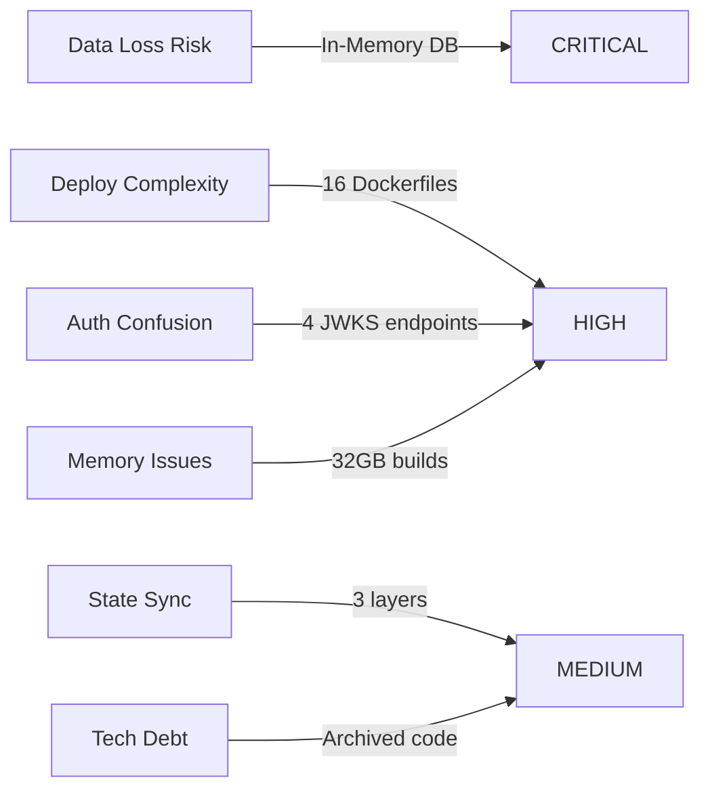

# Eggshell Recovery Project - Executive Index
**Project**: Paintbox → Eggshell Rebrand  
**Date**: 2025-08-21  
**Status**: Recovery In Progress  
**Production URL**: paintbox.fly.dev

## 🎯 Mission Statement

Transform the Paintbox Excel-to-web application into "Eggshell" - a production-ready, truthfully-marketed painting estimation platform under the Candlefish atelier brand. This recovery addresses architectural drift, consolidates 16+ Docker configurations, and implements honest telemetry while maintaining Excel formula compatibility.

## 📊 Current State Assessment

### ✅ What's Working
- **Core Functionality**: Excel formula engine processing 14,000+ formulas
- **Production Deployment**: Live on Fly.io with auto-scaling (2-6 instances)
- **Modern Stack**: Next.js 15.4.5, React 19.1, TypeScript 5.8
- **Test Coverage**: 40+ test suites including E2E, integration, and load tests
- **Integrations**: Salesforce and CompanyCam connections established

### 🔴 Critical Issues (P0)
1. **Database**: SQLite configured as `:memory:` - data lost on restart!
2. **Docker Chaos**: 16 different Dockerfile configurations
3. **Authentication**: 4 competing JWKS endpoints
4. **Memory Bloat**: Requires 16-32GB RAM for builds
5. **State Confusion**: 3 uncoordinated state layers (Zustand/Redis/IndexedDB)

### 🟡 Risk Map



## 📋 10-Day Recovery Plan

### Days 1-2: Stabilization
- [x] **Day 1**: System inventory and mapping (COMPLETED)
- [ ] **Day 2**: Canonicalize app, archive iterations, fix database

### Days 3-5: Core Functionality
- [ ] **Day 3**: Implement Golden Paths 1-4 (estimate creation flow)
- [ ] **Day 4**: Golden Paths 5-8 (export, sync, offline, telemetry)
- [ ] **Day 5**: Excel formula truth suite and validation

### Days 6-7: Integrations
- [ ] **Day 6**: Salesforce mapping and hardening
- [ ] **Day 7**: CompanyCam verification and offline queue

### Days 8-9: Rebrand & Polish
- [ ] **Day 8**: Eggshell design system implementation
- [ ] **Day 9**: Performance optimization and accessibility

### Day 10: Production Ready
- [ ] **Day 10**: Security audit, deployment, and go-live

## 🗂️ Deliverables

### Completed
- ✅ `1_SYSTEM_MAP.md` - Comprehensive inventory with architecture diagrams

### In Progress
- ⏳ `2_CANONICALIZATION_NOTES.md` - App selection and archival plan
- ⏳ `0_INDEX.md` - This executive summary

### Pending
- `2_GAP_REPORT.md` - Prioritized issues with fixes
- `3_FORMULA_SPEC.md` - Excel engine normative specification
- `4_SF_MAP.md` - Salesforce integration documentation
- `4_CC_MAP.md` - CompanyCam integration documentation
- `5_E2E_RESULTS.md` - Golden path test results
- `6_OFFLINE_SPEC.md` - Truthful offline capabilities
- `7_DESIGN_DNA.md` - Eggshell design system
- `8_WEB_VITALS_A11Y.md` - Performance and accessibility metrics
- `9_TELEMETRY_NOTES.md` - Honest status telemetry
- `10_OPS_PLAN.md` - Production deployment strategy

## 🎨 Eggshell Rebrand

### Design Tokens (from palette)
```json
{
  "primary": "#fefaee",    // Warm eggshell white
  "accent": "#9b8b73",     // Earthy brown
  "surface": "#fefbed",    // Light cream
  "background": "#fffef2"  // Soft white
}
```

### Brand Positioning
- **Atelier Quality**: Craftsmanship in estimation
- **Truthful Marketing**: No overstated claims
- **Single Tenant**: Kind Home exclusive (for now)

## 🚀 Golden Paths (Must Work)

| Path | Description | Status |
|------|-------------|--------|
| GP1 | Create estimate → add client → save draft | 🔴 Pending |
| GP2 | Exterior: add surfaces → calculate totals | 🔴 Pending |
| GP3 | Interior: add rooms → calculate totals | 🔴 Pending |
| GP4 | Attach CompanyCam photo → persist | 🔴 Pending |
| GP5 | Review → Export PDF+JSON with hash | 🔴 Pending |
| GP6 | Salesforce sync → show transaction ID | 🔴 Pending |
| GP7 | Offline queue → reconnect → sync | 🔴 Pending |
| GP8 | Telemetry widget with real status | 🔴 Pending |

## 🔧 Technical Decisions

### Canonical App Selection
**Current State**: Multiple competing architectures found
- Main app in `/app` directory (Next.js 15 App Router)
- Archived emergency servers
- Multiple backup configurations

**Decision**: Use main `/app` as canonical, archive all `*.backup.*` and `/archived-*`

### Database Strategy
**Current**: SQLite `:memory:` (data loss on restart!)  
**Target**: SQLite file-based with WAL mode  
**Future**: PostgreSQL when multi-tenant

### Docker Consolidation
**Current**: 16 Dockerfiles  
**Target**: 3 configurations
1. `Dockerfile.dev` - Local development
2. `Dockerfile.staging` - Staging/testing
3. `Dockerfile.production` - Production optimized

### State Management
**Current**: Zustand + Redis + IndexedDB (uncoordinated)  
**Target**: 
- Zustand: UI state only
- Redis: Server-side cache
- IndexedDB: Offline queue only

## 📈 Success Metrics

### Technical
- [ ] All 8 Golden Paths passing E2E tests
- [ ] Build memory < 4GB
- [ ] TTI < 2.5s on iPad over 4G
- [ ] Zero data loss incidents
- [ ] 100% truthful telemetry

### Business
- [ ] Excel parity validated (14,000+ formulas)
- [ ] Salesforce sync < 5s
- [ ] CompanyCam upload < 10s
- [ ] PDF generation < 3s
- [ ] Offline draft recovery 100%

## 🚨 Immediate Actions

1. **CRITICAL**: Fix in-memory database immediately
2. **HIGH**: Consolidate to single JWKS endpoint
3. **HIGH**: Select canonical app iteration
4. **MEDIUM**: Reduce Docker configurations
5. **MEDIUM**: Implement telemetry honesty

## 📞 Escalation Path

**Technical Issues**: Check implementation files  
**Integration Issues**: See `4_SF_MAP.md` and `4_CC_MAP.md`  
**Design Questions**: Reference `7_DESIGN_DNA.md`  
**Deployment**: Follow `10_OPS_PLAN.md`

---

**Next Action**: Canonicalize app and create archival script  
**ETA**: 10 days to production-ready Eggshell
