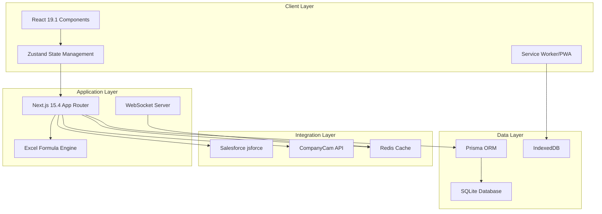

# Paintbox System Map - Comprehensive Inventory
**Generated**: 2025-08-21  
**Status**: Production Deployed (paintbox.fly.dev)  
**Tech Stack**: Next.js 15.4.5, TypeScript 5.8, React 19.1, Zustand 5.0

## 🔍 Executive Summary

The Paintbox project is a complex Excel-to-web application deployed on Fly.io with 14,000+ formula implementations. The codebase shows signs of rapid evolution with **16 different Docker configurations** and multiple archived iterations, indicating significant architectural drift that needs consolidation.

## 📐 Architecture Overview



## 🗂️ Directory Structure

### Core Application Directories
- `/app/` - Next.js 15 App Router pages and API routes
  - `/estimate/` - Main workflow pages (new, details, exterior, interior, review)
  - `/api/v1/` - RESTful API endpoints
  - `/api/auth/` - Authentication endpoints (NextAuth + JWT)
  - `/api/.well-known/` - JWKS endpoints (4 variants found)
- `/components/` - React components organized by feature
- `/lib/` - Business logic and services (28 subdirectories)
- `/stores/` - Zustand state management
- `/public/` - Static assets and PWA manifests

### Key Library Modules (`/lib/`)
1. **excel-engine/** - Formula processing (12 files, ~120KB)
   - formula-engine.ts - Core engine
   - excel-functions.ts - 40KB of function implementations
   - sheet-manager.ts - Sheet state management
   - dependency-resolver.ts - Formula dependencies
2. **calculations/** - Business calculations
3. **services/** - External integrations
4. **cache/** - Redis caching layer (9 files)
5. **middleware/** - Request processing (11 files)
6. **monitoring/** - Telemetry and logging

## 🚀 Deployment Configurations

### Docker Images (16 variants found!)
- **Production**: Dockerfile.production, Dockerfile.fly
- **Emergency**: Dockerfile.emergency, Dockerfile.fly.emergency
- **Minimal**: Dockerfile.minimal, Dockerfile.fly.minimal
- **Optimized**: Dockerfile.fly.optimized
- **Development**: Dockerfile.dev-tools
- **Simple**: Dockerfile.simple, Dockerfile.fly.simple
- **Deploy**: Dockerfile.deploy
- **Standalone**: Dockerfile.standalone
- **GraphQL**: Dockerfile.graphql
- **Dependency Checker**: Dockerfile.dependency-checker

### Deployment Targets
- **Primary**: Fly.io (paintbox.fly.dev) - ACTIVE
- **Secondary**: Vercel (configuration present)
- **Tertiary**: Render (scripts present)
- **Static**: Netlify (configuration found)

## 🔧 Technology Stack

### Frontend
- **Framework**: Next.js 15.4.5 with App Router
- **UI**: React 19.1.0 + Tailwind CSS v4
- **State**: Zustand 5.0.7 with persistence
- **Animations**: Framer Motion 11.17, React Spring 10.0
- **Components**: Radix UI primitives
- **Icons**: Heroicons, Lucide React

### Backend
- **Runtime**: Node.js with TypeScript 5.8.3
- **ORM**: Prisma 6.13.0
- **Database**: SQLite (in-memory for production!)
- **Cache**: Redis via ioredis 5.7.0
- **WebSocket**: Socket.io 4.8.1
- **Queue**: Bull 4.16.5

### Integrations
- **CRM**: Salesforce via jsforce 3.9.5
- **Photos**: CompanyCam API
- **Auth**: NextAuth 4.24.10 + JWT (jose 5.10.0)
- **Email**: SendGrid 8.1.5
- **Monitoring**: Sentry 10.0.0, LogRocket 10.1.0
- **Observability**: OpenTelemetry

### Excel Processing
- **Libraries**: 
  - exceljs 4.4.0
  - formula-parser 2.0.1
  - mathjs 14.6.0
  - decimal.js 10.6.0
  - xlsx-populate 1.21.0

## 📊 Data Models

### Core Entities (inferred from routes)
1. **Estimate** - Main business object
2. **Client/Contact** - Customer information
3. **Surface** - Exterior painting surfaces
4. **Room** - Interior spaces
5. **Photo** - CompanyCam integration
6. **Account** - Salesforce accounts

### State Management Layers
1. **Zustand** - Application state
2. **Redis** - Server-side cache
3. **IndexedDB** - Offline storage (via Dexie 4.0.11)
4. **SQLite** - Database (currently in-memory!)

## 🌐 API Endpoints

### Public APIs (`/app/api/`)
- `/health` - Health check endpoint
- `/simple-health` - Lightweight health check
- `/status` - Application status
- `/metrics` - Performance metrics

### Authenticated APIs (`/app/api/v1/`)
- `/salesforce/*` - CRM operations
  - `/accounts/[id]`
  - `/contacts/[id]`
  - `/search`
  - `/test`
- `/auth/*` - Authentication
  - `/login`
  - `/[...nextauth]`

### JWKS Endpoints (Multiple variants!)
- `/.well-known/jwks.json`
- `/.well-known/jwks-fixed.json`
- `/.well-known/jwks-secure.json`
- `/.well-known/jwks-optimized.json`

## 🧪 Test Infrastructure

### Test Suites (40+ npm scripts)
- **Unit Tests**: Jest with 30.0.5
- **E2E Tests**: Playwright 1.54.2
- **Load Tests**: Artillery 2.0.23
- **Integration**: Specific tests for Salesforce, CompanyCam
- **Excel Parity**: Multiple validation scripts
- **Auth Tests**: Comprehensive auth testing suite

### Test Commands
```bash
npm test                  # Basic tests
npm run test:e2e         # End-to-end tests
npm run test:excel-parity # Excel formula validation
npm run test:salesforce  # Salesforce integration
npm run test:companycam  # CompanyCam integration
npm run test:production  # Production test suite
```

## 🔄 Workflow Pages

### Main Estimate Flow (`/app/estimate/`)
1. `/new` - Start new estimate
2. `/new/details` - Client information
3. `/new/exterior` - Exterior surfaces
4. `/new/interior` - Interior rooms
5. `/new/review` - Review and finalize
6. `/[id]/pdf` - PDF generation
7. `/success` - Completion page

### Additional Pages
- `/login` - Authentication
- `/offline` - Offline mode
- `/maturity-map` - Feature maturity tracking
- `/infrastructure` - System status
- `/admin/secrets` - Secret management

## ⚠️ Critical Findings

### 🔴 High Priority Issues
1. **Database Configuration**: SQLite configured as `:memory:` in production!
2. **Docker Proliferation**: 16 different Docker configurations indicate deployment confusion
3. **JWKS Redundancy**: 4 different JWKS endpoints suggest authentication issues
4. **Archived Code**: Multiple backup and archived directories need cleanup

### 🟡 Medium Priority Concerns
1. **Memory Requirements**: NODE_OPTIONS set to 16-32GB for builds
2. **Multiple State Layers**: Zustand + Redis + IndexedDB without clear boundaries
3. **Test Coverage**: 40+ test scripts but unclear coverage metrics
4. **Environment Complexity**: Multiple .env files and configurations

### 🟢 Positive Aspects
1. **Comprehensive Testing**: Extensive test suite coverage
2. **Modern Stack**: Latest versions of major frameworks
3. **Excel Engine**: Sophisticated formula processing system
4. **Deployment Options**: Multiple deployment targets available
5. **Monitoring**: Good observability with Sentry and OpenTelemetry

## 📦 Excel Implementation

### Source Files
- **testcases/** directory contains:
  - `B.A.R.T. - 3.2.0 (EOY Draft) - Beta Test (1).xlsx`
  - Multiple beta test Excel files
  - Interior and Exterior calculation examples

### Excel Engine Components
- **40KB** of Excel function implementations
- **14,000+** formulas translated to TypeScript
- Formula dependency resolution system
- Progressive loading for performance
- Validation and error handling

## 🌐 External Integrations

### Salesforce (jsforce 3.9.5)
- Authentication via AWS Secrets Manager
- CRUD operations on Accounts/Contacts
- Search functionality
- Test endpoint available

### CompanyCam
- Photo upload and management
- Association with estimates
- Room/surface tagging
- Thumbnail generation

### AWS Services
- Secrets Manager for credentials
- Infisical SDK for secret injection

## 🔐 Security & Authentication

### Authentication Stack
- NextAuth 4.24.10 for session management
- JWT tokens via jose 5.10.0
- JWKS endpoints for key distribution
- AWS Secrets Manager integration

### Security Concerns
- Multiple JWKS endpoint variants suggest issues
- Secrets exposed in multiple .env files
- In-memory database in production

## 📈 Performance & Monitoring

### Monitoring Stack
- **Sentry**: Error tracking
- **LogRocket**: Session replay
- **OpenTelemetry**: Distributed tracing
- **Vercel Analytics**: Web analytics
- **Winston**: Application logging

### Performance Optimizations
- Redis caching layer
- WebSocket for real-time updates
- Progressive Excel loading
- Service Worker for offline

## 🚢 Deployment Status

### Current Production
- **URL**: paintbox.fly.dev
- **Region**: sjc (San Jose)
- **Instances**: 2-6 (auto-scaling)
- **Health Checks**: 2 endpoints configured
- **Concurrency**: 150-200 requests

### Build Configuration
```toml
# From fly.toml
app = "paintbox"
primary_region = "sjc"
dockerfile = "Dockerfile.simple"
NODE_ENV = "production"
PORT = "8080"
```

## 📝 Recommendations for Canonicalization

### Immediate Actions Required
1. **Fix Database**: Move from `:memory:` to persistent SQLite or PostgreSQL
2. **Consolidate Docker**: Reduce to 3 configurations (dev, staging, prod)
3. **Unify JWKS**: Single endpoint for key distribution
4. **Archive Cleanup**: Remove backup directories and obsolete code

### Architecture Improvements
1. **State Management**: Define clear boundaries for Zustand/Redis/IndexedDB
2. **Excel Engine**: Extract as separate microservice
3. **Integration Layer**: Implement circuit breakers and retries
4. **Testing**: Consolidate test scripts and add coverage reporting

### Next Steps
1. Select canonical app iteration from multiple versions
2. Implement Golden Path user journeys
3. Apply Eggshell rebranding
4. Enhance offline capabilities
5. Deploy to production with proper database

---

**Report Generated**: 2025-08-21  
**Next Task**: CANONICALIZE_APP - Select best iteration and archive others
