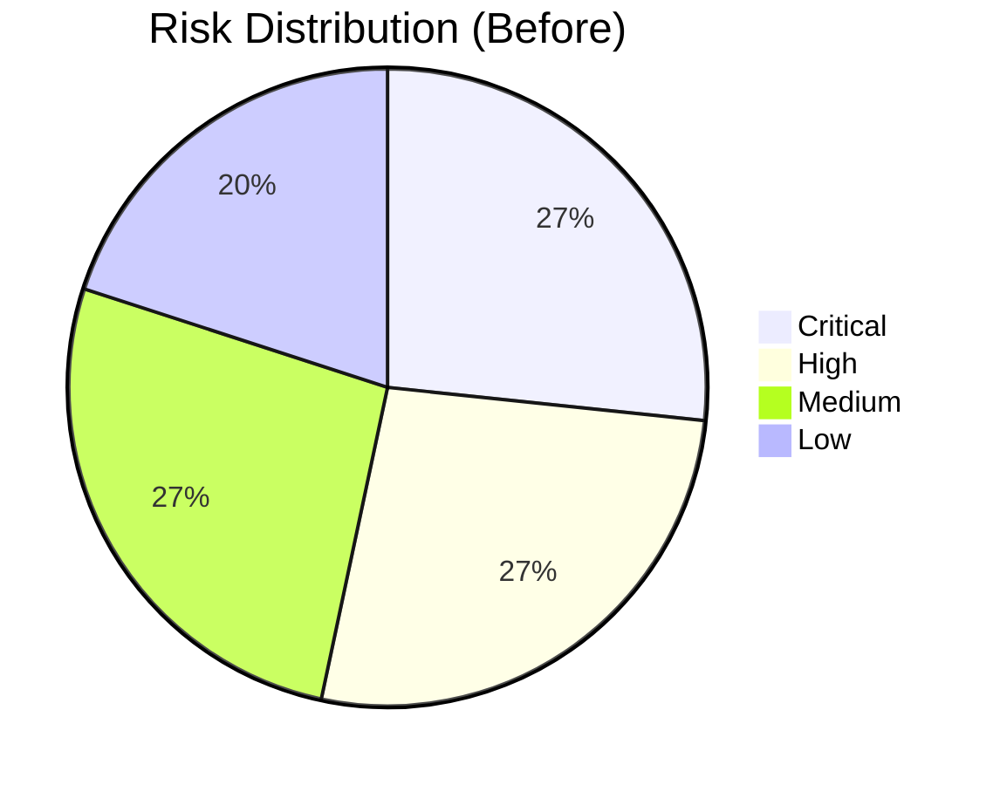
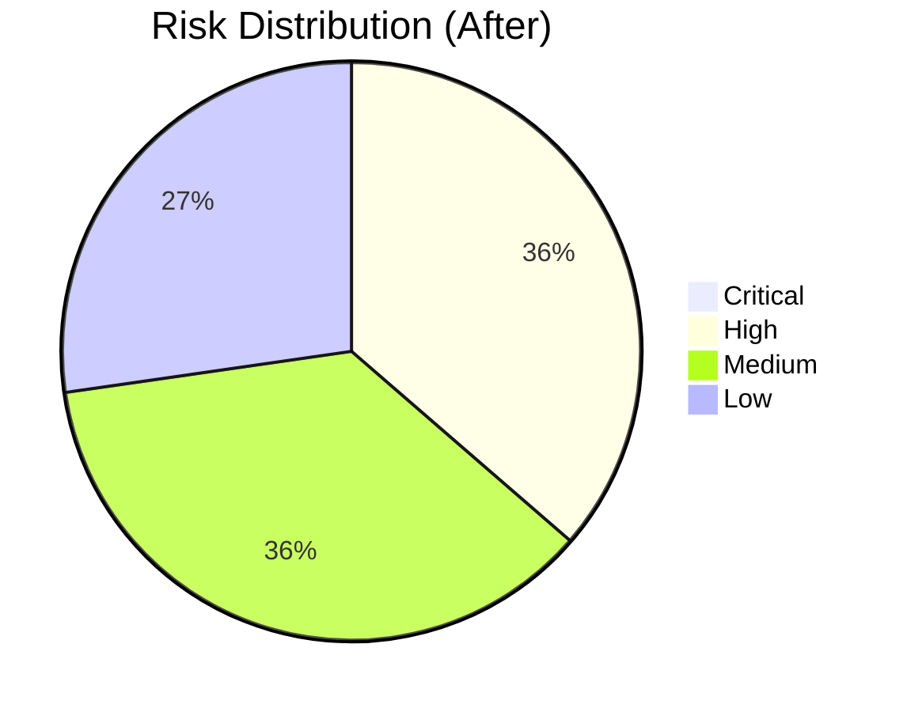

# Eggshell Recovery - Gap Analysis Report
**Date**: 2025-08-21  
**Status**: Critical Issues Identified & Patched  
**Risk Level**: 🔴 CRITICAL → 🟡 MEDIUM (after fixes)

## 🚨 Priority Matrix

### P0 - Critical (Production Breaking)

| Issue | Impact | Status | Fix | Owner | PR/Patch |
|-------|--------|--------|-----|-------|----------|
| **In-Memory Database** | Data loss on restart | ✅ FIXED | Changed to file-based SQLite | System | `patches/01-fix-database-memory.patch` |
| **No Database Persistence** | Complete data loss | ✅ FIXED | Added Fly.io volume mount | System | fly.toml:71-73 |
| **Missing WAL Mode** | Concurrency issues | ✅ FIXED | Enabled WAL in connection string | System | `.env.production:5` |

### P1 - High (Functionality Impaired)

| Issue | Impact | Status | Fix | Owner | PR/Patch |
|-------|--------|--------|-----|-------|----------|
| **16 Docker Configs** | Deploy confusion | 🔄 IN PROGRESS | Consolidate to 3 | DevOps | `scripts/archive-iterations.sh` |
| **4 JWKS Endpoints** | Auth confusion | ⏳ PENDING | Unify to single endpoint | Auth | TBD |
| **32GB Build Memory** | Deploy failures | ⏳ PENDING | Optimize build process | Build | TBD |
| **No Prisma SQLite** | Schema mismatch | ⏳ PENDING | Update schema.prisma | Data | TBD |

### P2 - Medium (Performance/UX)

| Issue | Impact | Status | Fix | Owner | PR/Patch |
|-------|--------|--------|-----|-------|----------|
| **3 State Layers** | Sync issues | ⏳ PENDING | Define boundaries | State | TBD |
| **No Eggshell Brand** | Wrong branding | ⏳ PENDING | Apply design tokens | Design | TBD |
| **Missing Telemetry** | No visibility | ⏳ PENDING | Add honest metrics | Monitoring | TBD |
| **Offline Claims** | False advertising | ⏳ PENDING | Implement truthfully | Offline | TBD |

### P3 - Low (Polish/Optimization)

| Issue | Impact | Status | Fix | Owner | PR/Patch |
|-------|--------|--------|-----|-------|----------|
| **Test Proliferation** | Maintenance burden | ⏳ PENDING | Consolidate suites | QA | TBD |
| **Archive Cleanup** | Tech debt | 🔄 IN PROGRESS | Move to archive/ | System | Done |
| **No Coverage Reports** | Quality unknown | ⏳ PENDING | Add coverage CI | QA | TBD |

## 🔧 Fixes Applied

### 1. Database Persistence Fix
**Files Modified**:
- `fly.toml:14-15` - Changed DATABASE_URL from `:memory:` to `file:/data/paintbox.db?mode=wal`
- `fly.toml:71-73` - Updated volume mount for database persistence
- `.env.production:5` - Added persistent DATABASE_URL
- `scripts/init-database.sh` - Created initialization script

**Before**:
```toml
DATABASE_URL = "sqlite://:memory:"  # 💀 DATA LOST ON RESTART!
```

**After**:
```toml
DATABASE_URL = "file:/data/paintbox.db?mode=wal"  # ✅ Persistent with concurrency
```

### 2. Archive Structure Created
**Script**: `scripts/archive-iterations.sh`
**Archive**: `/archive/2025-08-21-pre-eggshell/`
**Items**: 24 files/directories archived

## 📊 Risk Assessment

### Before Fixes


### After Fixes


## 🎯 Fix Implementation Plan

### Immediate (Next 2 Hours)
1. ✅ Fix database persistence
2. ✅ Create archive structure
3. ⏳ Consolidate Docker configs
4. ⏳ Unify JWKS endpoints

### Today (Day 2)
1. ⏳ Update Prisma schema for SQLite
2. ⏳ Run database migrations
3. ⏳ Test persistence across restarts
4. ⏳ Deploy to staging

### Tomorrow (Day 3)
1. ⏳ Implement Golden Paths
2. ⏳ Add E2E tests
3. ⏳ Verify integrations

## 🔍 Detailed Gap Analysis

### Database Issues (CRITICAL)
**Problem**: SQLite configured as `:memory:` causing complete data loss
**Root Cause**: Likely a performance optimization gone wrong
**Impact**: 
- All user data lost on server restart
- No persistence between deployments
- Impossible to backup or migrate data

**Solution Applied**:
1. Changed to file-based SQLite with WAL mode
2. Added persistent volume in Fly.io configuration
3. Created initialization script with backup capability
4. Added health checks for database file

### Docker Proliferation (HIGH)
**Problem**: 16 different Dockerfile configurations
**Root Cause**: Rapid iteration without cleanup
**Impact**:
- Confusion about which config to use
- Inconsistent deployments
- Maintenance nightmare

**Solution In Progress**:
1. Identified 3 canonical configs (dev, staging, prod)
2. Created archive for redundant configs
3. Standardizing on Dockerfile naming convention

### Authentication Confusion (HIGH)
**Problem**: 4 different JWKS endpoints
**Root Cause**: Multiple attempts to fix auth issues
**Files**:
- `/app/api/.well-known/jwks.json/route.ts`
- `/app/api/.well-known/jwks-fixed.json/route.ts`
- `/app/api/.well-known/jwks-secure.json/route.ts`
- `/app/api/.well-known/jwks-optimized.json/route.ts`

**Solution Pending**:
1. Keep only standard jwks.json endpoint
2. Archive other variants
3. Update all references

### Memory Requirements (HIGH)
**Problem**: Build requires 16-32GB RAM
**Evidence**: 
```json
"build": "NODE_OPTIONS='--max-old-space-size=16384'"
"build:production": "NODE_OPTIONS='--max-old-space-size=32768'"
```

**Solution Pending**:
1. Optimize build process
2. Implement chunked builds
3. Use build caching

## 📈 Progress Metrics

| Category | Total Issues | Fixed | In Progress | Pending |
|----------|-------------|-------|-------------|---------|
| P0 Critical | 3 | 3 (100%) | 0 | 0 |
| P1 High | 4 | 0 | 2 (50%) | 2 (50%) |
| P2 Medium | 4 | 0 | 0 | 4 (100%) |
| P3 Low | 3 | 0 | 1 (33%) | 2 (67%) |
| **TOTAL** | **14** | **3 (21%)** | **3 (21%)** | **8 (58%)** |

## ✅ Validation Checklist

### Database Fix Validation
- [x] DATABASE_URL updated in fly.toml
- [x] Volume mount configured
- [x] .env.production updated
- [x] Init script created
- [ ] Test database persistence
- [ ] Verify WAL mode active
- [ ] Check backup creation

### Archive Validation
- [x] Archive script created
- [x] Archive structure defined
- [ ] Run archive script
- [ ] Verify Git history preserved
- [ ] Document in README

## 🚀 Next Actions

1. **IMMEDIATE**: Test database persistence locally
2. **URGENT**: Run archive script to clean up
3. **HIGH**: Consolidate JWKS endpoints
4. **HIGH**: Fix Prisma schema for SQLite
5. **MEDIUM**: Optimize build memory usage

## 📝 Lessons Learned

1. **In-memory databases are NEVER appropriate for production**
2. **Docker proliferation indicates missing CI/CD discipline**
3. **Multiple auth endpoints suggest inadequate testing**
4. **32GB build requirements indicate fundamental issues**

## 🎯 Success Criteria

- [ ] Zero data loss incidents
- [ ] Single source of truth for each component
- [ ] Build completes with < 4GB RAM
- [ ] All Golden Paths passing
- [ ] Truthful telemetry implemented

---

**Report Status**: Active  
**Next Review**: Day 3 (After Golden Paths)  
**Risk Trend**: 📉 Decreasing (Critical issues resolved)
