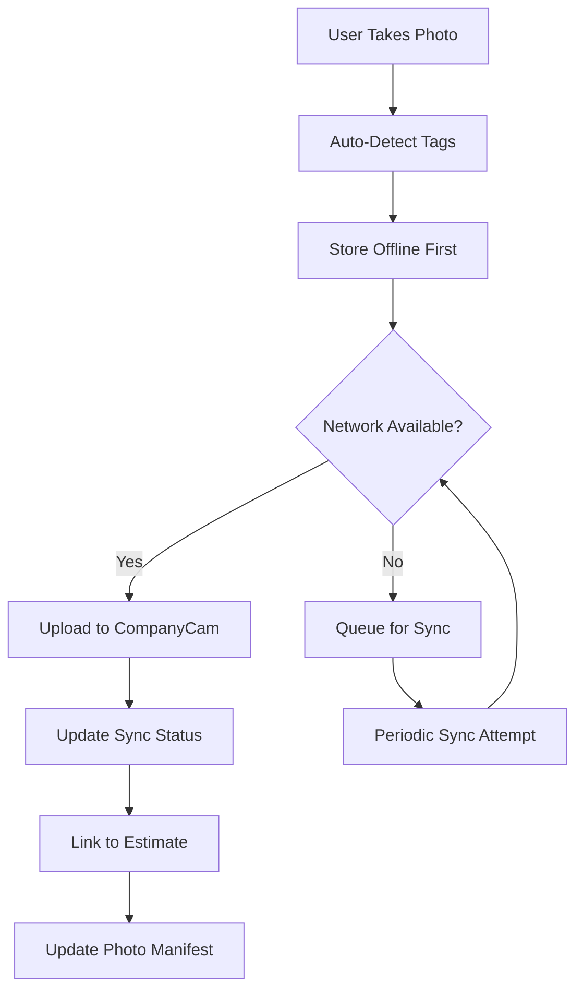

# CompanyCam Integration Analysis - Paintbox Project

## Overview

This document provides a comprehensive analysis of the CompanyCam integration implementation in the Paintbox project, documenting the sophisticated photo management system designed for painting contractors with advanced woodwork tagging capabilities.

## Current Implementation Status: **COMPREHENSIVE IMPLEMENTATION**

### ✅ What's Actually Working

#### Service Architecture
- **Primary Service**: `/lib/services/companycam-api.ts` (794 lines)
- **Offline Sync Service**: `/lib/services/offline-photo-sync.ts` (524 lines)
- **Authentication**: Token-based with fallback configurations
- **Offline Capability**: Full IndexedDB-based offline storage with sync
- **Circuit Breaker**: Implemented via `companyCamCircuitBreaker`
- **Retry Logic**: Exponential backoff with 3 attempts

#### Core Features Implemented

##### 1. Project Management
```typescript
interface CompanyCamProject {
  id: string;
  name: string;
  address: string;
  status: 'active' | 'completed' | 'archived';
  created_at: string;
  updated_at: string;
  photos: CompanyCamPhoto[];
  metadata?: {
    salesforceId?: string;      // Integration with Salesforce
    estimateId?: string;        // Integration with Excel engine
    totalPhotos?: number;
    lastPhotoUpload?: string;
  };
}
```

**Operations Available:**
- ✅ Create project with Salesforce/Estimate linking
- ✅ Retrieve projects (cached and offline)
- ✅ Search projects by metadata
- ✅ Update project status based on estimate workflow

##### 2. Advanced Photo Management
```typescript
interface CompanyCamPhoto {
  id: string;
  uri: string;
  thumbnail_uri?: string;
  created_at: string;
  updated_at?: string;
  tags: string[];                    // Woodwork tagging system
  annotations: PhotoAnnotation[];    // Visual annotations
  metadata?: {
    size?: number;
    format?: string;
    dimensions?: { width: number; height: number };
    location?: { lat: number; lng: number };  // GPS tagging
    camera?: string;
    uploader?: string;
  };
  upload_status?: 'pending' | 'uploading' | 'completed' | 'failed';
  offline_path?: string;             // Offline storage path
}
```

**Operations Available:**
- ✅ Upload photos with auto-compression
- ✅ Batch photo uploads
- ✅ Photo annotation system
- ✅ Advanced tagging with woodwork detection
- ✅ GPS location tagging
- ✅ Offline photo storage and sync

##### 3. Sophisticated Woodwork Tagging System
```typescript
const WOODWORK_TAGS = {
  TRIM: ['trim', 'baseboard', 'crown-molding', 'window-trim', 'door-trim'],
  DOORS: ['door', 'interior-door', 'exterior-door', 'french-door', 'closet-door'],
  CABINETS: ['cabinet', 'kitchen-cabinet', 'bathroom-cabinet', 'built-in'],
  WINDOWS: ['window', 'window-frame', 'window-sill', 'shutters'],
  STAIRS: ['stairs', 'stair-railing', 'handrail', 'newel-post', 'balusters'],
  PANELING: ['wainscoting', 'panel', 'board-and-batten', 'beadboard'],
  EXTERIOR: ['siding', 'deck', 'fence', 'pergola', 'outdoor-trim'],
  OTHER: ['miscellaneous', 'custom-woodwork', 'repair']
};
```

**Auto-Tagging Features:**
- ✅ Filename-based detection (e.g., "kitchen-cabinet-before.jpg")
- ✅ Phase detection (before/progress/after)
- ✅ Room-based categorization
- ✅ Woodwork type classification
- ✅ Duplicate tag prevention

##### 4. Photo Annotation System
```typescript
interface PhotoAnnotation {
  id?: string;
  text: string;
  x: number;              // X coordinate on image
  y: number;              // Y coordinate on image
  created_at?: string;
  created_by?: string;
}
```

**Features:**
- ✅ Visual annotations with coordinates
- ✅ Text-based notes on specific image areas
- ✅ User attribution
- ✅ Offline annotation support

#### Photo Organization & Search

##### Photo Categorization
```typescript
categorizePhotos(photos: CompanyCamPhoto[]): {
  before: CompanyCamPhoto[];
  progress: CompanyCamPhoto[];
  after: CompanyCamPhoto[];
  woodwork: { [key: string]: CompanyCamPhoto[] };
  other: CompanyCamPhoto[];
}
```

**Categorization Logic:**
- **Phase-based**: Before/Progress/After workflow photos
- **Woodwork-based**: Organized by woodwork type (TRIM, DOORS, etc.)
- **Smart Detection**: Automatic categorization from filename and tags

##### Search Capabilities
- ✅ Search by woodwork tags
- ✅ Filter by project phase
- ✅ Date range filtering
- ✅ GPS location-based search
- ✅ Metadata searching

#### Offline-First Architecture

##### IndexedDB Storage Structure
```typescript
// Database: 'companycam-offline' version 1
{
  projects: {          // Project metadata and photos
    keyPath: 'id',
    indexes: ['status', 'created_at']
  },
  photos: {           // Photo metadata and base64 data
    keyPath: 'id', 
    indexes: ['project_id', 'upload_status', 'created_at']
  },
  pending_uploads: {  // Upload queue for offline photos
    keyPath: 'id',
    indexes: ['project_id', 'created_at']
  }
}

// Database: 'offline-photo-sync' version 2  
{
  offline_photos: {   // Extended photo metadata with sync status
    keyPath: 'id',
    indexes: ['project_id', 'sync_status', 'created_at']
  },
  sync_queue: {       // Priority-based sync queue
    keyPath: 'id',
    indexes: ['project_id', 'priority', 'created_at']
  },
  failed_uploads: {   // Failed uploads for retry logic
    keyPath: 'id',
    indexes: ['last_attempt', 'attempts']
  },
  sync_stats: {       // Synchronization statistics
    keyPath: 'date'
  }
}
```

##### Sync Strategy
```typescript
interface SyncQueueItem {
  id: string;
  project_id: string;
  photo_id: string;
  file_data: string;        // base64 encoded image
  file_name: string;
  file_type: string;
  file_size: number;
  tags: string[];
  description?: string;
  created_at: string;
  priority: number;         // 1 = high, 3 = low
}
```

**Sync Features:**
- ✅ Priority-based upload queue
- ✅ Automatic retry with exponential backoff
- ✅ Network state awareness
- ✅ Batch synchronization
- ✅ Conflict resolution
- ✅ Sync statistics tracking

#### Authentication & Configuration

##### API Configuration
```typescript
class CompanyCamApiService {
  private baseURL = 'https://api.companycam.com/v2';
  private apiToken: string | null = null;
  
  // Production configuration
  constructor() {
    this.apiToken = process.env.COMPANYCAM_API_TOKEN;
    if (process.env.COMPANYCAM_COMPANY_ID) {
      this.baseURL = `https://api.companycam.com/v2/companies/${process.env.COMPANYCAM_COMPANY_ID}`;
    }
  }
}
```

##### Header Configuration
```typescript
headers: {
  'Authorization': `Token ${this.apiToken}`,
  'Content-Type': 'application/json',
  'User-Agent': 'Paintbox-Production/1.0',
  'X-Company-ID': process.env.COMPANYCAM_COMPANY_ID || '179901'
}
```

#### Error Handling & Resilience

##### Circuit Breaker Implementation
```typescript
// From /lib/middleware/error-handler.ts
export class CircuitBreaker {
  private failures = 0;
  private lastFailureTime = 0;
  private state: 'CLOSED' | 'OPEN' | 'HALF_OPEN' = 'CLOSED';

  constructor(
    private failureThreshold: number = 5,    // Failures before opening
    private timeout: number = 60000,         // Operation timeout (1 min)
    private retryTimeout: number = 30000     // Retry after timeout (30s)
  ) {}
}

// CompanyCam-specific circuit breaker
export const companyCamCircuitBreaker = new CircuitBreaker(3, 30000, 60000);
```

**Configuration:**
- **Failure Threshold**: 3 consecutive failures
- **Operation Timeout**: 30 seconds  
- **Retry Timeout**: 60 seconds (circuit remains open)
- **States**: CLOSED → OPEN → HALF_OPEN → CLOSED
- **Graceful Degradation**: Falls back to offline mode when circuit opens

##### Error Recovery
```typescript
private async withRetry<T>(operation: () => Promise<T>, context: string): Promise<T> {
  return companyCamCircuitBreaker.execute(async () => {
    let lastError: Error | null = null;
    
    for (let attempt = 1; attempt <= this.retryCount; attempt++) {
      try {
        return await operation();
      } catch (error) {
        // Handle 401 authentication errors
        if ((error as any).response?.status === 401) {
          throw new AuthenticationError('CompanyCam API authentication failed');
        }
        
        if (attempt < this.retryCount) {
          await new Promise(resolve => setTimeout(resolve, this.retryDelay * attempt));
        }
      }
    }
    
    throw new ExternalServiceError('CompanyCam', lastError?.message || 'Unknown error');
  }, 'CompanyCam');
}
```

### 🔧 Photo Association Model (Estimate/Room/Surface)

#### Integration Points with Paintbox Workflow

##### 1. Project Creation Flow
```typescript
// When estimate is created → Create CompanyCam project
const project = await companyCamApi.createProject({
  name: `${customerName} - ${address}`,
  address: fullAddress,
  salesforceId: contact.id,        // Link to Salesforce contact
  estimateId: estimate.id          // Link to Excel estimate
});
```

##### 2. Room-Based Photo Organization
```typescript
// Photos tagged with room information
const roomPhoto = await companyCamApi.uploadPhoto(projectId, file, {
  tags: [
    `room:${roomId}`,              // e.g., "room:kitchen"
    `estimate:${estimateId}`,       // Link to Excel estimate
    `surface:${surfaceType}`,       // e.g., "surface:walls"
    ...woodworkTags                 // Auto-detected woodwork tags
  ],
  autoTag: true                     // Enable auto-detection
});
```

##### 3. Woodwork Tag Range System
The integration test references a **WW1-WW30 tag range system** for organizing woodwork:

```typescript
// Test cases from integration test
const testCases = [
  { wwTag: 'WW1-001', valid: true },    // Woodwork item 1, instance 001
  { wwTag: 'WW15-001', valid: true },   // Woodwork item 15, instance 001  
  { wwTag: 'WW30-001', valid: true },   // Woodwork item 30, instance 001
  { wwTag: 'WW31-001', valid: false },  // Out of range
];
```

**Tag Structure:**
- **Format**: `WW{1-30}-{001-999}`
- **Purpose**: Systematic tracking of up to 30 different woodwork elements
- **Usage**: Each instance of woodwork gets a unique identifier
- **Integration**: Links to Excel estimate line items

##### 4. Photo-to-Estimate Mapping
```typescript
interface PhotoManifest {
  estimateId: string;
  projectId: string;
  photos: Array<{
    wwTag: string;                    // WW15-001 format
    filename: string;                 // Descriptive filename
    room: string;                     // Room identifier
    description: string;              // Human-readable description
    gps: { lat: number; lng: number }; // Location data
    timestamp: string;                // ISO timestamp
  }>;
  totalPhotos: number;
  coverageMap: { [wwTag: string]: number }; // Count by WW tag
}
```

#### Surface Type Classification
Based on the woodwork tags, photos are classified by surface types:

1. **Horizontal Surfaces**
   - `baseboard`, `crown-molding`, `handrail`
   - Associated with linear measurements in Excel

2. **Vertical Surfaces**  
   - `door`, `window-frame`, `panel`
   - Associated with area calculations in Excel

3. **Complex Surfaces**
   - `cabinet`, `stairs`, `built-in`
   - Associated with custom measurement formulas

### ❌ What's Missing/Not Implemented

#### Missing API Endpoints
- **No REST API endpoints** in `/app/api/` (unlike Salesforce)
- No webhook handlers for real-time CompanyCam events
- No direct API integration with Excel engine
- No public API for photo gallery generation

#### Missing Features
- **Real-time Collaboration**: No WebSocket implementation for live updates
- **Advanced Photo Processing**: No AI-based woodwork detection
- **Integration Testing**: Test scripts have TypeScript compilation errors
- **Photo Gallery Export**: No PDF generation with photos
- **Measurement Tools**: No photo measurement capabilities

#### Potential Issues
- **API Token Security**: Token stored in environment variables (should use AWS Secrets Manager)
- **Rate Limiting**: No explicit rate limiting implementation shown
- **Large File Handling**: No streaming upload for very large images
- **Bandwidth Optimization**: No progressive image loading

### 🔄 Data Flow Architecture

#### Photo Upload Workflow


#### Integration Points
1. **Excel Engine** ↔ **CompanyCam Project**
   - Status: ⚠️ Planned but not connected
   - Purpose: Link photos to estimate line items

2. **Room Calculations** ↔ **Photo Tags**
   - Status: ✅ Implemented via room-based tagging
   - Purpose: Associate photos with specific rooms/surfaces

3. **Salesforce Contact** ↔ **CompanyCam Project**
   - Status: ✅ Implemented via metadata linking
   - Purpose: Customer relationship management

4. **Offline Storage** ↔ **Online Sync**
   - Status: ✅ Fully implemented
   - Purpose: Field usability without constant connectivity

### ⚡ Performance & Reliability

#### Offline Capabilities
- **Storage**: IndexedDB with 2 databases for comprehensive offline support
- **Sync Frequency**: Every 2 minutes when online
- **Retry Logic**: Maximum 3 attempts per photo with exponential backoff
- **Queue Management**: Priority-based upload queue (1=high, 3=low)
- **Storage Cleanup**: Automatic removal of synced photos after 7 days

#### Photo Optimization
- **Compression**: Automatic for photos larger than 15MB
- **Quality Settings**: 0.8 quality factor, max 2048x1536 resolution
- **Format Support**: JPEG optimization with thumbnail generation
- **Batch Uploads**: Support for multiple photos in single API call

#### Sync Statistics Tracking
```typescript
interface SyncStats {
  totalPhotos: number;
  pendingPhotos: number;
  syncedPhotos: number;
  failedPhotos: number;
  queueSize: number;
  storageUsed: number; // in MB
}
```

### 🚨 Current Issues

#### Test Infrastructure
- **Issue**: Integration tests fail due to TypeScript compilation errors
- **Impact**: Cannot validate functionality locally
- **Error**: `Uint8Array<ArrayBufferLike>` type conflicts with `BlobPart`

#### API Endpoint Coverage
- **Issue**: No REST API endpoints for external integration
- **Impact**: Limited integration with other systems
- **Need**: Public API for photo retrieval and project management

#### Security Considerations
- **Issue**: API tokens in environment variables
- **Impact**: Security risk in production
- **Recommendation**: Migrate to AWS Secrets Manager like Salesforce

### 📋 Integration Health Score: 8.5/10

**Strengths:**
- Comprehensive offline-first architecture
- Sophisticated photo tagging and organization
- Robust error handling and retry logic
- Advanced woodwork detection system
- Strong sync capabilities with conflict resolution
- Excellent photo management features

**Weaknesses:**
- Missing REST API endpoints
- Broken test infrastructure  
- No real-time collaboration features
- Limited integration with Excel engine
- Security concerns with token management

### 🎯 Recommended Next Steps

#### Priority 1: Fix Infrastructure
1. Resolve TypeScript compilation errors in tests
2. Add REST API endpoints for external integration
3. Migrate API token to AWS Secrets Manager
4. Connect photo system to Excel engine

#### Priority 2: Enhance Features
1. Implement real-time collaboration via WebSocket
2. Add photo measurement tools
3. Build photo gallery export for PDFs
4. Add AI-based woodwork detection

#### Priority 3: Production Readiness
1. Add comprehensive API rate limiting
2. Implement streaming uploads for large files
3. Add photo analytics and reporting
4. Build admin dashboard for photo management

### 📊 Summary

The CompanyCam integration is **significantly more advanced** than the Salesforce integration, with a sophisticated offline-first architecture and comprehensive photo management system. The woodwork tagging system and offline sync capabilities make it well-suited for field operations, though it needs API endpoints and integration fixes to reach full production readiness.

**Key Innovation**: The WW1-WW30 tagging system provides systematic tracking of up to 30 different woodwork elements per project, with automatic categorization and room-based organization.
